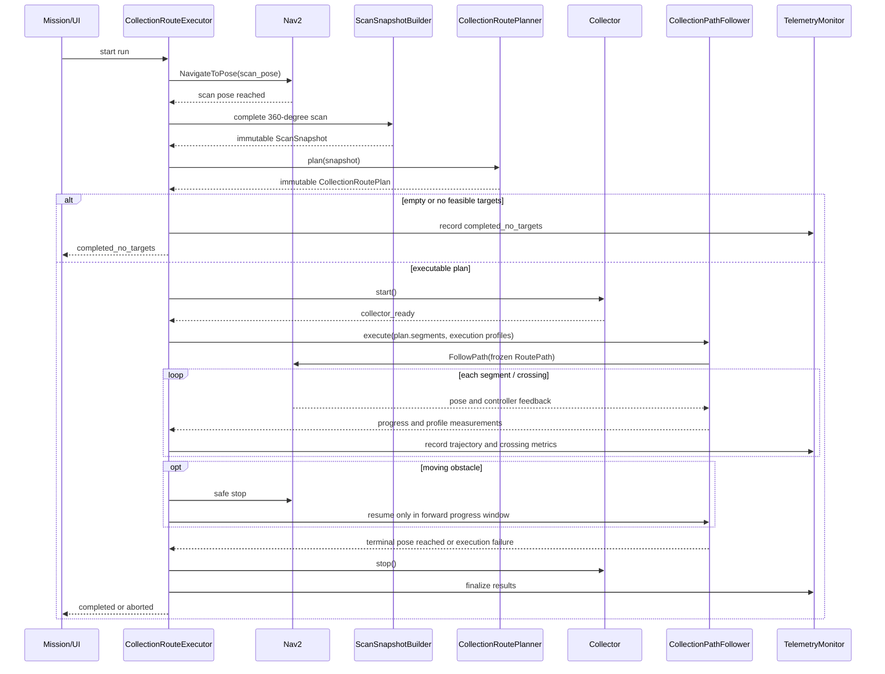

# Τεχνικός σχεδιασμός: continuous collection route

> Κατάσταση: **ενεργό design document** για την υλοποίηση του `collect_route`.
> Συμπληρώνει το [ενεργό specification](collection-route-rules-el.md): εκείνο
> ορίζει τη συμπεριφορά και τα κριτήρια αποδοχής, ενώ αυτό το έγγραφο ορίζει
> τα όρια κώδικα, τα δεδομένα και τη σειρά υλοποίησης.

## Σκοπός

Η υλοποίηση παράγει μία immutable `CollectionRoutePlan` από ένα frozen scan
snapshot και την εκτελεί ως μία συνεχή `RoutePath`. Η αναγνώριση ή αποτυχία
συλλογής μιας μπάλας δεν αλλάζει τη γεωμετρία, τη σειρά ή την πρόοδο της
ενεργής route.

Η σημερινή `collect_route_mission.py` είναι η υλοποίηση που αντικαθίσταται:
περιέχει per-stop Nav2 legs και mission-owned drive-through passes. Δεν
επεκτείνεται και δεν διατηρείται ως compatibility ή fallback path. Το νέο
`collect_route` είναι πλήρες rewrite στα όρια
planner/executor/controller που ορίζει αυτό το έγγραφο.

## Αρχιτεκτονική και ownership

```text
Perception + localization + court model
             |
             v
       ScanSnapshotBuilder -----> ScanSnapshot (immutable)
             |                         |
             |                         v
             |                 CollectionRoutePlanner
             |                         |
             |                         v
             |                 CollectionRoutePlan (immutable)
             |                         |
             v                         v
TelemetryMonitor <----- CollectionRouteExecutor -----> CollectionPathFollower
                                      |                         |
                                      v                         v
                              Collector interface          Nav2 FollowPath
                              Safety interface             + profile enforcement
```

| Component | Ευθύνη | Δεν επιτρέπεται να κάνει |
| --- | --- | --- |
| `ScanSnapshotBuilder` | 360° aggregation, confirmation, fusion, immutable snapshot | Να σχεδιάζει ή να εκτελεί route |
| `CollectionRoutePlanner` | feasibility, global candidates, επιλογή και πλήρες plan | Να οδηγεί robot ή να διαβάζει live detections |
| `CollectionRouteExecutor` | FSM, readiness, safety pause/resume, terminal result | Να αλλάζει geometry ή να κάνει replan |
| `CollectionPathFollower` | Επιβάλλει segment profile και στέλνει τη path στον controller | Να εφευρίσκει per-ball goals, rotate ή reverse |
| `TelemetryMonitor` | Εκτελεσμένη τροχιά, crossings, post-scan validation | Να αλλάζει plan/execution |
| Collector/Safety adapters | Health, ready/stop και ασφαλές stop | Να αποφασίζουν την route |

## Dependency rules

Οι εξαρτήσεις δείχνουν προς σταθερότερα domain abstractions, ποτέ προς τον
executor ή συγκεκριμένα ROS/Nav2 implementations.

```text
CollectionRouteExecutor
  ├── ScanSnapshotBuilder ──> Domain types
  ├── CollectionRoutePlanner ──> Domain types, geometry, cost evaluator
  ├── CollectionPathFollower ──> Domain types, Nav2 adapter
  ├── Collector adapter
  ├── Safety adapter
  └── TelemetryMonitor ──> Domain types
```

| Component | Επιτρεπτές εξαρτήσεις | Απαγορευμένες εξαρτήσεις |
| --- | --- | --- |
| `CollectionRoutePlanner` | Domain types, pure geometry, collision/feasibility evaluator, cost evaluator | Executor, Nav2/actions, ROS nodes, telemetry, collector, live perception |
| `ScanSnapshotBuilder` | Domain types, perception/localization adapter, fusion rules | Planner, executor, Nav2, collector |
| `CollectionRouteExecutor` | Planner output, snapshot builder interface, follower, collector/safety/telemetry interfaces | Planner internals, geometry/cost algorithm details |
| `CollectionPathFollower` | Domain segment/profile, Nav2 adapter, odometry/localization interface | Planner, snapshot builder, collector policy, perception |
| `TelemetryMonitor` | Domain types, executed pose/events, post-scan observations | Planner mutation, follower commands, collector commands |

Οι ROS nodes είναι composition/wiring layer: δημιουργούν adapters και δίνουν
interfaces στον executor. Δεν περιέχουν planning policy και δεν εισάγονται ως
dependency στα pure planner/domain modules.

## Μοντέλα δεδομένων

Τα παρακάτω είναι domain models ανεξάρτητα από ROS messages. ROS adapters
μετατρέπουν τα δεδομένα στα αντίστοιχα messages/actions, χωρίς να μεταφέρουν
mission policy στο transport layer.

```text
ScanSnapshot {
  scan_id, scan_timestamp, map_frame, robot_pose_at_scan,
  balls[SnapshotBall { ball_id, position, confidence, covariance }],
  configuration_snapshot
}

BallResult {
  ball_id,
  status: covered | deferred | unreachable,
  reason_code: selected | route_conflict | planning_budget |
               no_candidate_found | keepout | turn_radius |
               no_entry | no_exit | mechanical_spacing,
  pass_id?: string,
  predicted_lateral_error?: float
}

CollectionRoutePlan {
  plan_id, scan_id, map_frame, start_pose, terminal_pose,
  planning_status, total_length, expected_duration,
  segments[], ball_results[], configuration_snapshot
}

RouteSegment {
  id, type: connector | funnel_pass | terminal_connector,
  path, progress_start, progress_end,
  execution_profile, covered_ball_ids, obstacle_constraint
}
```

`CollectionRoutePlan` και τα nested elements είναι immutable μετά την επιτυχή
επιστροφή του planner. Το executor κρατά μόνο runtime state χωριστά από το
plan: progress, lifecycle state, safety state, collector state και telemetry.

## Planner pipeline

1. **Validate snapshot.** Ελέγχει frame, covariance/configuration και αν το
   snapshot είναι empty. Empty snapshot επιστρέφει valid empty plan με
   `empty_no_balls`.
2. **Per-ball deterministic feasibility.** Παράγει valid crossing sets ή
   `unreachable` reason. Χρησιμοποιεί inflated static obstacles, funnel swept
   footprint, heading interval, turning radius και entry/exit/run-in/run-out.
3. **Generate global route candidates.** Συνδυάζει passes και collision-free
   connectors. Δεν επιτρέπεται greedy επιλογή της «επόμενης μπάλας» ως τελικό
   αποτέλεσμα.
4. **Score candidates.** Εφαρμόζει τη σειρά του specification: maximum
   covered, minimum operational cost, minimum funnel passes.
5. **Finalize outcomes.** Κάθε snapshot ball αποκτά ακριβώς ένα `BallResult`.
   Αν κανένα target δεν καλύπτεται, επιστρέφει empty plan με
   `empty_no_feasible_targets`; timeout και internal failure είναι ξεχωριστά
   `planning_status`.
6. **Freeze and validate.** Το πλήρες plan περνά continuous swept-footprint
   checking και profile feasibility πριν παραδοθεί στον executor.

Ο planner δεν παίρνει post-scan perception input. Αν εξαντληθεί planning
budget χωρίς deterministic απόδειξη infeasibility, το αποτέλεσμα μιας μπάλας
είναι `deferred`, όχι `unreachable`.

## Εκτέλεση και Nav2 boundary

Ο executor έχει ακριβώς τις ακόλουθες lifecycle transitions:

```text
idle -> navigating_to_scan_pose -> scanning -> planning
planning -> completed_no_targets | collector_starting | aborted_planning
collector_starting -> executing_route | aborted_collector
executing_route <-> waiting_path_clear
executing_route -> route_completed | aborted_safety | aborted_tracking | aborted_collector
route_completed -> collector_stopping -> evaluating_results -> completed
```

Ο executor είναι ο μόνος owner του action lifecycle. Επιτρέπεται
`NavigateToPose` μόνο προς το scan pose. Για collection στέλνει μία frozen
RoutePath στο `FollowPath`, με collection profile
`use_rotate_to_heading=false` και `allow_reversing=false`.

## Ακολουθία ενός run



Το `SnapshotBuilder` κλείνει το snapshot πριν κληθεί ο planner. Μετά την
επιστροφή του `RoutePlan`, μόνο safety pause, collector health και tracking
μπορούν να αλλάξουν lifecycle state· κανένα δεν αλλάζει την RoutePath.

Το `CollectionPathFollower` δέχεται `RouteSegment[]`, όχι μόνο ένα άσημο
`nav_msgs/Path`. Πριν από κάθε segment επιβάλλει το αντίστοιχο
`ExecutionProfile` (π.χ. μέσω collection controller plugin ή verified
segment-specific speed-limit contract) και επιβεβαιώνει ότι:

- το crossing διασχίζεται μέσα σε min/max speed,
- υπάρχει απαιτούμενο run-in και run-out,
- η εκτελεσμένη pose μένει μέσα στο trajectory tube,
- δεν εκδίδεται reverse ή standalone rotate.

Αν ο επιλεγμένος Nav2 controller δεν μπορεί να εκθέσει/τηρήσει αυτή τη
σύμβαση, δεν χρησιμοποιείται για collection execution. Η απλή αποστολή path
δεν αποτελεί επαρκή υλοποίηση.

## Safety, collector και telemetry boundaries

- Το safety adapter μπορεί μόνο να σταματήσει και να δηλώσει clear/not-clear.
  Resume επιτρέπεται μόνο από forward progress window της ίδιας path. Αν δεν
  μένει run-in πριν το επόμενο crossing, ο executor κάνει abort· δεν κάνει
  backtrack ή recovery maneuver.
- Ο collector adapter εκθέτει `start`, `ready`, `health`, `stop` και
  `force_disable`. Start timeout/health failure, jam ή full hopper οδηγούν σε
  `aborted_collector`; stopping timeout καταγράφει fault μετά force-disable.
- Το perception monitor συνεχίζει μετά το scan αποκλειστικά για telemetry.
  Μπορεί να παράγει `target_position_invalidated`, αλλά δεν επηρεάζει plan,
  progress ή controller commands.
- Κάθε planned crossing αντιστοιχίζεται σε measured crossing speed, lateral
  error, heading error και collector outcome. Έτσι η διάγνωση ξεχωρίζει
  planning, tracking και μηχανική συλλογή.

## ROS interfaces και αρχεία υλοποίησης

Τα ονόματα είναι προτεινόμενα και οριστικοποιούνται μαζί με τα tests. Η
αντιστοίχιση ευθύνης όμως δεν αλλάζει.

| Layer | Προτεινόμενο module | Ρόλος |
| --- | --- | --- |
| Domain types | `collection_route_types.py` | immutable plan/snapshot/result/profile models και enum validation |
| Planning | `collection_route_planner.py` | feasibility, candidates, scoring, final plan |
| Scan | `collection_scan_snapshot.py` | scan aggregation/fusion/confirmation |
| Execution | `collection_route_executor.py` | lifecycle FSM και adapter orchestration |
| Nav2 | `collection_path_follower.py` | FollowPath lifecycle και profile enforcement adapter |
| Telemetry | `collection_route_telemetry.py` | executed trajectory και crossing measurements |
| ROS wiring | controller/node layer | topics, actions, status/UI serialization |

Το υπάρχον `collect_route_mission.py` αφαιρείται όταν τα νέα unit/integration
tests καλύψουν το νέο executor. Δεν υπάρχει compatibility adapter, feature
flag, runtime fallback ή παράλληλη σημασία του `collect_route`.

## Σειρά υλοποίησης και gates

1. **Domain contracts και tests.** Enums, immutable models, serialization και
   validators. Gate: tests για invalid enum, mutation attempt και complete
   ball results.
2. **Snapshot + planner offline.** Deterministic feasibility και global route
   candidates σε fixtures. Gate: no balls, all unreachable, deferred by
   budget/conflict, close balls, net/fence/corner cases.
3. **Plan execution simulator.** Executor με fake follower, collector και
   safety adapters. Gate: frozen geometry, collector timeout, safety resume,
   close-to-crossing abort και follow-up cycle.
4. **Nav2/profile enforcement.** Production follower/controller integration.
   Gate: telemetry proves profile compliance for every crossing; no rotate,
   reverse or per-ball goal appears in action logs.
5. **Gazebo end-to-end.** Real perception contract, court obstacles and
   moving-person pause. Gate: all acceptance criteria of the specification.
6. **UI/follow-up.** Expose results and bounded follow-up runs only after the
   plan/execution contract is stable.

Δεν προχωρά επόμενο gate όταν αποτυγχάνει το προηγούμενο. Τα Gazebo results
είναι evidence για behavior, όχι λόγος να αλλάξει το frozen-route contract.

## Non-goals της πρώτης υλοποίησης

- Dynamic replanning από νέες detections ή missed collection.
- Recovery που κάνει backtrack, reverse ή standalone rotate μέσα σε route.
- Αυτόματη αλλαγή scan pose.
- Εκτέλεση heuristic preview όταν λείπουν mechanical/safety parameters.
- Συγχώνευση mission policy μέσα σε Nav2 BT ή perception node.

## Definition of done

Η υλοποίηση θεωρείται έτοιμη μόνο όταν όλα τα criteria του specification
επαληθεύονται από unit tests και Gazebo telemetry, και όταν ένα saved
`CollectionRoutePlan` μπορεί να συσχετιστεί μονοσήμαντα με τη corresponding
`ExecutedTrajectory` και τα `BallResult` του.
