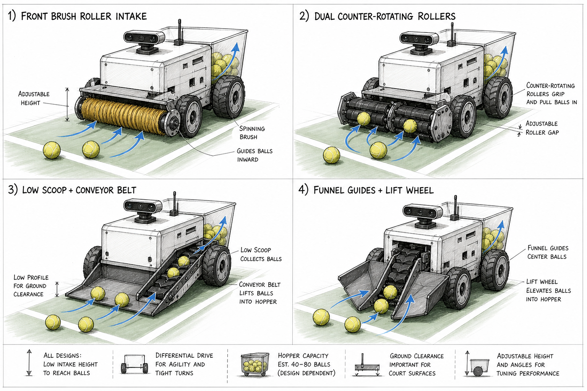
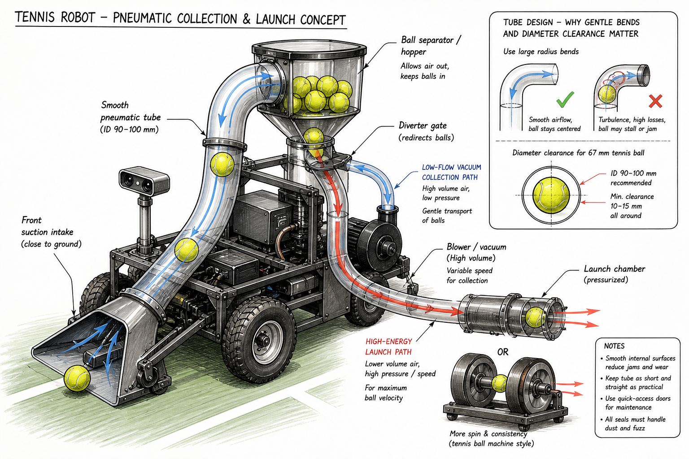
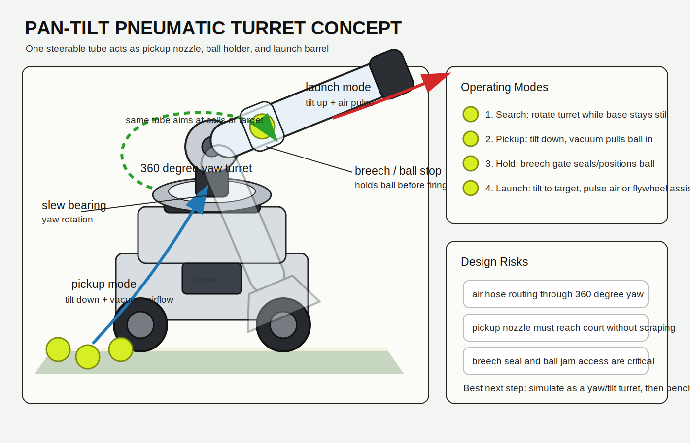

# Collector And Launcher Concepts

Last checked: 2026-05-16

This document compares early mechanical concepts for collecting tennis balls and, later, launching them for practice. Costs are rough prototype estimates and exclude shipping, VAT/import duties, machining, 3D printing, and failed experiments.

## Concept Sketches

### Collector Intake Options



### Pneumatic Collection And Launch Concept



### Pan-Tilt Pneumatic Turret Concept



## Important Ball Constraint

An ITF tennis ball diameter is approximately 65.4-68.6 mm. For any tube-based concept, use generous clearance:

- minimum tube internal diameter: about 90 mm
- preferred tube internal diameter: 100 mm
- avoid tight bends
- keep the path short, smooth, and serviceable

Sources: ITF ball specification references and current retail pipe examples show common 100 mm PVC/ventilation tube is inexpensive and widely available. Example 100 mm flexible PVC ventilation tube: [Karwei](https://www.karwei.nl/assortiment/sanivesk-buis-flexibel-pvc-wit-100-mm-3-meter/p/B118002). Example tennis machine throwing wheel replacement: [Tennis Warehouse Australia](https://www.tenniswarehouse.com.au/spinfire-throwing-wheel.html).

## Concept Summary

| Concept | Collection | Launch | Prototype cost | Complexity | Best use | Verdict |
|---|---|---|---:|---|---|---|
| A. Funnel + lift wheel + flywheel barrel | Mechanical funnel guides ball into a lift wheel/roller | Hopper feeds a rear/top dual-flywheel launch barrel | US $330-$780 | Medium-high | First full architecture | Best direction, build collector first |
| B. Brush roller intake + flywheel barrel | Front brush/roller sweeps balls into a bin | Hopper feeds a rear/top dual-flywheel launch barrel | US $310-$750 | Medium | Simple pickup tests plus normal launcher | Good quick prototype |
| C. Pan-tilt pneumatic turret | Same steerable tube tilts down to vacuum-pick balls | Same tube tilts up and fires as a barrel/cannon | US $350-$900+ | High | Simulation concept and bench prototype | Third main option; very interesting, mechanically risky |
| D. Scoop + conveyor + flywheel barrel | Low scoop feeds belt/elevator into hopper | Conveyor/hopper feeds a rear/top dual-flywheel launch barrel | US $370-$900 | High | Higher capacity collection | Strong later option |
| E. Fixed pneumatic collection + pneumatic launch | Vacuum/airflow pulls balls through fixed tube | Diverter sends balls to launch chamber | US $250-$700+ | High | Bench experiment, not first robot | Interesting but less elegant than turret |
| F. Mechanical collector + flywheel launcher | Any collector above | Dual counter-rotating flywheels | US $250-$600+ launcher only | Medium-high | Reliable training shots | Best long-term launcher |

## Full Robot Architecture Note

The first collector sketches intentionally focused on pickup geometry and do not show the launch tube/barrel clearly. A complete tennis robot needs three mechanical zones:

1. front collector/intake
2. middle hopper/feed gate
3. launch module with a short barrel or guide tube

For mechanical collector concepts A, B, and D, the launcher should be treated as a separate rear/top module. The ball path is:

```text
front intake -> hopper/bin -> feed gate -> dual flywheels -> short launch barrel
```

The launch barrel is not a long pressure tube. It is a short guarded guide after the flywheels that sets exit direction and keeps fingers away from moving parts.

Concept C is different: it uses one moving tube as both collection nozzle and launch barrel.

## A. Funnel + Lift Wheel + Flywheel Barrel

Estimated prototype cost:

- collector only: US $80-$180
- full collector + launcher prototype: US $330-$780

Likely parts:

- 3D printed or sheet plastic funnel guides: US $10-$40
- rubber lift wheel or roller: US $10-$40
- small DC gear motor: US $15-$50
- simple motor driver: US $10-$30
- brackets, bearings, fasteners: US $20-$60

Launcher module:

- dual throwing wheels: US $100-$220
- two launch motors: US $60-$200
- motor drivers: US $40-$120
- feed gate and short launch barrel: US $40-$120
- guards, frame, fasteners: US $40-$140

Pros:

- forgiving if the robot approaches slightly off-center
- keeps the front of the base mechanically simple
- easy to simulate as collision guides plus one driven wheel
- good match for the current `bearing_rad` and `distance_m` approach logic

Cons:

- may struggle with balls against fences or court edges
- wheel pressure/gap needs tuning
- still needs a hopper/bin design

Recommended role: first mobile collection prototype.

Full robot role: best first complete architecture if we keep the launcher modular and build it after pickup works.

## B. Brush Roller Intake + Flywheel Barrel

Estimated prototype cost:

- collector only: US $60-$150
- full collector + launcher prototype: US $310-$750

Likely parts:

- soft brush roller or foam roller: US $15-$50
- DC gear motor: US $15-$50
- motor driver: US $10-$30
- front tray/bin and brackets: US $20-$50

Launcher module: same dual-flywheel barrel module as Concept A.

Pros:

- mechanically simple
- cheap to test
- works well if the robot can center itself in front of the ball
- easy to repair

Cons:

- can push balls away if height, speed, or roller softness is wrong
- less controlled than funnel/lift geometry
- may collect court debris

Recommended role: quick bench prototype if we want fastest mechanical test.

Full robot role: fastest full prototype, but pickup may be less reliable than funnel/lift.

## C. Pan-Tilt Pneumatic Turret

Estimated prototype cost: US $350-$900+

Core idea:

```text
one steerable tube / barrel
  -> yaw turret, ideally 360 degrees
  -> tilt down for pickup
  -> tilt up for launch
  -> vacuum/airflow collection mode
  -> hold/breech mode
  -> pressure pulse or blower launch mode
```

Likely parts:

- 90-100 mm smooth tube/barrel: US $20-$80
- pan turret bearing or slew mechanism: US $40-$180
- tilt hinge/actuator: US $30-$150
- blower/vacuum source: US $50-$200
- launch pressure chamber or high-energy air path: US $80-$250+
- breech gate / ball stop / sealing door: US $30-$120
- slip ring or cable/air hose management: US $20-$120
- frame, guards, seals, access doors: US $80-$200

Pros:

- same tube does collection and aiming/launch
- 360 degree yaw can collect balls without rotating the whole base
- base can be more symmetric because it does not need a fixed front intake
- simulation-friendly as a turret with yaw/tilt states
- elegant if it works

Cons:

- hardest concept mechanically
- 360 degree rotation complicates air hose and cable routing
- tube must reach low enough for pickup without scraping or jamming
- needs a reliable ball hold/breech mechanism
- launch energy and repeatability are uncertain
- safety guarding is important because the launcher can aim in many directions

Recommended role: third main architecture option. Simulate before buying parts. Bench-test the tube, vacuum pickup, breech, and launch pulse separately before putting it on a mobile base.

## D. Low Scoop + Conveyor Belt + Flywheel Barrel

Estimated prototype cost:

- collector only: US $120-$300
- full collector + launcher prototype: US $370-$900

Likely parts:

- low scoop: US $10-$40
- small belt or printed conveyor: US $30-$100
- motor and pulleys: US $30-$80
- frame, bearings, tensioner, brackets: US $50-$120

Launcher module: same dual-flywheel barrel module as Concept A, potentially fed more cleanly by the conveyor/hopper.

Pros:

- naturally moves balls upward into storage
- scalable to multiple balls
- easier to integrate with a hopper

Cons:

- more moving parts
- belt alignment and debris handling can become annoying
- front geometry may require a larger chassis

Recommended role: second-generation collector if the first MVP works.

Full robot role: best capacity path, but too complex for first mechanical build.

## E. Fixed Pneumatic Collection + Pneumatic Launch

Estimated prototype cost: US $250-$700+

Likely parts:

- 90-100 mm smooth tube and bends: US $20-$80
- high-flow blower/vacuum: US $50-$200
- separator/hopper: US $30-$100
- diverter gate/servo/actuator: US $20-$80
- launch chamber or pressure path: US $80-$250+
- seals, access doors, filters, mounts: US $50-$150

Pros:

- same tube can theoretically serve transport and launch routing
- includes a visible launch tube/path from the start
- fewer ground-contact pickup mechanisms
- can move balls to a high hopper without a conveyor
- interesting system for experiments

Cons:

- collection wants high airflow and low pressure; launch wants high speed/energy and repeatability
- same path needs diverters, seals, and jam access
- noisy and power-hungry
- tennis ball fuzz increases friction and dust
- bends can stall or jam balls
- pneumatic launch is harder to tune than flywheels

Recommended role: bench experiment only. Do not make it the first mobile robot mechanism.

## F. Mechanical Collector + Dual Flywheel Launcher

Estimated prototype cost: US $250-$600+ for launcher module

Likely parts:

- two throwing wheels: US $100-$220 pair, depending source
- two motors: US $60-$200
- motor drivers: US $40-$120
- feed gate/wheel and short launch barrel: US $40-$120
- frame, guards, bearings, fasteners: US $50-$150

Pros:

- proven tennis ball machine architecture
- repeatable speed and spin
- easier to tune shot velocity than air launch
- launcher can be developed as a separate module after collection

Cons:

- rotating wheels need guarding and safety interlocks
- more electrical power draw
- spin/velocity calibration needed

Recommended role: best long-term launcher path.

## Current Recommendation

Build the project in this order:

1. Simulate and test `scan -> align -> approach -> stop_near_ball`.
2. Model Concept A: funnel + lift wheel.
3. Model Concept C separately as a pan-tilt pneumatic turret, because it changes the base geometry completely.
4. Add the hopper/feed gate interface in the mechanical-collector model, even before the launcher works.
5. Add a placeholder launch module with dual flywheels and a short barrel/tube.
6. Treat the fixed pneumatic tube idea as a bench-only side experiment.

The pan-tilt pneumatic turret is worth sketching, simulating, and possibly bench-testing because it can change the base choice completely. The fixed pneumatic concept is less attractive as a main architecture, but still useful as a bench experiment for airflow, tube clearance, and ball handling.
