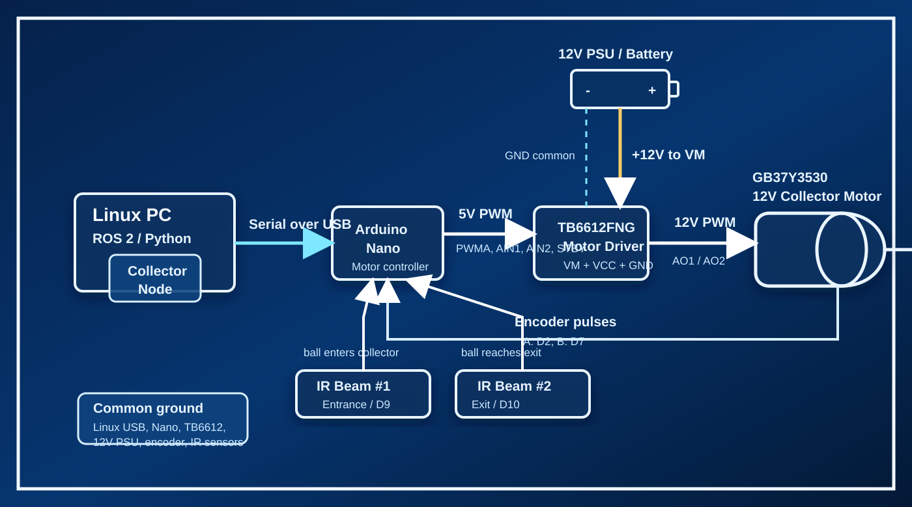

# Collector Wiring Reference

Αυτό το έγγραφο είναι ο πίνακας αναφοράς για το πρώτο λειτουργικό prototype του
collector, με:

- Arduino Nano
- TB6612FNG motor driver
- GB37Y3530 12V DC gear motor με encoder
- 2x Adafruit IR break beam sensors
- εξωτερικό 12V τροφοδοτικό για το μοτέρ

Στόχος του πρώτου wiring είναι να γυρίσει ελεγχόμενα ο intake roller, να
διαβάζουμε encoder pulses, και να ανιχνεύουμε μπαλάκι στην είσοδο και στην έξοδο
του collector.

## Γρήγορη Διάγνωση

Αν βλέπεις PWM/serial messages αλλά ο κινητήρας δεν γυρίζει, το πιο πιθανό είναι
ότι λείπει η τροφοδοσία μοτέρ:

```text
12V PSU -> TB6612 VM
12V PSU GND -> TB6612 GND
```

Το `VCC` του TB6612 τροφοδοτεί μόνο τη λογική. Το μοτέρ παίρνει ισχύ από το `VM`.

## 1. Arduino Nano προς TB6612FNG

| Arduino Nano | TB6612FNG | Σκοπός |
|---|---|---|
| D3 | PWMA | PWM ταχύτητας Motor A |
| D4 | AIN1 | Κατεύθυνση Motor A |
| D5 | AIN2 | Κατεύθυνση Motor A |
| D6 | STBY | Enable του driver |
| 5V | VCC | Λογική τροφοδοσία TB6612 |
| GND | GND | Κοινή γείωση |

### Τι κάνει το κάθε pin

| Pin | Περιγραφή |
|---|---|
| PWMA | Ρυθμίζει ταχύτητα με PWM, συνήθως `0` έως `255` |
| AIN1 | Direction bit 1 |
| AIN2 | Direction bit 2 |
| STBY | `LOW` = απενεργοποίηση, `HIGH` = ενεργοποίηση |
| VCC | 5V λογικής |
| GND | Κοινή αναφορά όλων των κυκλωμάτων |

Παράδειγμα φοράς:

```cpp
digitalWrite(AIN1, HIGH);
digitalWrite(AIN2, LOW);
analogWrite(PWMA, 80);
```

Αν ο roller γυρίζει ανάποδα, άλλαξε τη λογική κατεύθυνσης:

```cpp
digitalWrite(AIN1, LOW);
digitalWrite(AIN2, HIGH);
```

ή αντάλλαξε τα καλώδια `AO1` και `AO2`.

## 2. 12V Τροφοδοτικό προς TB6612FNG

Προσοχή: αυτό είναι το κομμάτι που λείπει όταν το Arduino στέλνει PWM αλλά το
μοτέρ δεν έχει δύναμη να γυρίσει.

Στη δεξιά πλευρά του TB6612FNG, από πάνω προς τα κάτω, η σειρά είναι:

```text
VM
VCC
GND
AO1
AO2
BO2
BO1
GND
```

| Τροφοδοτικό 12V | TB6612FNG | Σκοπός |
|---|---|---|
| +12V | VM | Τροφοδοσία κινητήρα |
| GND | GND | Επιστροφή ρεύματος και κοινή γείωση |

Το `VM` είναι μόνο για το `+12V` του μοτέρ. Το `VCC` είναι μόνο για `5V` λογικής.
Μην βάλεις ποτέ `12V` στο `VCC`.

### Κρίσιμη σημείωση γείωσης

Το `GND` του 12V τροφοδοτικού, το `GND` του TB6612 και το `GND` του Arduino Nano
πρέπει να είναι κοινά. Χωρίς κοινή γείωση, τα PWM/direction signals δεν έχουν
σωστή αναφορά.

```text
Arduino GND
    |
TB6612 GND
    |
12V PSU GND
```

## 3. GB37Y3530 Motor προς TB6612FNG

Ο κινητήρας έχει δύο καλώδια ισχύος και τέσσερα καλώδια encoder.

### Motor leads

| Χρώμα | Χρήση |
|---|---|
| Κόκκινο |  Motor Lead (AO1)|
| Μαύρο | Motor Lead (AO2) |
| Μπλε | Encoder A |
| Πράσινο | Encoder B |
| Κίτρινο | Encoder VCC |
| Λευκό | Encoder GND |

### Σύντομος πίνακας χρωμάτων

| Χρώμα καλωδίου | Αντιστοιχεί σε | Σύνδεση σε αυτό το prototype |
|---|---|---|
| Κόκκινο | Motor lead | TB6612 `AO1` |
| Μαύρο | Motor lead | TB6612 `AO2` |
| Μπλε | Encoder A | Arduino Nano `D2` |
| Πράσινο | Encoder B | Arduino Nano `D7` |
| Κίτρινο | Encoder VCC | `5V` |
| Λευκό | Encoder GND | `GND` |

Αν ο roller γυρίζει ανάποδα, άλλαξε πρώτα τη φορά στο software ή αντάλλαξε τα
δύο motor leads `AO1`/`AO2`. Μην αλλάξεις τα καλώδια του encoder για να διορθώσεις
τη φορά του μοτέρ.

### Σύνδεση μοτέρ

| Motor | TB6612FNG |
|---|---|
| Κόκκινο | AO1 |
| Μαύρο | AO2 |

Αν η φορά είναι ανάποδη, προτίμησε πρώτα αλλαγή στο software. Αν χρειάζεται,
αντάλλαξε `AO1` και `AO2`.

## 4. Encoder προς Arduino Nano

| Encoder | Arduino Nano | Σκοπός |
|---|---|---|
| Κίτρινο | 5V | Τροφοδοσία encoder |
| Λευκό | GND | Γείωση encoder |
| Μπλε | D2 | Encoder A / interrupt input |
| Πράσινο | D7 | Encoder B / direction input |

Σημείωση: το `D3` χρησιμοποιείται ήδη για `PWMA`, άρα δεν το χρησιμοποιούμε για
`Encoder B` σε αυτό το wiring. Το `D7` είναι η καθαρή επιλογή για direction
read. Αργότερα, αν θέλουμε πλήρες quadrature decoding με interrupts και στα δύο
κανάλια, μπορούμε να αλλάξουμε pin map ή controller.

### Τι κάνει

| Pin | Περιγραφή |
|---|---|
| Encoder A | Μετρά παλμούς |
| Encoder B | Δίνει κατεύθυνση σε σχέση με το A |
| 5V | Τροφοδοσία encoder |
| GND | Γείωση |

Ο encoder θα χρειαστεί αργότερα για ακριβή έλεγχο RPM και για να ξέρουμε αν ο
roller έχει κολλήσει.

## 5. IR Break Beam #1 - Roller Entrance

Το πρώτο IR beam μπαίνει στην είσοδο του roller και βλέπει πότε μπαίνει μπαλάκι
στον collector.

### Receiver, 3 καλώδια

| Receiver | Arduino Nano |
|---|---|
| Κόκκινο | 5V |
| Μαύρο | GND |
| Λευκό | D9 |

### Emitter, 2 καλώδια

| Emitter | Arduino Nano |
|---|---|
| Κόκκινο | 5V |
| Μαύρο | GND |

## 6. IR Break Beam #2 - Roller Exit

Το δεύτερο IR beam μπαίνει στην έξοδο του roller και βλέπει ότι το μπαλάκι έφτασε
προς το flywheel ή το επόμενο στάδιο.

### Receiver, 3 καλώδια

| Receiver | Arduino Nano |
|---|---|
| Κόκκινο | 5V |
| Μαύρο | GND |
| Λευκό | D10 |

### Emitter, 2 καλώδια

| Emitter | Arduino Nano |
|---|---|
| Κόκκινο | 5V |
| Μαύρο | GND |

### IR input mode

Τα Adafruit IR break beam receivers έχουν open-collector output. Στο Arduino
χρησιμοποίησε internal pull-up:

```cpp
pinMode(9, INPUT_PULLUP);
pinMode(10, INPUT_PULLUP);
```

Με pull-up, το signal μπορεί να φαίνεται ανάποδο λογικά. Δηλαδή θα δεις συνήθως
`LOW` όταν η δέσμη είναι σπασμένη/blocked και `HIGH` όταν η δέσμη είναι καθαρή.
Αυτό είναι το αντίστροφο από το σχόλιο που είχαμε αρχικά στα collector sketches.

## 7. Τελική Χρήση Στο Tennis Robot

| Sensor / Module | Θέση | Ρόλος |
|---|---|---|
| IR #1 | Roller entrance | Βλέπει μπαλάκι να μπαίνει |
| IR #2 | Roller exit | Βλέπει ότι το μπαλάκι έφτασε στο επόμενο στάδιο |
| Encoder | Collector motor | Μετρά RPM και βοηθά στο jam detection |
| TB6612FNG | Collector motor driver | Ελέγχει φορά και PWM ταχύτητα |

Η βασική λογική του collector είναι:

```text
IR #1 triggered
    -> ball entered roller
    -> keep roller running

IR #2 triggered
    -> ball reached exit/flywheel path
    -> collection transfer confirmed

Encoder pulses missing while PWM > 0
    -> possible jam or wiring/power fault
```

## 8. Τελική Εικόνα Συστήματος



```text
12V PSU
    |
    v
TB6612 VM
    |
    v
GB37Y3530 Motor
    |
    v
Collector Roller

Arduino Nano
    |-- TB6612 control: D3, D4, D5, D6
    |-- Encoder: D2, D7
    |-- IR Beam #1: D9
    |-- IR Beam #2: D10
```

## 9. Πρώτο Power-On Checklist

Πριν βάλεις 12V στο `VM`:

1. Επιβεβαίωσε ότι `Arduino GND`, `TB6612 GND` και `12V PSU GND` είναι κοινά.
2. Επιβεβαίωσε ότι το `VCC` του TB6612 είναι στο `5V`, όχι στο `12V`.
3. Επιβεβαίωσε ότι το `VM` του TB6612 είναι στο `+12V`.
4. Επιβεβαίωσε ότι το `STBY` πηγαίνει σε pin που γίνεται `HIGH`.
5. Ξεκίνα με χαμηλό PWM, π.χ. `50` έως `80`, όχι κατευθείαν `255`.
6. Κράτα το μοτέρ χωρίς μηχανικό φορτίο στο πρώτο test.
7. Έλεγξε αν ο TB6612 ζεσταίνεται πολύ.
8. Αν ο roller γυρίζει ανάποδα, άλλαξε direction pins ή `AO1`/`AO2`.

### Έλεγχος με πολύμετρο

Πριν συνδέσεις μοτέρ ή πριν δώσεις PWM, μέτρα πάνω στα pins του TB6612:

| Μέτρηση | Αναμενόμενο |
|---|---|
| `VCC` προς `GND` | περίπου 5V |
| `VM` προς `GND` | περίπου 12V |
| `Arduino GND` προς `TB6612 GND` | συνέχεια / σχεδόν 0 ohm |
| `AO1` και `AO2` | μόνο προς τα δύο καλώδια του μοτέρ |

Αν δεις 12V στο `VCC`, σταμάτα. Αν δεν δεις κοινή γείωση μεταξύ Arduino και
TB6612, σταμάτα και διόρθωσε τη γείωση πριν συνεχίσεις.

## 10. Προσοχή Για Ρεύμα Μοτέρ

Ο GB37Y3530 μπορεί να έχει μεγάλο stall current. Ο TB6612FNG είναι μικρός driver
και δεν πρέπει να χρησιμοποιηθεί για παρατεταμένο stall ή βαριά μηχανική φόρτιση.

Για το πρώτο bench test:

- χαμηλό PWM,
- μικρή διάρκεια,
- χωρίς μπλοκαρισμένο roller,
- έλεγχος θερμοκρασίας driver,
- άμεση διακοπή αν ο driver ζεσταθεί, κάνει reset, ή το μοτέρ τραβάει απότομα.

Αν ο collector χρειάζεται πολλή ροπή ή κολλάει συχνά σε μπαλάκι, θα χρειαστεί πιο
δυνατός motor driver για το τελικό build.

## 11. Συνοπτικός Pin Map

| Arduino Nano Pin | Χρήση |
|---|---|
| D2 | Encoder A |
| D3 | TB6612 PWMA |
| D4 | TB6612 AIN1 |
| D5 | TB6612 AIN2 |
| D6 | TB6612 STBY |
| D7 | Encoder B |
| D9 | IR Break Beam #1 receiver signal |
| D10 | IR Break Beam #2 receiver signal |
| 5V | TB6612 VCC, encoder VCC, IR sensors VCC |
| GND | Common ground |

## 12. Arduino Sketches Και Tests

Τα sketches για bring-up και επιβεβαίωση καλής λειτουργίας είναι στο:

```text
arduino/collector/
```

Προτεινόμενη σειρά:

1. `01_ir_beam_test` - ελέγχει τα 2 IR break beams χωρίς 12V στο `VM`.
2. `02_encoder_hand_test` - ελέγχει encoder pulses γυρίζοντας τον άξονα με το χέρι.
3. `03_motor_tb6612_test` - ελέγχει ότι ο TB6612 γυρίζει το μοτέρ με χαμηλό PWM.
4. `04_collector_smoke_test` - ελέγχει motor, encoder και IR beams μαζί.
5. `05_wiring_diagnostic` - δείχνει live status για IR, encoder και TB6612 wiring, με ασφαλές σύντομο motor pulse μέσω της εντολής `p`.
6. `06_motor_driver_wiring_check` - απομονώνει μόνο Arduino Nano, TB6612FNG, 12V τροφοδοσία και motor, χωρίς IR/encoder.

## 13. Τρέχον Συμπέρασμα

Το πλήρες wiring του πρώτου collector prototype είναι έτοιμο ως σχέδιο. Το μόνο
κομμάτι που λείπει όταν βλέπεις PWM messages αλλά το μοτέρ δεν γυρίζει είναι:

```text
+12V -> TB6612 VM
GND  -> TB6612 GND, κοινό με Arduino GND
```

Μόλις μπει αυτό, ο TB6612 θα έχει και λογική τροφοδοσία (`VCC`) και τροφοδοσία
μοτέρ (`VM`), άρα ο collector motor μπορεί να γυρίσει.
