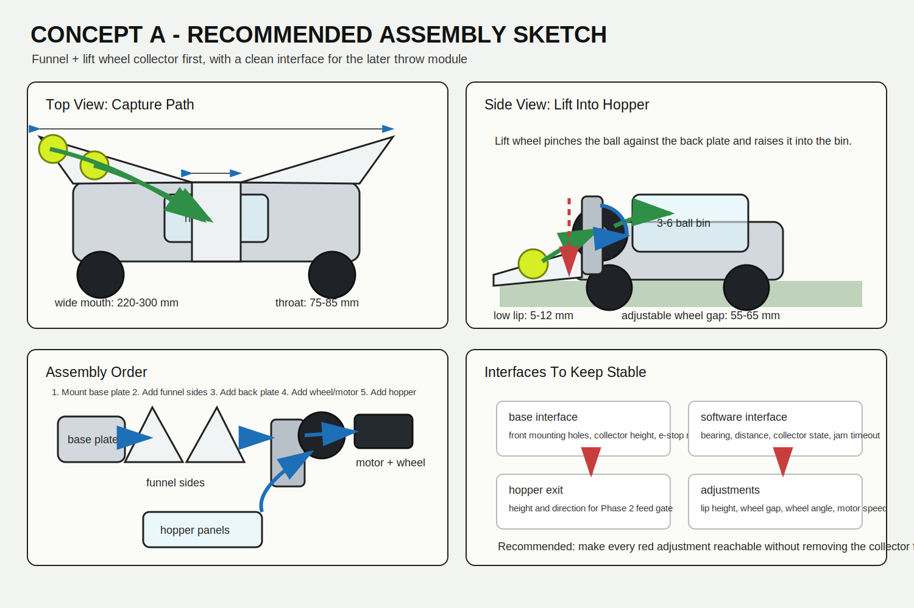

# Concept A: Funnel + Lift Wheel Plan

Last checked: 2026-05-16

This document turns Concept A into a two-phase build plan:

1. **Collect MVP**: find, approach, capture, and store tennis balls.
2. **Throw Phase 2**: add controlled feeding and a dual-flywheel launcher.

Costs are rough prototype estimates and exclude shipping, VAT/import duties, local reseller markups, spare parts, machining, 3D printing, and failed experiments.

## Goal

Build the simplest useful version of the tennis robot architecture:

```text
camera/depth perception -> base alignment -> front funnel -> lift wheel -> small hopper
```

Then extend the same architecture:

```text
small hopper -> feed gate -> dual flywheels -> short guarded launch barrel
```

The important decision is to keep collection and throwing modular. The first machine should prove that the base can locate and collect balls reliably before we add high-energy launch hardware.

## Phase 1: Collect MVP

### Recommended Assembly Sketch



Assembly intent:

```text
base front plate
  -> left/right funnel side plates
  -> fixed or adjustable back plate
  -> lift wheel + motor bracket
  -> small transparent hopper/bin
  -> optional ball-present sensor at throat or hopper entry
```

Keep these four adjustments reachable without removing the collector from the robot:

- bottom lip height
- funnel side angle
- lift wheel gap
- lift wheel angle/speed

The preferred first build is not a sealed beautiful mechanism. It is a tunable rig that can tell us what geometry actually works on a court-like surface.

### Scope

The Collect MVP should do one job well:

1. detect one visible tennis ball
2. estimate `bearing_rad` and `distance_m`
3. rotate/drive the base toward the ball
4. slow down near the ball
5. guide the ball into a front funnel
6. lift or pinch the ball into a small hopper/bin
7. confirm collection by sensor, camera state, or simple timeout

### Use The Base Capabilities

The current simulation already gives us the right control signals for a first collector:

| Base capability | Current source | How it helps collection |
|---|---|---|
| RGB tennis ball detection | `controllers/ball_detector/perception.py` | Finds the largest ball-colored target in the camera image. |
| Bearing estimate | `bearing_rad` from `estimate_ball_observation()` | Lets the base center the ball before pickup. |
| Rough distance estimate | `distance_m` from apparent ball diameter | Lets the base switch from approach to slow capture. |
| Differential drive control | left/right wheel motor velocity | Allows `scan -> align -> approach -> capture` behavior without a steering mechanism. |
| Telemetry | `robot.vision.ball.*`, `robot.control.loop.duration` | Helps tune detection stability, approach speed, and capture behavior. |

For the physical robot, the base should expose the same logical contract:

```text
ball_observation:
  visible: bool
  bearing_rad: float
  distance_m: float
  confidence: float

base_command:
  linear_speed_m_s: float
  angular_speed_rad_s: float

collector_command:
  lift_wheel_speed: float
  intake_enabled: bool
```

### Mechanical Concept

The front module is intentionally simple:

```text
wide low funnel -> centered throat -> rubber lift wheel/roller -> ball shelf/hopper
```

Suggested starting dimensions:

| Feature | Starting target | Why |
|---|---:|---|
| Funnel mouth width | 220-300 mm | Forgives approach error and bearing noise. |
| Throat width | 75-85 mm | Centers a 65.4-68.6 mm tennis ball without jamming. |
| Bottom lip height | 5-12 mm | Low enough to catch the ball, high enough to avoid scraping. |
| Lift wheel diameter | 60-100 mm | Easy to source or print; enough contact patch. |
| Lift wheel gap to back plate | 55-65 mm adjustable | Needs tuning for tennis ball fuzz and compression. |
| Hopper capacity | 3-6 balls | Enough for MVP without complicating sorting. |

The first prototype should have adjustable slots for funnel height, wheel gap, and wheel angle. Adjustment matters more than perfect CAD on the first pass.

### Phase 1 Bill Of Materials

| Priority | Component | Qty | Est. unit cost | Est. subtotal | Notes |
|---|---:|---:|---:|---:|---|
| Required | Funnel side plates, PETG/ABS print or 2-3 mm plastic sheet | 1 set | US $10-$40 | US $10-$40 | Can be 3D printed or cut from sheet plastic. |
| Required | Rubber lift wheel / compliant roller, 60-100 mm | 1 | US $10-$35 | US $10-$35 | Prefer soft rubber or TPU over hard plastic. |
| Required | DC gear motor for lift wheel | 1 | US $15-$50 | US $15-$50 | Start around 100-300 RPM, enough torque to pinch a ball. |
| Required | Motor driver for collector motor | 1 | US $10-$30 | US $10-$30 | Small H-bridge is enough unless using a large motor. |
| Required | Bearings, shaft, hubs/couplers | 1 set | US $15-$45 | US $15-$45 | Make the wheel easy to remove. |
| Required | Brackets, fasteners, inserts, standoffs | 1 set | US $20-$60 | US $20-$60 | Expect iteration here. |
| Required | Small hopper/bin panels | 1 | US $10-$35 | US $10-$35 | Transparent plastic is useful for debugging. |
| Recommended | Ball-present sensor at hopper throat | 1 | US $3-$15 | US $3-$15 | IR break beam, microswitch, or ToF sensor. |
| Recommended | Emergency stop switch | 1 | US $10-$30 | US $10-$30 | Required before real moving tests. |
| Optional | 100 mm smooth tube/duct section for later feed path tests | 1 | US $8-$25 | US $8-$25 | Good clearance for tennis balls; avoid tight bends. |

Estimated Phase 1 collector module total:

- **Lean bench prototype**: US $80-$150
- **Mobile-ready collector MVP**: US $150-$280
- **With base electronics already available**: no extra perception cost
- **With OAK-D S2 camera added**: add about US $350-$380 minimum from the hardware list

### Phase 1 Acceptance Criteria

The Collect MVP is successful when it can:

| Test | Target |
|---|---|
| Center approach | Ball enters the funnel from 1.5-2.0 m away with less than 2 approach corrections. |
| Offset approach | Ball still collects when initial alignment is off by about 100 mm. |
| Slow capture | Base slows before contact and does not push the ball away. |
| Lift reliability | 8 of 10 balls move from floor to hopper on flat court-like surface. |
| Jam recovery | A stuck ball can be cleared without disassembling the whole front module. |
| Telemetry/debug | Logs or console output show detection, bearing, distance, and collector state. |

### Phase 1 Software Tasks

| Task | Output |
|---|---|
| Add behavior states | `scan`, `align`, `approach`, `capture`, `reverse_clear`, `collected`. |
| Add near-ball stop distance | Use `distance_m` threshold before entering capture speed. |
| Add collector command abstraction | Keep lift wheel control separate from drive control. |
| Add simulated collection event | In Webots, mark a ball as collected when it reaches the intake zone. |
| Add telemetry fields | Collector state, collection attempts, successful captures, jam timeout. |

## Phase 2: Throw

### Scope

Phase 2 adds a launcher only after collection is repeatable. The launcher should be a rear/top module so it does not disturb the front intake.

```text
hopper -> metering/feed gate -> dual counter-rotating flywheels -> short guarded barrel
```

This should start as a bench module before it is mounted on the mobile base.

### Phase 2 Bill Of Materials

| Priority | Component | Qty | Est. unit cost | Est. subtotal | Notes |
|---|---:|---:|---:|---:|---|
| Required | Throwing wheels or high-friction flywheels | 2 | US $40-$130 | US $80-$260 | Tennis machine replacement wheels are convenient but not cheap. |
| Required | High-speed DC/BLDC launch motors | 2 | US $30-$100 | US $60-$200 | Final choice depends on target ball speed. |
| Required | Motor drivers / ESCs for launch motors | 2 | US $20-$80 | US $40-$160 | Must match motor type and current draw. |
| Required | Feed gate servo or small geared motor | 1 | US $10-$40 | US $10-$40 | Releases one ball at a time. |
| Required | Short launch barrel / guarded guide | 1 | US $20-$80 | US $20-$80 | Guide, not a pressure tube. Keep fingers away from wheels. |
| Required | Launcher frame, guards, fasteners | 1 set | US $50-$150 | US $50-$150 | Guarding is part of the design, not an add-on. |
| Required | Battery/regulator upgrade | 1 set | US $60-$200 | US $60-$200 | Launch motors will dominate power budget. |
| Required | Safety interlock / arming switch | 1 | US $10-$40 | US $10-$40 | Needed before spin-up tests. |
| Recommended | RPM sensors | 2 | US $5-$25 | US $10-$50 | Needed for repeatable throws. |
| Optional | Pan/tilt aim adjustment | 1 set | US $40-$150 | US $40-$150 | Defer unless fixed-angle launch is too limiting. |

Estimated Phase 2 launcher module total:

- **Bench launcher only**: US $330-$650
- **Mobile-mounted launcher with power and safety**: US $450-$900

### Phase 2 Acceptance Criteria

| Test | Target |
|---|---|
| Single-ball feed | One ball enters flywheels per feed command. |
| Spin-up stability | Wheel speed reaches target before feed gate opens. |
| Repeatable launch | Ball exits within a consistent direction/speed band. |
| Safe idle | Feed gate cannot open unless launcher is armed and wheels are ready. |
| Mechanical access | Wheels and feed path can be inspected and cleared safely. |

## Suggested Build Order

1. Simulate the collection state machine using current camera detection.
2. Print or cut the front funnel with adjustable throat and lip.
3. Bench-test lift wheel gap, speed, and ball compression by hand-feeding balls.
4. Mount the collector to the base and test slow approach.
5. Add ball-present sensing or collection confirmation.
6. Tune approach speed and capture speed using telemetry.
7. Freeze the collector interface: hopper exit height, ball spacing, and feed direction.
8. Build Phase 2 launcher as a separate bench module.
9. Add feed gate and safety interlocks.
10. Mount launcher only after bench throws are predictable.

## Current Cost Summary

| Build level | Estimated cost |
|---|---:|
| Collector bench MVP only | US $80-$150 |
| Collector mobile MVP, excluding base and camera | US $150-$280 |
| Collector MVP with OAK-D S2 camera path | US $500-$660 |
| Launcher bench module | US $330-$650 |
| Full Concept A prototype, excluding mobile base | US $480-$1,180 |
| Full Concept A with mobile base still to be selected | Add roughly US $250-$800 |

## Buying Strategy

Buy now for Collect MVP:

- funnel material / filament
- one compliant lift wheel or roller
- one DC gear motor
- one motor driver
- shaft/bearings/fasteners
- emergency stop switch
- simple ball-present sensor

Do not buy yet:

- launch motors
- launcher ESCs/drivers
- expensive throwing wheels
- large battery pack
- pan/tilt launcher hardware

The launcher depends on the hopper height, ball feed direction, and available power budget, so buying those parts too early risks locking us into the wrong geometry.

## Reference Price Anchors

These links are not final purchase recommendations; they anchor the rough cost ranges:

- OAK-D S2 camera and hardware docs: https://new-store.luxonis.com/products/oak-d-s2 and https://docs.luxonis.com/hardware/products/OAK-D%20S2
- Example 100 mm flexible duct pricing: https://www.airconcentre.co.uk/products/devola-100mm-pvc-flexible-ducting-3m-dvfd1003
- Example tennis-machine throwing wheel: https://www.tenniswarehouse.com.au/spinfire-throwing-wheel.html
- Example pair of Tennis Tutor Cube replacement wheels: https://www.clarkesports.net/product-page/tennis-tutor-cube-throwing-wheel-replacements-2
- BTS7960 motor-driver voltage/current class reference: https://www.handsontec.com/dataspecs/module/BTS7960%20Motor%20Driver.pdf

## Open Decisions

| Decision | Default for now |
|---|---|
| Camera | Use current simulated RGB first; physical build can use OAK-D S2. |
| Collector motor voltage | 12 V DC for simple sourcing. |
| Hopper capacity | Start with 3-6 balls. |
| Launch architecture | Dual flywheel, fixed angle at first. |
| Mobile base | Reuse current differential-drive concept; choose physical chassis after simulated approach behavior is stable. |
