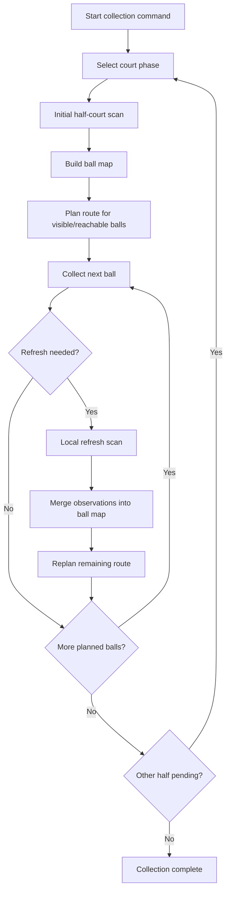
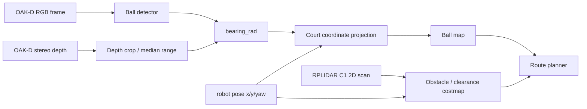
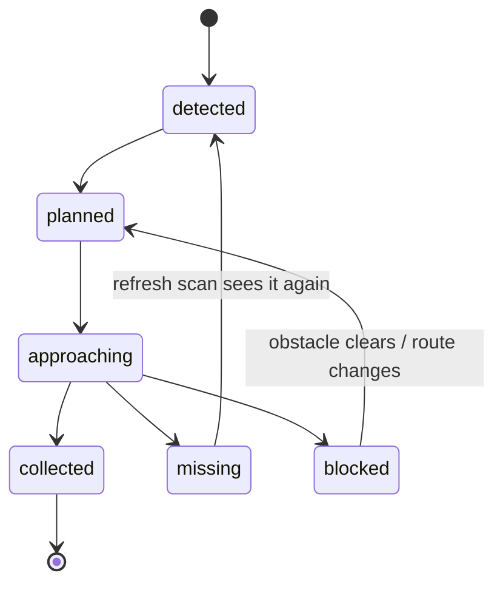
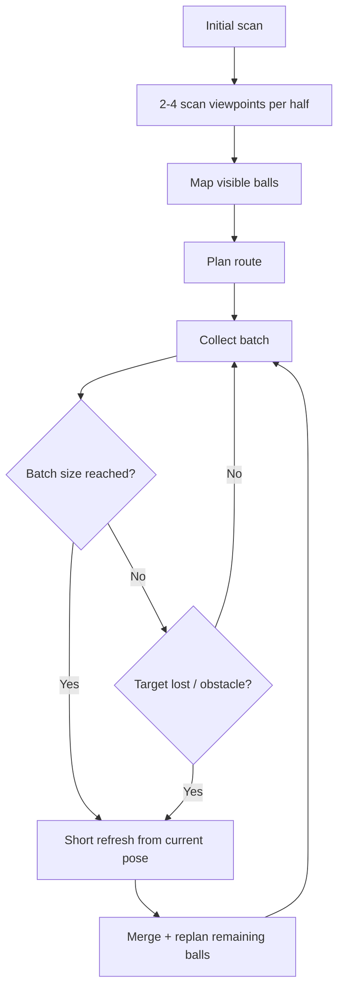

# Half-Court Scan And Route Overview

Last checked: 2026-05-27

This document defines the first mapping and route-planning approach for the tennis robot collector. The goal is to avoid reactive back-and-forth movement by scanning one half of the court, building a temporary ball map, planning a collection route, and refreshing that map during collection.

The intended first hardware path uses the OAK-D S2 as the primary ball-perception sensor and the RPLIDAR C1 as the navigation/costmap sensor:

- RGB image for tennis-ball detection.
- Stereo depth for distance.
- IMU as part of future pose estimation.
- RPLIDAR C1 2D scan for obstacles, net/fence/wall clearance, and route costmaps.
- Wheel encoders, when the mobile base is selected, for odometry.

## Strategy

Split collection into two independent court phases:

1. Collect all reachable balls on one side of the net.
2. Move/reset to the other side.
3. Repeat the same scan, route, refresh, and collect loop.

The first implementation does not require full SLAM. It uses court-bounded local mapping:

```text
camera detection + depth + robot pose -> ball position in court coordinates
LiDAR scan + robot pose -> obstacle/cost map in court coordinates
```

The ball map chooses what can be collected; the LiDAR costmap chooses how safely the robot can reach it.

## High-Level Flow



## Perception-To-Map Pipeline



The simulated code already has the core projection shape in `controllers/ball_detector/perception.py`:

```text
BallDetection -> BallObservation -> robot XY -> world/court XY
```

The physical robot should preserve this contract even if the detector changes from HSV thresholding to a neural model later.

## Ball Map State



Minimum fields for the first implementation:

| Field | Purpose |
|---|---|
| `id` | Stable temporary ball identity. |
| `x_m`, `y_m` | Court position estimate. |
| `confidence` | Detection reliability or freshness score. |
| `last_seen_s` | Helps age out stale detections. |
| `state` | `detected`, `planned`, `approaching`, `collected`, `missing`, or `blocked`. |
| `phase` | Court side / half-court ownership. |

## Route Selection

The first route planner can be greedy instead of a perfect TSP solver. It should choose the next reachable ball with the lowest weighted cost:

```text
cost = path_distance
     + turn_cost
     + stale_detection_penalty
     + obstacle_penalty
     + edge_penalty
     + lidar_clearance_penalty
     - confidence_bonus
```

With RPLIDAR C1 installed, `obstacle_penalty`, `edge_penalty`, and `lidar_clearance_penalty` should come from the 2D costmap instead of camera-only heuristics. The route should be recalculated after a refresh scan, after a blocked route, or after a missing ball.

## Sensor Roles

| Sensor | Main question | Algorithm output |
|---|---|---|
| OAK-D S2 | Where are the balls? | Ball detections, depth, bearing, ball map. |
| RPLIDAR C1 | Where can the robot move safely? | Occupancy/cost map, wall/net/fence clearance, obstacle inflation. |
| Encoders + IMU | Where is the robot now? | Odometry and pose prediction/correction. |

The LiDAR should not be used as the primary tennis-ball detector. Its value is safer navigation and better approach decisions, especially for balls near walls, fences, the net, bags, or people.

## Scan Policy



Recommended starting defaults:

| Parameter | Initial value |
|---|---:|
| Initial scan viewpoints per half | 2-4 |
| Refresh interval | Every 3-5 collected balls |
| Missing-ball retries | 2 |
| Minimum detection confidence | Start permissive, tighten after real camera tests |
| Replan trigger | Refresh scan, blocked path, target missing, safety stop |

## Realistic Ball Distribution

The simulator and Webots ball generator should not use a purely uniform scatter by default. In a physical court, more balls tend to settle near:

- the net, after short/failed returns and balls rolling inward;
- the back court or wall/fence behind the baseline;
- with fewer balls staying in the open middle of the court.

The first biased randomizer uses this approximate mix:

| Zone | Approx. share |
|---|---:|
| Near net | 46% |
| Back court / baseline wall side | 36% |
| Service-line / transition area | 12% |
| Uniform outliers | 6% |

This distribution is still deterministic by seed, but it makes route planning tests more realistic because the planner must handle clustered balls instead of evenly spaced targets.

## First Implementation Scope

For the first implementation in the browser route simulator:

1. Add a two-phase court mode.
2. Generate balls across both halves.
3. Plan phase A and phase B separately.
4. Add explicit phase scan and refresh scan events.
5. Keep telemetry for phases, scans, replans, distance, blocked balls, and collection order.
6. Add a LiDAR-costmap mode to compare camera-only planning against camera+RPLIDAR planning.

For benchmark validation:

1. Run 100 deterministic random scenarios with 40 balls each.
2. Measure average collection time, distance, collectable rate, replans, and scan events.
3. Estimate miss risk for balls close to net, wall/fence, or obstacles.
4. Compare realistic ball bias against uniform scatter.
5. Compare `rescan_every`, travel speed, safety buffer, and candidate-window settings.
6. Export per-decision candidate rows with `--training-out` for a future next-ball ranking model.

The first useful machine-learning dataset is a learning-to-rank table. Each planning decision writes one row per candidate ball:

```text
robot pose + ball pose + route/risk features -> selected
```

This lets a model learn the planner's current policy first. Later, physical-run outcomes can replace or augment the label with real success/failure and pickup time.

For the Webots/physical controller after that:

1. Publish detected balls in court coordinates.
2. Add a persistent ball map.
3. Feed the current map into a route planner.
4. Convert the selected next ball into the existing `scan -> align -> approach -> capture` state machine.

## Open Decisions

| Decision | Default for now |
|---|---|
| Side order | Start on the left/west half in simulation. |
| Net crossing | Treat halves as independent phases; do not plan through the net. |
| Full SLAM | Defer until court-line correction plus odometry is insufficient. |
| LiDAR | Use RPLIDAR C1 as recommended navigation/costmap sensor, complementary to OAK-D. |
| Perfect route solver | Defer; use greedy route with penalties and refresh scans. |
