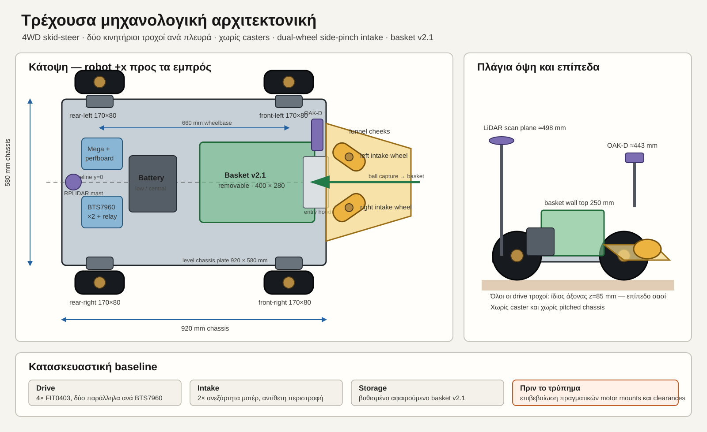

# Τρέχον σχέδιο chassis — 4WD και dual-wheel intake

Ημερομηνία baseline: 2026-08-16

Αυτό είναι το ενεργό μηχανολογικό layout του prototype. Αν υπάρχει διαφορά
με παλαιότερο Concept A, 2WD/caster σχέδιο ή cut list, υπερισχύει αυτό το
έγγραφο μαζί με το URDF και τα ενεργά mechanism specs.



## 1. Κλειδωμένη αρχιτεκτονική

- Επίπεδο chassis `920 × 580 mm`, χωρίς κλίση.
- Τέσσερις ίδιοι κινητήριοι τροχοί `170 × 80 mm`, δύο ανά πλευρά.
- 4WD skid-steer χωρίς caster.
- Wheelbase `660 mm`: άξονες drive στο `x=±330 mm`.
- Wheel centres στο `y=±350 mm`, άρα συνολικό εξωτερικό πλάτος περίπου
  `780 mm` μαζί με τα ελαστικά.
- Τέσσερα FIT0403, ένα ανά drive wheel. Στο πρώτο prototype τα δύο μοτέρ της
  κάθε πλευράς συνδέονται παράλληλα σε ένα BTS7960.
- Dual-wheel side-pinch intake μπροστά: δύο κάθετοι intake τροχοί, ένα μοτέρ
  ανά τροχό, αντίθετης φοράς.
- Βυθισμένο, αφαιρούμενο basket v2.1 στο κέντρο/μπροστά του chassis.
- Μπαταρία χαμηλά και πίσω από το basket, κοντά στον διαμήκη άξονα.

Οι αριθμητικές τιμές αναφοράς προέρχονται από
`ros2_ws/src/tennis_robot/urdf/tennis_robot.urdf.xacro`. Η γεωμετρία intake
και basket ορίζεται αντίστοιχα στα:

- `docs/mechanism/dual-wheel-intake-design-el.md`
- `docs/mechanism/basket-bin-redesign-spec-el.md`
- `cad/basket-bin-v2/params.scad`

## 2. Drive modules

Κάθε γωνία έχει αφαιρούμενο motor pod για FIT0403 και τροχό HPI Baja 5B:

```text
rear-left      x=-330 mm, y=+350 mm
rear-right     x=-330 mm, y=-350 mm
front-left     x=+330 mm, y=+350 mm
front-right    x=+330 mm, y=-350 mm
shaft height   z=85 mm από το έδαφος
```

Το `y=±350 mm` είναι το κέντρο του τροχού, όχι η άκρη του chassis. Οι τροχοί
είναι εξωτερικοί της πλάκας. Όλοι οι άξονες πρέπει να έχουν το ίδιο ύψος ώστε
να πατούν και οι τέσσερις τροχοί χωρίς να στρεβλώνεται η βάση.

Μη χρησιμοποιήσεις ακόμη το SVG ως drilling template. Πριν ανοίξουν τελικές
τρύπες M5, πρέπει να μετρηθούν πάνω στα πραγματικά `19-00037912` motor mounts:

- απόσταση και διάμετρος οπών,
- θέση shaft ως προς την επιφάνεια στήριξης,
- clearance του μοτέρ και του encoder connector,
- clearance του 12→24 mm wheel adapter και του ελαστικού.

## 3. Intake και basket interface

Η ροή της μπάλας είναι:

```text
wide funnel
  -> δύο intake wheels / side pinch
  -> ramp + receiving chute
  -> basket entry hood
  -> αφαιρούμενο basket v2.1
```

Το intake δεν είναι ο παλιός οριζόντιος wide roller. Οι δύο κύριοι intake
τροχοί έχουν κατακόρυφους άξονες, ακτίνα `60 mm`, ύψος `80 mm`, nominal gap
`56 mm`, nominal nip `x=540 mm` και tilt `35°` στο τρέχον URDF baseline.
Κάθε τροχός χρειάζεται ανεξάρτητο μοτέρ και ενδοτική πλευρική στήριξη.

Το basket έχει εσωτερικό `400 × 280 mm`, εκτείνεται περίπου από `x=20` έως
`x=420 mm` και αφαιρείται προς τα πάνω. Μην τοποθετηθεί μόνιμη τραβέρσα πάνω
από το άνοιγμα αφαίρεσης. Το entry hood μένει στο chassis και ανοίγει ή
αφαιρείται πριν σηκωθεί το basket.

## 4. Electronics και καλώδια

- Mega/perfboard και logic connectors σε προστατευμένο, προσβάσιμο tray.
- BTS7960 και 40A relay εκτός κλειστού κουτιού, με αερισμό.
- High-current καλώδια εκτός perfboard, σύμφωνα με
  `docs/hardware/motion-perfboard-wiring-el.md`.
- Δύο ανεξάρτητα cable looms drive, ένα ανά πλευρά, ώστε τα εμπρός/πίσω μοτέρ
  να αποσυνδέονται χωρίς να λυθεί όλο το robot.
- Encoder και sensor καλώδια μακριά από `M+`/`M-` και relay wiring.
- Πρόβλεψη service loop για τα τέσσερα drive encoders και τα δύο intake motors.

## 5. Τι μπορεί να κοπεί τώρα

Μπορεί να σημαδευτεί και να κοπεί μόνο το εξωτερικό περίγραμμα `920 × 580 mm`,
εφόσον έχει επιλεγεί οριστικά το υλικό/πάχος. Το sim χρησιμοποιεί πλάκα
`14 mm`. Η παλιότερη λίστα `760 × 430 × 21 mm` έχει αρχειοθετηθεί και δεν
είναι έγκυρη για κατασκευή.

Πριν από εσωτερικά ανοίγματα ή τρύπες απαιτούνται πραγματικές μετρήσεις για:

1. τα τέσσερα motor mounts,
2. το βυθισμένο basket και το flange του,
3. τα intake carriages και το funnel,
4. battery straps και έξοδο μπαταρίας,
5. Mega/perfboard, BTS7960, relay και fuse holders,
6. lidar mast και OAK-D bracket.

Η σειρά κατασκευής είναι: dry-fit drive pods → έλεγχος τεσσάρων επαφών στο
έδαφος → basket opening → intake alignment → battery/electronics → sensors.

## 6. Αρχειοθετημένα σχέδια

Τα 2WD/caster, pitched-chassis, single-wide-roller και 760×430 σχέδια βρίσκονται
στο `docs/archive/mechanical/`. Είναι χρήσιμα μόνο για ιστορικό αποφάσεων και
δεν πρέπει να χρησιμοποιούνται για κοπή, διάτρηση ή παραγγελία εξαρτημάτων.
