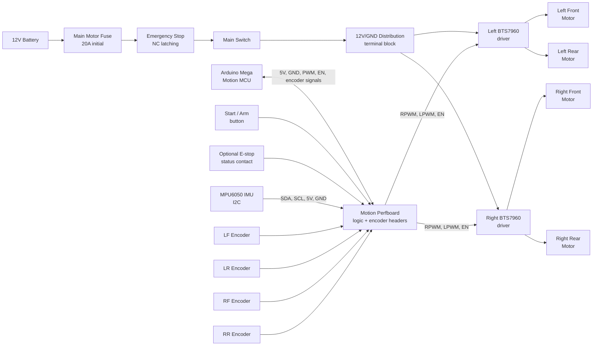

# Motion Perfboard Wiring Reference

Αυτό το έγγραφο περιγράφει την πλακέτα perfboard για το πρώτο 4WD motion
prototype του tennis robot.

Στόχος: να φτιαχτεί μια καθαρή logic/distribution πλακέτα για:

- Arduino Mega 2560 Rev3 ως motion MCU
- 2x BTS7960 / IBT-2 motor drivers, ένας ανά πλευρά
- 4x DC geared motors με encoder, δύο μοτέρ παράλληλα ανά πλευρά
- encoder headers για odometry/diagnostics
- MPU6050 IMU για yaw-rate/acceleration diagnostics μέσω I2C
- κοινό logic ground, 5V encoder rail και καθαρά control signals

## 0. Τι Είναι Πρακτικά Η Πλακέτα

Η σωστή ιδέα είναι **carrier / breakout perfboard**, όχι power board. Το Mega
μένει αφαιρούμενο και η πλακέτα προσφέρει υποδοχές για drivers, encoders, IMU και
κουμπιά.

Με την υπάρχουσα perfboard 80x120 mm προτείνεται:

- το Mega να στερεωθεί με M3 αποστάτες πάνω από την πλακέτα ή δίπλα της,
- το J1 να συνδεθεί στα Mega pins με κοντό, αριθμημένο harness,
- να μη συγκολληθεί το Mega απευθείας στην perfboard,
- να μείνει προσβάσιμο το USB και το reset,
- να υπάρχουν θηλυκά headers/βύσματα ώστε drivers και αισθητήρες να αλλάζουν.

Τα headers του Mega δεν σχηματίζουν απλό ορθογώνιο πλέγμα perfboard. Για να
κουμπώνει σαν Arduino shield χρειάζονται σωστά τοποθετημένα long male/stackable
headers και ακριβές template. Για το πρώτο prototype το ξεχωριστό J1 harness
είναι πιο εύκολο στην κατασκευή και επισκευή.

## Διαγράμματα

Επισκόπηση συστήματος (power domain εκτός perfboard vs logic domain):


Pinout των headers J1-J9 — πώς ενώνεται κάθε component στην perfboard:


## 1. Σημαντικό Όριο Της Perfboard

Η perfboard **δεν μεταφέρει ρεύμα μοτέρ**.

Πάνω στην perfboard περνάνε μόνο:

```text
Arduino Mega control signals
BTS7960 logic pins
encoder signals
5V encoder supply
common GND reference
```

Το 12V high-current κομμάτι περνάει εκτός perfboard:

```text
Battery +
  -> main motor fuse
  -> automotive relay contact 30
relay contact 87
  -> power distribution / terminal block
  -> BTS7960 B+ terminals

Battery -
  -> power distribution / terminal block
  -> BTS7960 B- terminals
  -> Arduino/perfboard GND reference
```

Μη βάλεις ποτέ τα ρεύματα μοτέρ μέσα από λεπτές perfboard διαδρομές.

## 2. Safety Chain: Fuse, Start, E-Stop

Η πρώτη κίνηση του robot πρέπει να έχει φυσική ασφάλεια, όχι μόνο software stop.

### High-current motor power chain με το υπάρχον E-stop 10A

```text
Battery +
  -> main motor fuse, 20A αρχικά
  -> automotive relay contact 30
automotive relay contact 87 (όχι 87a)
  -> distribution block
  -> Left BTS7960 B+
  -> Right BTS7960 B+

Battery -
  -> distribution block
  -> Left BTS7960 B-
  -> Right BTS7960 B-
```

Το E-stop `39-00013660` είναι 10A, ενώ η motor fuse είναι 20A. Άρα **δεν**
περνάμε το ρεύμα των μοτέρ από το E-stop. Το NC contact του οδηγεί μόνο το πηνίο
ενός relay αυτοκινήτου 12V/40A:

```text
Electronics fused +12V
  -> main toggle switch
  -> E-stop NC contact
  -> relay coil 86
relay coil 85
  -> Battery GND
```

Έτσι, πάτημα E-stop ανοίγει το NC, πέφτει το relay και το contact 30-87 κόβει
φυσικά το +12V προς τα δύο `B+`. Αν η βάση του relay έχει ενσωματωμένη δίοδο,
τηρείται υποχρεωτικά η πολικότητα 86=+12V και 85=GND. Μην χρησιμοποιήσεις το
87a. Προαιρετικά βάλε flyback diode παράλληλα στο πηνίο (κάθοδος στο 86,
άνοδος στο 85) αν δεν υπάρχει ήδη.

Προτεινόμενες αρχικές ασφάλειες:

| Fuse | Προτεινόμενη τιμή | Κόβει | Σημείωση |
|---|---:|---|---|
| Main motor fuse | 20A αρχικά, 25A μόνο αν χρειαστεί | Drive motor branch | Να είναι κοντά στη μπαταρία |
| Electronics fuse | 3A-5A | Arduino/SBC/sensors branch | Ξεχωριστή από τα μοτέρ |
| Accessory 12V fuse | 5A-10A | Buck-boost/accessories | Μόνο αν υπάρχει accessory rail |

Η τιμή της main fuse θα οριστικοποιηθεί μετά από μέτρηση ρεύματος. Ξεκινάμε
συντηρητικά, γιατί στο πρώτο prototype θέλουμε να βρούμε λάθη καλωδίωσης πριν
γίνουν ακριβά.

### Emergency stop

Το emergency stop πρέπει να κόβει **φυσικά** την τροφοδοσία των motor drivers.

```text
E-stop pressed
  -> no +12V at BTS7960 B+
  -> motors cannot move even if Arduino/PWM fails
```

Προτίμηση:

- normally-closed contact,
- latching mushroom button,
- rated για DC current πάνω από την επιλεγμένη ασφάλεια ή να οδηγεί relay/contactor
  που έχει το κατάλληλο DC rating.

Μην βασιστείς μόνο σε κουμπί που πάει σε Arduino input για emergency stop.
Μπορούμε να το διαβάζουμε και από το Arduino για status, αλλά η πραγματική
ασφάλεια πρέπει να κόβει το power path.

### Start / Arm button

Το start button δεν είναι emergency stop. Είναι logic input προς το Arduino Mega
για να οπλίζει την κίνηση μετά από reset ή μετά από E-stop release.

Προτεινόμενη λογική:

```text
Power on
  -> Arduino boots DISARMED
  -> BTS7960 enables LOW
  -> user presses START/ARM
  -> Arduino checks that E-stop status is clear
  -> Arduino enables BTS7960
  -> motors remain stopped until a fresh host command arrives

E-stop pressed
  -> Arduino disables BTS7960
  -> motor power is also cut by E-stop chain

Command timeout
  -> Arduino writes zero PWM immediately
  -> driver remains armed, but a fresh command is required for motion
```

Προτεινόμενο start button wiring:

| Start button | Arduino Mega | Σκοπός |
|---|---|---|
| One side | D32 | `START_ARM` input |
| Other side | `LOGIC_GND` | Active-low button |

Στο firmware:

```cpp
pinMode(32, INPUT_PULLUP);
```

Με αυτό:

```text
HIGH = not pressed
LOW  = pressed
```

Το firmware κάνει debounce και οπλίζει μόνο από `DISARMED`. Το κουμπί δεν
ξεκινά κίνηση μόνο του και δεν αντικαθιστά το USB serial heartbeat.

### Optional E-stop status input

Χρησιμοποίησε το δεύτερο, NO contact του 1NO+1NC E-stop για status:

| E-stop auxiliary contact | Arduino Mega | Σκοπός |
|---|---|---|
| One side | D33 | `ESTOP_STATUS` input |
| Other side | `LOGIC_GND` | Active-low status |

Αυτό είναι μόνο telemetry/status. Δεν αντικαθιστά το φυσικό κόψιμο του 12V motor
power.

Σε αυτό το wiring το NO κλείνει όταν πατηθεί το E-stop, άρα το D33 γίνεται LOW
και σημαίνει `TRIPPED`. Πριν κολλήσεις, επιβεβαίωσε με continuity tester ποιο
ζεύγος είναι NC και ποιο NO, γιατί οι αριθμοί ακροδεκτών διαφέρουν ανά μοντέλο.

## 3. System Topology

```text
Arduino Mega 2560
    |
    | PWM / enable signals
    v
Motion perfboard
    |
    +--> Left BTS7960  -> left front motor + left rear motor
    |
    +--> Right BTS7960 -> right front motor + right rear motor
    |
    +<-- 4x encoder A/B signals
```

Για το πρώτο prototype, κάθε BTS7960 οδηγεί δύο μοτέρ παράλληλα στην ίδια πλευρά.
Αν δούμε υπερβολικό ρεύμα, ζέσταμα ή άνισο τράβηγμα, προσθέτουμε άλλα 2 BTS7960
ώστε να πάμε σε ένα driver ανά μοτέρ.

### Wiring Diagram



Στο διάγραμμα, η επάνω διαδρομή είναι το high-current motor power. Η κάτω
διαδρομή είναι logic/control/encoder και περνάει από την perfboard.

## 4. Arduino Mega Pin Map

### BTS7960 Control Pins

| Arduino Mega | Perfboard net | BTS7960 pin | Σκοπός |
|---|---|---|---|
| D5 PWM | `LEFT_RPWM` | Left driver `RPWM` | Αριστερή πλευρά, φορά A |
| D6 PWM | `LEFT_LPWM` | Left driver `LPWM` | Αριστερή πλευρά, φορά B |
| D30 | `LEFT_EN` | Left driver `R_EN` + `L_EN` | Enable αριστερού driver |
| D9 PWM | `RIGHT_RPWM` | Right driver `RPWM` | Δεξιά πλευρά, φορά A |
| D10 PWM | `RIGHT_LPWM` | Right driver `LPWM` | Δεξιά πλευρά, φορά B |
| D31 | `RIGHT_EN` | Right driver `R_EN` + `L_EN` | Enable δεξιού driver |
| 5V | `LOGIC_5V` | Both drivers `VCC` | Logic τροφοδοσία |
| GND | `LOGIC_GND` | Both drivers `GND` | Κοινή γείωση |

Σημείωση: στα περισσότερα BTS7960 modules τα `R_EN` και `L_EN` μπορούν να
δεθούν μαζί και να οδηγούνται από ένα enable pin ανά driver. Αν το συγκεκριμένο
module απαιτήσει ξεχωριστό έλεγχο, κρατάμε χώρο στην perfboard για να τα
χωρίσουμε αργότερα.

### Encoder Pins

| Motor | Encoder A | Encoder B | Encoder VCC | Encoder GND |
|---|---|---|---|---|
| Left front | D2 interrupt | D22 | `ENC_5V` | `LOGIC_GND` |
| Left rear | D3 interrupt | D23 | `ENC_5V` | `LOGIC_GND` |
| Right front | D18 interrupt | D24 | `ENC_5V` | `LOGIC_GND` |
| Right rear | D19 interrupt | D25 | `ENC_5V` | `LOGIC_GND` |

### Safety / User Inputs

| Arduino Mega | Net | Χρήση |
|---|---|---|
| D32 | `START_ARM` | Start/arm button, active-low with `INPUT_PULLUP` |
| D33 | `ESTOP_STATUS` | Optional E-stop auxiliary status, active-low with `INPUT_PULLUP` |
| D34 | `ARMED_LED` | LED ένδειξης armed, output μέσω αντίστασης 470Ω |

### MPU6050 IMU / I2C

| Arduino Mega | Net | MPU6050 pin | Χρήση |
|---|---|---|---|
| D20 / SDA | `I2C_SDA` | `SDA` | I2C data |
| D21 / SCL | `I2C_SCL` | `SCL` | I2C clock |
| 5V or 3.3V | `IMU_VCC` | `VCC` | Τροφοδοσία module |
| GND | `LOGIC_GND` | `GND` | Κοινή γείωση |

Τα περισσότερα MPU6050 breakout modules δέχονται 5V επειδή έχουν regulator,
αλλά αυτό πρέπει να επιβεβαιωθεί στο συγκεκριμένο module. Αν το module γράφει
μόνο 3.3V, χρησιμοποίησε 3.3V και έλεγξε αν χρειάζεται level shifting στο I2C.

Στο prototype το MPU6050 χρησιμοποιείται για yaw-rate/acceleration sanity checks
και βελτίωση odometry diagnostics. Δεν το αντιμετωπίζουμε ως απόλυτη πυξίδα.

Για αρχικό bring-up μετράμε interrupt στο `A` και διαβάζουμε το `B` για φορά.
Αργότερα, αν θέλουμε πλήρες quadrature decoding και στα 8 edges, μπορούμε να
περάσουμε σε Teensy/ESP32 ή σε pin-change interrupt library.

## 5. Perfboard Headers

### Header J1 - Arduino Mega Control

| Pin | Net | Προς |
|---:|---|---|
| 1 | `LEFT_RPWM` | Mega D5 |
| 2 | `LEFT_LPWM` | Mega D6 |
| 3 | `RIGHT_RPWM` | Mega D9 |
| 4 | `RIGHT_LPWM` | Mega D10 |
| 5 | `LEFT_EN` | Mega D30 |
| 6 | `RIGHT_EN` | Mega D31 |
| 7 | `START_ARM` | Mega D32 |
| 8 | `ESTOP_STATUS` | Mega D33, optional |
| 9 | `ARMED_LED` | Mega D34 |
| 10 | `I2C_SDA` | Mega D20 / SDA |
| 11 | `I2C_SCL` | Mega D21 / SCL |
| 12 | `LOGIC_5V` | Mega 5V |
| 13 | `LOGIC_GND` | Mega GND |

### Header J2 - Left BTS7960 Logic

| Pin | Net | BTS7960 pin |
|---:|---|---|
| 1 | `LEFT_RPWM` | `RPWM` |
| 2 | `LEFT_LPWM` | `LPWM` |
| 3 | `LEFT_EN` | `R_EN` |
| 4 | `LEFT_EN` | `L_EN` |
| 5 | `LOGIC_5V` | `VCC` |
| 6 | `LOGIC_GND` | `GND` |

### Header J3 - Right BTS7960 Logic

| Pin | Net | BTS7960 pin |
|---:|---|---|
| 1 | `RIGHT_RPWM` | `RPWM` |
| 2 | `RIGHT_LPWM` | `LPWM` |
| 3 | `RIGHT_EN` | `R_EN` |
| 4 | `RIGHT_EN` | `L_EN` |
| 5 | `LOGIC_5V` | `VCC` |
| 6 | `LOGIC_GND` | `GND` |

### Headers J4-J7 - Motor Encoders

Χρησιμοποίησε 4-pin headers, ένα ανά motor encoder:

| Header | Motor | Pin 1 | Pin 2 | Pin 3 | Pin 4 |
|---|---|---|---|---|---|
| J4 | Left front encoder | `ENC_5V` | `LOGIC_GND` | D2 / `LF_ENC_A` | D22 / `LF_ENC_B` |
| J5 | Left rear encoder | `ENC_5V` | `LOGIC_GND` | D3 / `LR_ENC_A` | D23 / `LR_ENC_B` |
| J6 | Right front encoder | `ENC_5V` | `LOGIC_GND` | D18 / `RF_ENC_A` | D24 / `RF_ENC_B` |
| J7 | Right rear encoder | `ENC_5V` | `LOGIC_GND` | D19 / `RR_ENC_A` | D25 / `RR_ENC_B` |

Τα χρώματα καλωδίων των encoders να επιβεβαιωθούν από το datasheet/label του
μοτέρ πριν κολληθούν. Μην υποθέσεις ότι είναι ίδια με άλλο motor model.

### Header J8 - User Controls

| Pin | Net | Σύνδεση |
|---:|---|---|
| 1 | `START_ARM` | Start/arm button side A |
| 2 | `LOGIC_GND` | Start/arm button side B |
| 3 | `ESTOP_STATUS` | Optional E-stop auxiliary side A |
| 4 | `LOGIC_GND` | Optional E-stop auxiliary side B |
| 5 | `ARMED_LED` | Άνοδος LED μέσω αντίστασης 470Ω |
| 6 | `LOGIC_GND` | Κάθοδος LED |

Αν το φωτιζόμενο κουμπί έχει ενσωματωμένη αντίσταση για **12V**, μην οδηγήσεις
το LED του απευθείας από D34· χρησιμοποίησε ξεχωριστό 5V LED ή transistor driver
σύμφωνα με το datasheet του κουμπιού.

### Header J9 - MPU6050 IMU

| Pin | Net | MPU6050 pin |
|---:|---|---|
| 1 | `IMU_VCC` | `VCC` |
| 2 | `LOGIC_GND` | `GND` |
| 3 | `I2C_SDA` | `SDA` |
| 4 | `I2C_SCL` | `SCL` |

Το `XDA`, `XCL`, `AD0` και `INT` του MPU6050 μένουν ασύνδετα στο πρώτο bring-up,
εκτός αν η βιβλιοθήκη/firmware που θα χρησιμοποιήσουμε ζητήσει interrupt pin.

## 6. Motor Power Wiring

Η ισχύς δεν περνάει από την perfboard.

### Left Side Motors

| Left BTS7960 terminal | Σύνδεση |
|---|---|
| `B+` | +12V από distribution block, μετά από fuse και relay contact 87 |
| `B-` | Battery GND / power ground |
| `M+` | Left front motor lead A + left rear motor lead A |
| `M-` | Left front motor lead B + left rear motor lead B |

### Right Side Motors

| Right BTS7960 terminal | Σύνδεση |
|---|---|
| `B+` | +12V από distribution block, μετά από fuse και relay contact 87 |
| `B-` | Battery GND / power ground |
| `M+` | Right front motor lead A + right rear motor lead A |
| `M-` | Right front motor lead B + right rear motor lead B |

Αν μία πλευρά γυρίζει ανάποδα, διόρθωσε πρώτα στο software. Αν χρειαστεί,
αντάλλαξε `M+`/`M-` στη συγκεκριμένη πλευρά. Μην αλλάξεις τα encoder wires για
να διορθώσεις φορά μοτέρ.

## 7. Grounding Plan

Όλα πρέπει να έχουν κοινή αναφορά γείωσης:

```text
Battery GND
  -> BTS7960 B-
  -> BTS7960 logic GND
  -> perfboard LOGIC_GND
  -> Arduino Mega GND
  -> encoder GND
```

Χωρίς κοινό ground, τα PWM και encoder signals μπορεί να φαίνονται τυχαία ή να
μην λειτουργούν καθόλου.

## 8. 5V Plan

Για το πρώτο prototype:

```text
Arduino Mega 5V -> perfboard LOGIC_5V / ENC_5V
```

Αυτό τροφοδοτεί:

- BTS7960 logic `VCC`
- encoder `VCC`

Μη χρησιμοποιήσεις το 5V rail για μοτέρ, relay coils ή άλλα φορτία. Αν αργότερα
μπουν πολλοί αισθητήρες, βάλε ξεχωριστό 5V buck converter και κράτα κοινό GND.

## 9. Recommended Perfboard Layout

Πρακτική διάταξη:

```text
[J1 harness προς Mega]        [J2 Left BTS7960 logic]   [J3 Right BTS7960 logic]

[J4 LF encoder] [J5 LR encoder] [J6 RF encoder] [J7 RR encoder]

[J8 controls/LED]             [J9 MPU6050]

5V rail along top
GND rail along bottom
Signal wires short and labelled
```

### Σειρά κατασκευής

1. Βάλε προσωρινά όλα τα headers και το Mega για να ελέγξεις χώρο, USB και reset.
2. Σημάδεψε Pin 1 σε J1-J9 και γράψε `5V`, `GND`, `A`, `B`, `RPWM`, `LPWM` πάνω
   και κάτω από την πλακέτα.
3. Κόλλησε πρώτα μόνο τις δύο logic μπάρες 5V/GND. Δεν συνδέονται ποτέ με +12V.
4. Κόλλησε J1, J2, J3 και έλεγξε κάθε σύνδεση με continuity tester.
5. Κόλλησε J4-J7, μετά J8/J9, ελέγχοντας ότι δεν υπάρχει short 5V-GND.
6. Πρόσθεσε 100nF κεραμικό κοντά σε κάθε encoder header μεταξύ 5V-GND και
   100-470µF electrolytic στην είσοδο της logic rail, με σωστή πολικότητα.
7. Στερέωσε τα καλώδια με strain relief. Τα encoder A/B να περνούν μακριά από
   τα M+/M- και, όπου γίνεται, συνεστραμμένα με GND.
8. Σύνδεσε το J1 harness pin-προς-pin και κάνε δεύτερο continuity check πριν
   μπει USB ή μπαταρία.

Μην τροφοδοτείς ταυτόχρονα το Mega από USB και από εξωτερικό 5V στο pin `5V`.
Στο πρώτο bring-up τροφοδότησέ το μόνο από USB· το 5V του Mega τροφοδοτεί τη
μικρή logic rail (BTS7960 logic + encoders), όχι Pi, relay ή μοτέρ.

Πρότεινε χρώματα:

| Χρώμα | Χρήση |
|---|---|
| Κόκκινο | `LOGIC_5V` / `ENC_5V` |
| Μαύρο | `LOGIC_GND` |
| Κίτρινο | PWM signals |
| Πορτοκαλί | Enable signals |
| Μπλε/Πράσινο | Encoder A/B |
| Λευκό | Start/E-stop status inputs |
| Μωβ | I2C SDA/SCL προς MPU6050 |

## 10. First Power-On Checklist

Πριν συνδέσεις τα μοτέρ στους drivers:

1. Μέτρα `LOGIC_5V` προς `LOGIC_GND`: πρέπει να είναι περίπου 5V.
2. Μέτρα συνέχεια `Arduino GND` προς `BTS7960 logic GND`: πρέπει να είναι σχεδόν 0 ohm.
3. Επιβεβαίωσε ότι δεν υπάρχει 12V πάνω στην perfboard.
4. Επιβεβαίωσε ότι κάθε encoder παίρνει 5V και GND στη σωστή πολικότητα.
5. Επιβεβαίωσε ότι το MPU6050 VCC ταιριάζει με το module: 5V tolerant ή 3.3V only.
6. Χωρίς Mega συνδεδεμένο, επιβεβαίωσε ότι το E-stop ρίχνει το relay και κόβει
   το +12V και στα δύο BTS7960 `B+`.
7. Επιβεβαίωσε ότι το main fuse είναι κοντά στη μπαταρία.
8. Επιβεβαίωσε ότι START είναι `HIGH` idle/`LOW` pressed και ESTOP_STATUS είναι
   `HIGH` released/`LOW` pressed.
9. Σήκωσε `LEFT_EN` / `RIGHT_EN` μόνο από software, όχι με μόνιμο jumper στο 5V.
10. Δοκίμασε πρώτα encoder hand test, γυρίζοντας κάθε τροχό με το χέρι.
11. Δοκίμασε MPU6050 I2C scan και stationary gyro bias check.
12. Δοκίμασε κάθε πλευρά με χαμηλό PWM χωρίς βάρος στο robot.
13. Μετά από 10-20 δευτερόλεπτα, έλεγξε θερμοκρασία BTS7960 και καλωδίων.

## 11. First Motion Test Limits

Για τις πρώτες δοκιμές:

```text
PWM limit: 40-80 / 255
test duration: 2-5 seconds
robot lifted or wheels off ground first
then very slow floor test
```

Σταμάτα αμέσως αν:

- ζεσταίνεται γρήγορα driver ή καλώδιο,
- μυρίζει πλαστικό/μονωτικό,
- κάποια πλευρά τραβάει πολύ πιο δυνατά,
- οι encoder counts πάνε ανάποδα ή μηδενίζουν,
- πέφτει/κάνει reset το Arduino Mega.

## 12. Upgrade Path Σε 4 Drivers

Αν χρειαστούν 4 BTS7960, κρατάμε την ίδια λογική αλλά χωρίζουμε τα motor outputs:

```text
Left front BTS7960  -> left front motor
Left rear BTS7960   -> left rear motor
Right front BTS7960 -> right front motor
Right rear BTS7960  -> right rear motor
```

Η perfboard μπορεί να επεκταθεί με δύο επιπλέον BTS7960 logic headers. Τα encoder
headers δεν αλλάζουν.
