# Standalone flywheel energy-transfer root-cause report

Date: 2026-08-26
Scope: frozen standalone launcher only
Decision: **Case B — the accepted geometry has sufficient kinematic potential, but the traction required for 14 m/s is not physically validated.**

## Executive decision

The measured 8.25 m/s ceiling is a traction-transfer ceiling, not a motor-speed or stored-wheel-energy ceiling. At every saturated operating point the analytical contact remains at the Coulomb limit for essentially the full acceleration interval and retains substantial slip. Raising wheel speed at fixed friction therefore adds available wheel energy but almost no tangential impulse.

With the geometry, 58 mm nip, calibrated ball, motors, bus, controls and wheel properties unchanged, a fine-timestep diagnostic case at μ=3.0 and ±160 rad/s reaches 14.389 m/s. This proves kinematic potential, not physical capability. The best launcher-interface evidence found reaches μ=2.05 in a static, pressed, cut-ball/polypropylene experiment. Dynamic tennis-ball court evidence is mostly 0.42–0.80, with a destructive coarse abrasive surface above 1.0. No evidence validates μ≈3 for tennis felt against a durable rubber or urethane flywheel tread.

The result is therefore:

- primary limit: **traction**;
- coupled limit: the finite contact/impulse window of the accepted nip;
- motor torque limit: false;
- wheel-energy limit: false;
- numerical limit: false at the selected, converged 14 m/s point;
- physical wheel validated: false;
- next gate: dynamic felt/tread coupon or instrumented-roller testing, before changing motors or reopening the nip.

No launcher, motor, ball or complete-robot geometry was redesigned in this phase.

## Frozen protocol and executed evidence

The pre-results protocol is [`config/flywheel_energy_transfer_diagnostic_protocol.json`](../../config/flywheel_energy_transfer_diagnostic_protocol.json). It freezes the authoritative capability map and protocol by SHA-256 and independently hashes the ball calibration, ball model, bench, launcher module, exit meshes and both physics plugins. All frozen-input checks pass in the compiled result.

The compiled campaign contains:

- 56 friction/speed matrix cases: μ=0.3, 0.6, 0.9, 1.2, 1.5, 2.0, 2.5 and 3.0 at 80–300 rad/s;
- 3 adaptive μ=3.0 transition cases at 130, 140 and 150 rad/s;
- 2 deliberately extreme μ=5 and μ=10 upper-bound cases;
- 8 additional 0.5 ms and 0.25 ms high-traction convergence cases;
- 69 compiled operating points and 1,730 rows of per-contact time-series telemetry.

The μ>0.9 values are `DIAGNOSTIC_ONLY_NOT_PHYSICAL_CALIBRATION`. The μ=5 and μ=10 cases are `IDEAL_TRACTION_UPPER_BOUND_NOT_A_PHYSICAL_LAUNCH_RESULT`.

## Saturation mechanism

The original plateaus reproduce, and the extended sweep produces a new plateau for every μ. Between 160 and 300 rad/s, exit-speed change is only:

- μ=0.3: 0.00147 m/s;
- μ=0.6: 0.00164 m/s;
- μ=0.9: 0.00163 m/s;
- μ=1.2: 0.00162 m/s;
- μ=1.5: 0.00163 m/s;
- μ=2.0: 0.00176 m/s;
- μ=2.5: 0.00164 m/s;
- μ=3.0: 0.00153 m/s.

At the original maximum, μ=0.9 and ±300 rad/s:

- actual wheel surface speed is 29.994 m/s while ball exit speed is 8.2475 m/s;
- mean slip during one wheel's contact is 25.286 m/s;
- friction utilization stays at the Coulomb limit for 100% of the sampled interval;
- tangential impulse is only 0.16068 N·s per wheel;
- contact lasts 12.0 ms over an effective 24.70° wheel arc;
- the wheels retain 98.45% of their pre-contact rotational energy;
- wheel droop is only 0.773%.

The high wheel surface speed, large persistent slip, full friction utilization, fixed impulse and negligible speed gain establish the causal chain:

`fixed μ → Ft capped at μFn → finite contact impulse → exit-speed plateau`

The contact duration is a coupled limiter because it bounds the time available to accumulate μFn impulse. It is not classified as an independent geometry failure: unchanged geometry crosses 14 m/s when the diagnostic traction cap is raised. Likewise, normal compliance is not the limiting coefficient: the nip produces the intended approximately 8 mm diametral compression, while the frozen normal law remains inside its calibrated envelope.

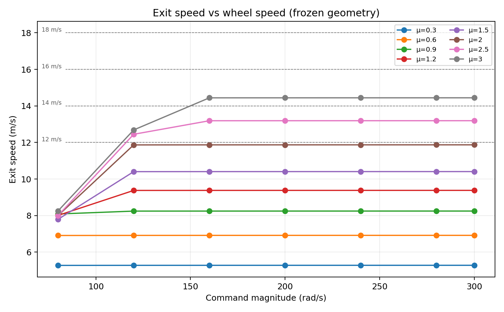

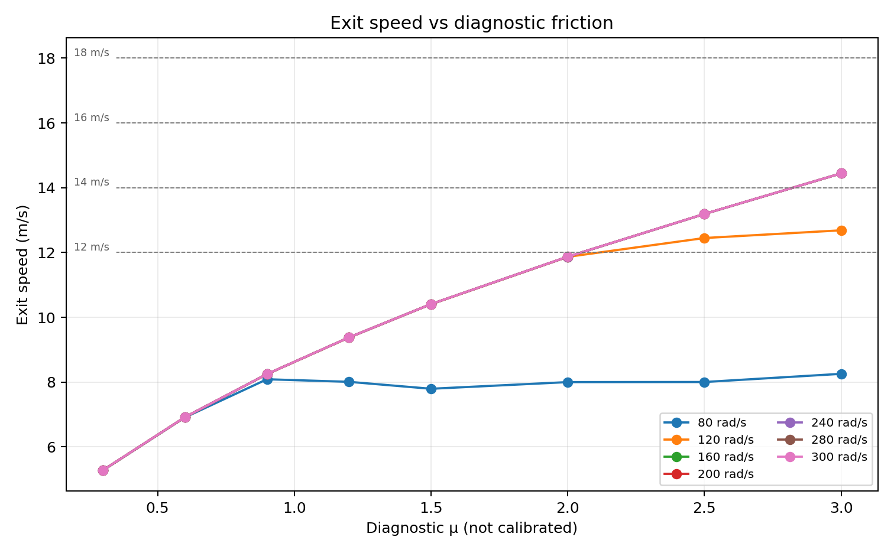

## Detailed converged 14 m/s audit

The first executed point accepted for the nominal target is μ=3.0, target ±160 rad/s, at a 0.25 ms timestep. The μ=3, 140 rad/s 1 ms result is excluded because it fails the frozen convergence limits.

Measured kinematics:

- actual wheel speed: ±159.6936 rad/s, or 1,524.96 rpm;
- wheel surface speed: 15.9694 m/s;
- exit velocity: `[13.5354, 0.0, 4.88327]` m/s;
- exit speed: 14.38935 m/s;
- elevation: 19.8383°;
- spin vector: `[0.0, -0.267981, 0.0]` rad/s, equivalent to 2.559 rpm;
- post-release path: noncontacting.

Measured contact region:

- first bilateral ball-centre position: `[-0.0293654, 0, 0.337992]` m;
- release ball-centre position: `[0.0308298, 0, 0.358832]` m;
- maximum-compression position: `[-0.0000689, 0, 0.347723]` m;
- bilateral travel: 63.701 mm;
- inclusive contact duration: 8.75 ms; sampled first-to-last interval: 8.50 ms;
- effective arc: 27.723° or 48.387 mm per wheel;
- loading/unloading time: 6.25/2.25 ms.

Measured normal and tangential transfer, per wheel:

- maximum compression: 3.997 mm; maximum diametral compression: 7.994 mm;
- mean/peak normal force: 13.355/27.198 N;
- normal impulse: 0.11352 N·s;
- mean/peak tangential force: 40.065/81.593 N;
- tangential impulse: 0.34056 N·s;
- time near the Coulomb limit: 100%;
- mean slip velocity: 8.714 m/s;
- mean slip ratio: 0.5486.

Measured motor and energy ledger:

- pre-contact wheel rotational energy: 172.1685 J;
- wheel energy loss: 10.0179 J;
- motor work during contact: 1.2560 J;
- ball mechanical-energy gain: 5.7657 J;
- contact dissipation: 5.1274 J;
- post-release wheel energy retained: 94.18%;
- peak current per motor: 18.454 A, below 20 A;
- estimated peak required bus voltage: 6.368 V, below 12.8 V;
- wheel droop: 2.965%; recovery time: 0.40975 s;
- normalized energy residual: −0.297%, inside the ±2% gate.

This point is dynamically orderly—no jam, fixed-component contact, meaningful side/topspin, force/compression violation, current violation or energy-accounting failure—but it is still traction saturated. Its validity is numerical and diagnostic, not material.

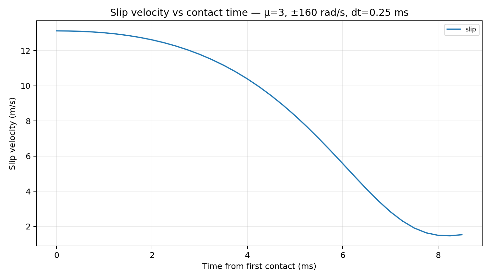

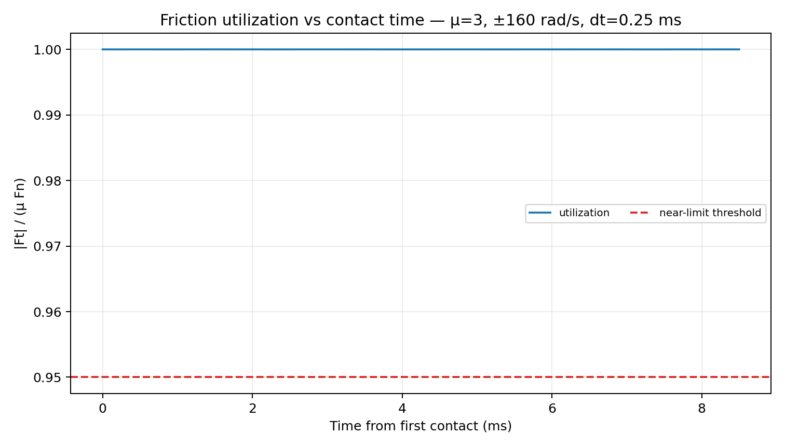

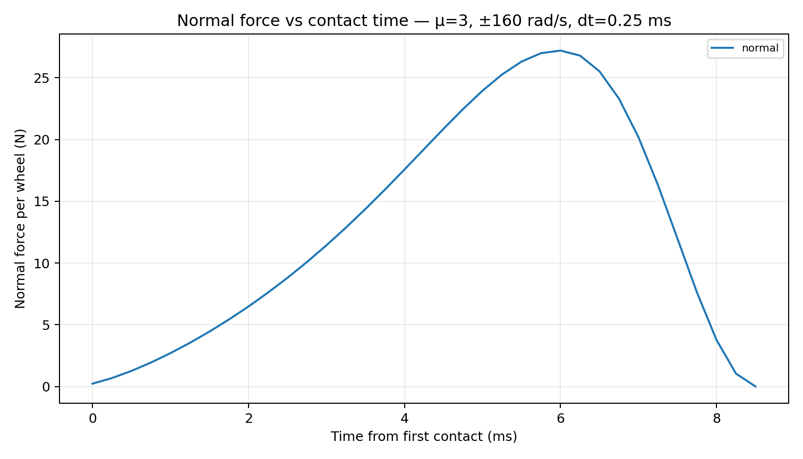

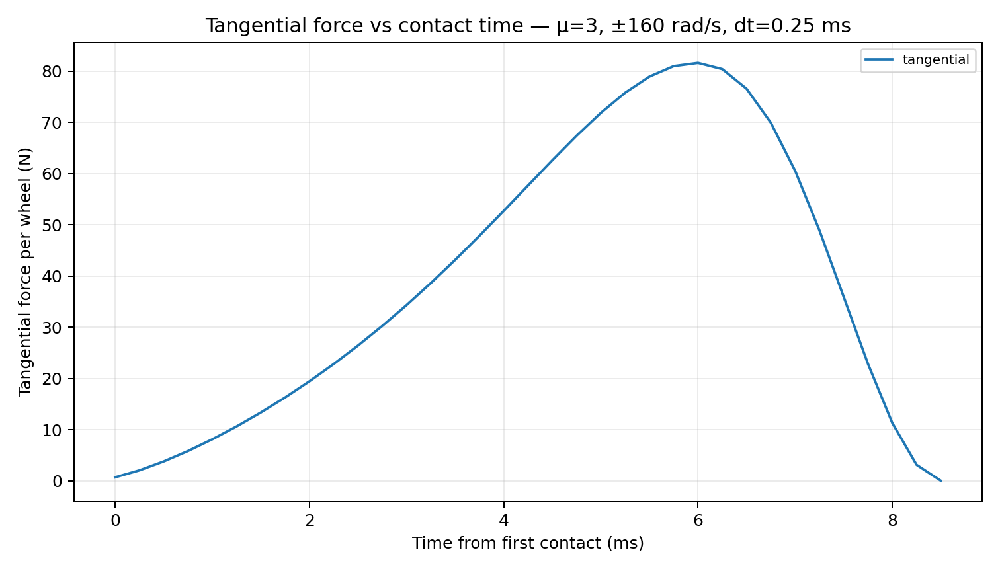

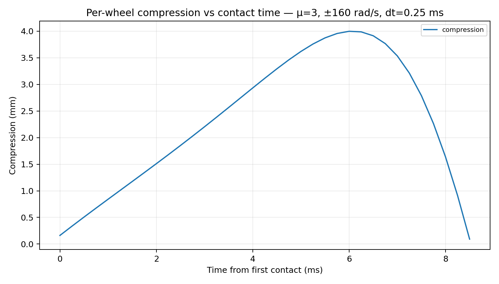

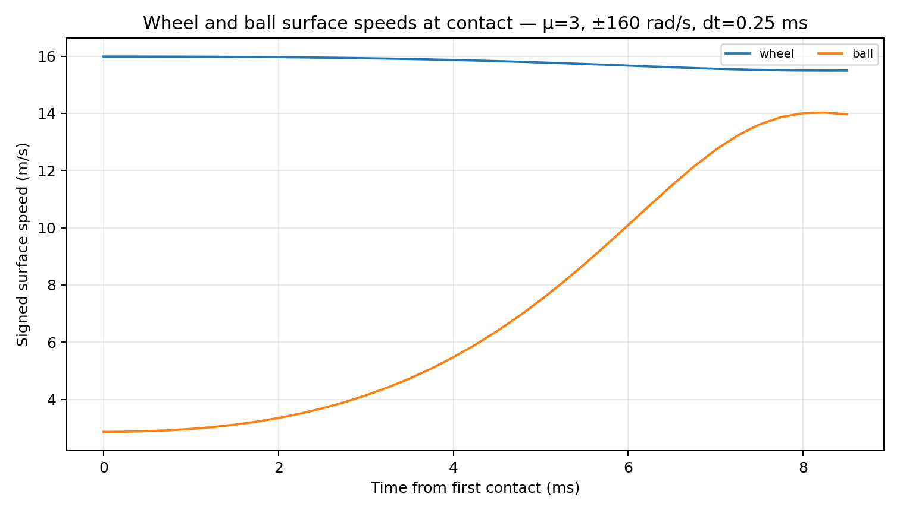

## Target crossings and upper bound

The minimum tested diagnostic values that cross each threshold are:

- 10 m/s: μ=1.5 at ±120 rad/s, 10.4037 m/s;
- 12 m/s: μ=2.5 at ±120 rad/s, 12.4480 m/s;
- 14 m/s: μ=3.0 at ±160 rad/s and 0.25 ms, 14.3893 m/s;
- 16 m/s: μ=5.0 at ±300 rad/s, 18.4695 m/s, ideal-bound classification;
- 18 m/s: the same μ=5.0 point, ideal-bound classification.

Linear interpolation between the converged μ=2.5/300 rad/s result (13.1953 m/s) and μ=3.0/160 rad/s result gives μ≈2.837. This is reported only as `ESTIMATED_DIAGNOSTIC_THRESHOLD`; it is neither a fit nor a physical coefficient.

The fine-timestep μ=10, ±300 rad/s case provides the reported ideal-traction upper bound of **25.76945 m/s**. It retains the frozen geometry and ball model, but μ=10 is deliberately nonphysical. Its 0.5 ms and 0.25 ms results converge; the 1 ms result fails the peak-force convergence comparison and is not used. The upper-bound point has 19.914° elevation, 3.301 rpm spin, 5.75 ms contact, 7.993 mm diametral compression, 27.265 N peak normal force per wheel and 3.287% droop.

The upper bound far above 14 m/s rules out Case C. Traction alone can solve the simulation target, but no real tread has yet been shown to supply that simulated μ.

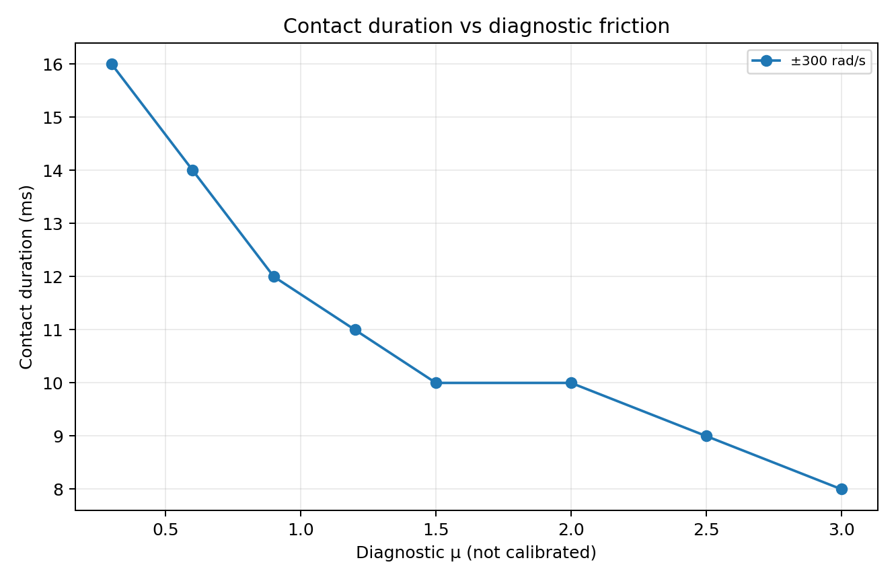

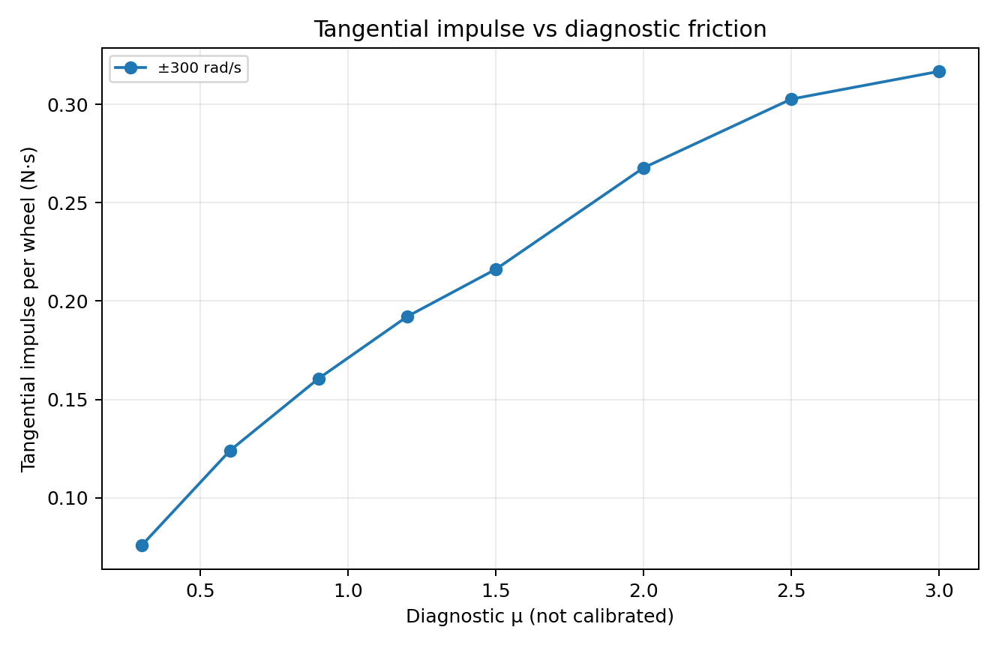

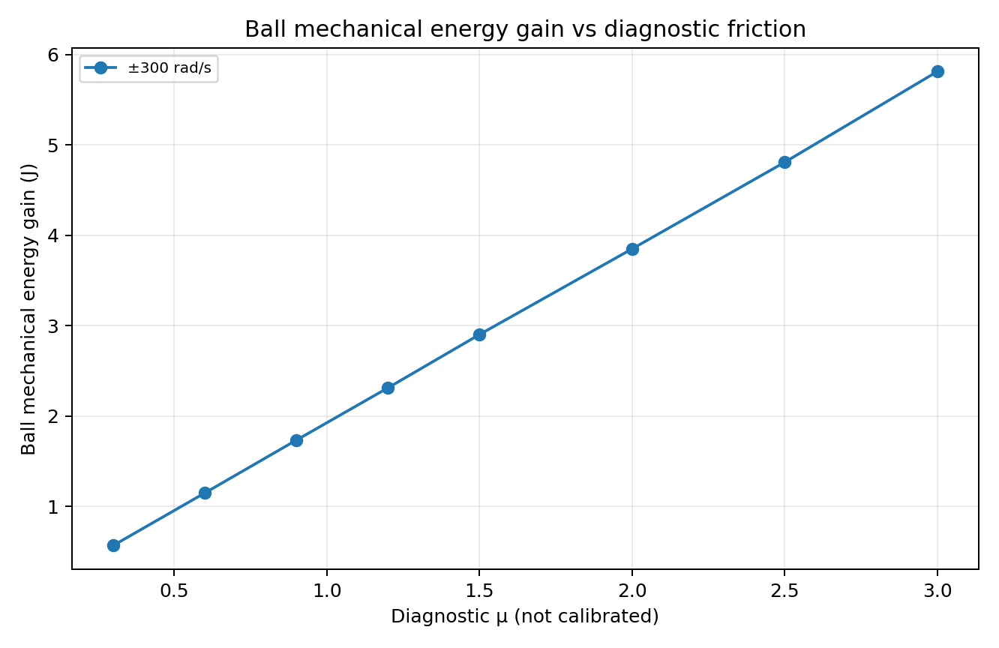

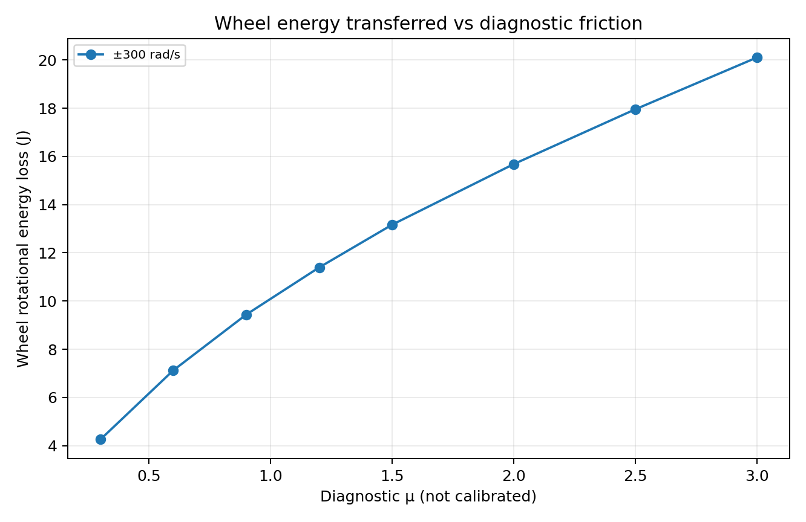

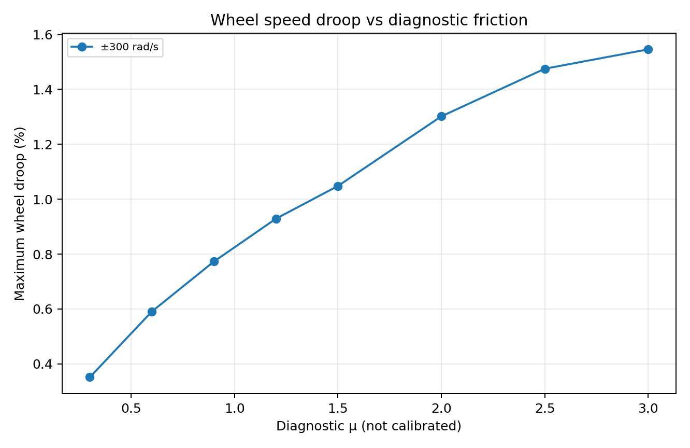

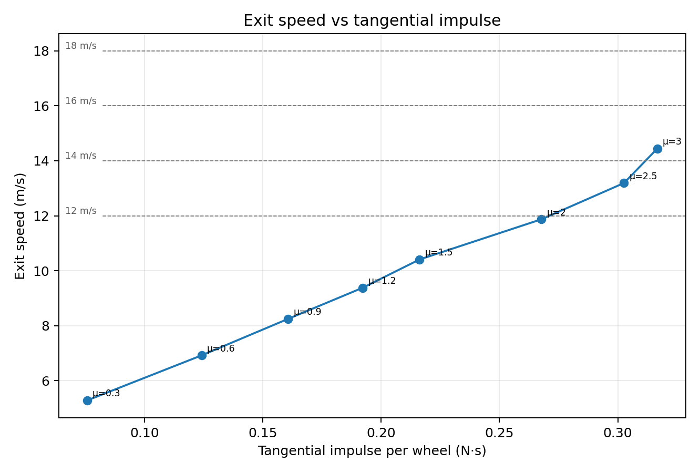

## Numerical and secondary gates

The frozen 0.25 ms comparison rules were applied without adjustment:

- μ=2.5, 300 rad/s: 1.0/0.5/0.25 ms all pass;
- μ=3.0, 140 rad/s: 1.0 ms fails, fine 0.5/0.25 ms pair passes;
- μ=3.0, 160 rad/s: all three timesteps pass; this is the selected 14 m/s point;
- μ=10, 300 rad/s: 1.0 ms fails peak-force convergence, fine pair passes.

All selected target and upper-bound results use converged fine-timestep evidence. The 14 m/s point passes successful launch, target reachability, finite telemetry, calibrated compression envelope, force cap, current, voltage, post-release noncontact and energy residual checks. Therefore `NUMERICALLY_LIMITED=false`, while the report explicitly excludes unconverged high-traction points.

## Physical plausibility evidence

Evidence is separated from the diagnostic simulation:

- **Published, launcher-interface static experiment.** Wójcicki, Puciłowski and Kulesza cut a tennis ball in half, pressed it to increase contact area, and used an inclined polypropylene roller segment. Their selected maximum-pressure/maximum-contact-length coefficient was 2.05. This is the closest published launcher-specific interface evidence found, but it is static, uses polypropylene, modifies the ball specimen and does not establish high-rate rubber/urethane tread behavior. [Paper text and experiment](https://paperzz.com/doc/9307786/mathematical-analysis-for-a-new-tennis-ball-launcher).
- **Published dynamic tennis-ball/surface measurements.** Cross measured approximately 0.42 for smooth concrete, 0.62 for smooth Rebound Ace, 0.70 for Rebound Ace court, 0.73 for P800, 0.80 for clay and above 1.0 for coarse P150. On the P150 surface, a reliable coefficient could not be established because the ball transitions to biting; the paper also reports felt damage. This demonstrates that high apparent grip changes the contact mode and that a constant-Coulomb model is incomplete at extreme traction. [Cross, Sports Engineering 2003](https://www.physics.usyd.edu.au/~cross/PUBLICATIONS/23.%20CourtSpeed.PDF).
- **Governing-body reference.** The ITF categorizes tennis court COF as low ≤0.55, medium 0.56–0.70 and high ≥0.71. These are court measurements, not tread specifications, but they provide a standardized tennis-ball reference far below μ=3. [ITF Technical Booklet](https://www.itftennis.com/media/14104/2025-technical-booklet.pdf).
- **Candidate-material evidence, not friction calibration.** A ball-machine patent recommends urethane, nitrile or butyl coatings at 25–60 Shore A, especially 40–50 A, and reports more slip above 60 A. This supports a coupon shortlist but supplies no tennis-felt coefficient. [US Patent 6,470,873](https://patents.justia.com/patent/6470873).

The published μ=2.05 result must not be treated as a safe dynamic tread coefficient, and it remains below the minimum tested μ=3.0 that reaches 14 m/s. No manufacturer or published dynamic evidence validates μ≈3 for the required interface. Consequently:

`PHYSICAL_TYRE_FRICTION_VALIDATED = false`

## Root-cause and design-gate classifications

- `EXIT_SPEED_SATURATION_REPRODUCED = true`
- `PRIMARY_LIMIT_IDENTIFIED = true`
- `TRACTION_LIMITED = true`
- `CONTACT_DURATION_LIMITED = true` — coupled finite impulse window
- `CONTACT_GEOMETRY_LIMITED = false` — no hard kinematic ceiling below 14 m/s
- `COMPLIANCE_LIMITED = false`
- `MOTOR_TORQUE_LIMITED = false`
- `WHEEL_ENERGY_LIMITED = false`
- `NUMERICALLY_LIMITED = false`
- `COMBINED_LIMIT = true` — traction plus finite duration
- `IDEAL_TRACTION_UPPER_BOUND_M_S = 25.76945`
- `DIAGNOSTIC_10_M_S_REACHED = true`
- `DIAGNOSTIC_12_M_S_REACHED = true`
- `DIAGNOSTIC_14_M_S_REACHED = true`
- `DIAGNOSTIC_16_M_S_REACHED = true`
- `DIAGNOSTIC_18_M_S_REACHED = true`
- `MINIMUM_TESTED_MU_FOR_14_M_S = 3.0`
- `PHYSICAL_TYRE_FRICTION_VALIDATED = false`
- `CURRENT_LAUNCHER_GEOMETRY_HAS_SUFFICIENT_KINEMATIC_POTENTIAL = true`
- `REALISTIC_TRACTION_INSUFFICIENT = true`
- `CURRENT_LAUNCHER_GEOMETRY_REMAINS_VIABLE = false` — not physically demonstrated
- `CURRENT_LAUNCHER_GEOMETRY_14M_S_CAPABILITY = true` — diagnostic/kinematic only
- `HIGHER_TRACTION_WHEEL_IS_PREFERRED_NEXT_STEP = true` — material testing, not an unvalidated wheel selection
- `NIP_REDESIGN_REQUIRED = false` — not established; do not reopen before the material gate
- `MOTOR_CHANGE_REQUIRED = false`
- `POST_FLYWHEEL_PATH_NONCONTACTING = true`
- `LAUNCH_CONTACT_TIMESTEP_CONVERGED = true`
- `LAUNCH_ENERGY_ACCOUNTING_VALIDATED = true`
- `PHYSICAL_FLYWHEEL_WHEEL_VALIDATED = false`
- `PHYSICAL_HARDWARE_PENDING = true`

## Required next gate

Build a small dynamic felt/tread contact test, not a new launcher. Screen urethane, nitrile and butyl candidates over a controlled hardness/texture range using regulation new and worn tennis balls. Measure tangential force versus normal force at representative normal load, surface speed, slip speed, temperature and repeated-cycle wear. Record the transition from gross slip to bite/stick-slip and felt damage rather than collapsing it into a single static coefficient.

Only if a durable interface demonstrates sufficient dynamic traction should a physical wheel candidate be selected and the unchanged launcher retested. If it cannot, contact geometry/nip may be reopened in a later authorized design phase. The present evidence gives no reason to change the motor first.

## Reproducible artifacts

- authoritative result: [`config/flywheel_energy_transfer_root_cause.json`](../../config/flywheel_energy_transfer_root_cause.json)
- compact operating-point CSV: [`flywheel-energy-transfer-case-summary.csv`](flywheel-energy-transfer-case-summary.csv)
- full contact telemetry CSV: [`flywheel-energy-transfer-contact-telemetry.csv`](flywheel-energy-transfer-contact-telemetry.csv)
- per-case analyzer: [`scripts/analyze_flywheel_energy_transfer_case.py`](../../scripts/analyze_flywheel_energy_transfer_case.py)
- campaign compiler: [`scripts/compile_flywheel_energy_transfer_root_cause.py`](../../scripts/compile_flywheel_energy_transfer_root_cause.py)
- plot generator: [`scripts/plot_flywheel_energy_transfer_root_cause.py`](../../scripts/plot_flywheel_energy_transfer_root_cause.py)

Rebuild the committed artifacts from the preserved native case directories with:

```bash
python3 scripts/compile_flywheel_energy_transfer_root_cause.py \
  /tmp/flywheel_campaign /tmp/flywheel_energy_transfer
MPLCONFIGDIR=/tmp/matplotlib-flywheel \
  python3 scripts/plot_flywheel_energy_transfer_root_cause.py
```
