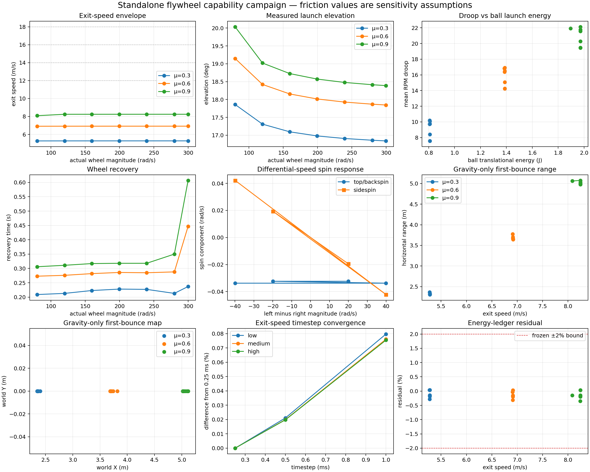
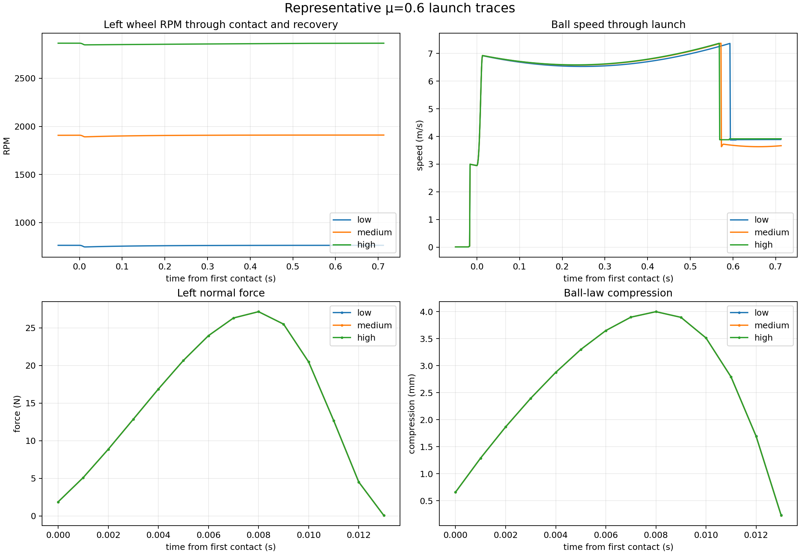
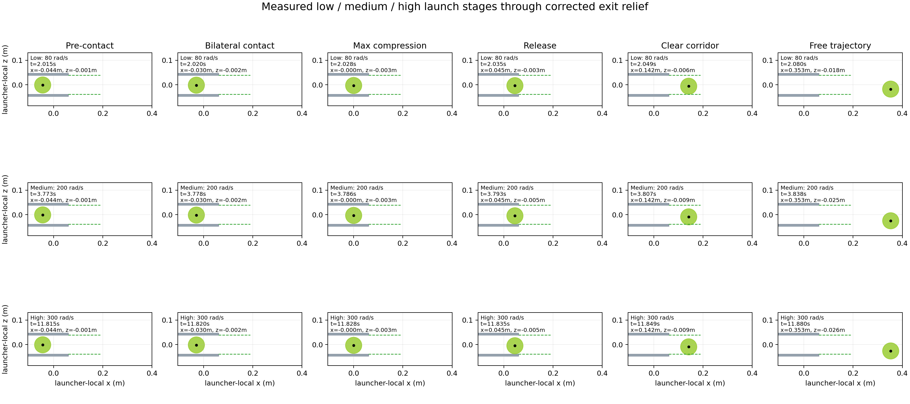

# Standalone flywheel launcher capability validation

Date: 2026-08-26

## Decision

The post-correction standalone launcher campaign is complete. All 37 executed
native-Gazebo trials cleared the corrected exit corridor, all requested wheel
targets through ±300 rad/s settled within tolerance, the representative
contact cases converged from 1.00 ms to 0.25 ms, and the frozen energy ledger
remained inside its predeclared ±2% limit.

The bench is valid for a bounded simulation capability map, but it does **not**
meet the requested 12–18 m/s envelope. Across the predeclared uncalibrated tyre
friction sensitivity range μ = 0.3/0.6/0.9, the maximum executed exit speed was
8.24753 m/s. Raising wheel speed above roughly 120 rad/s produced almost no
additional exit speed because the frozen Coulomb traction model was saturated.

This is a measured capability result, not a redesign trigger. No geometry,
ball coefficient, nip, wheel mass/inertia, or motor limit was changed during
the campaign.

The authoritative machine-readable result is
`config/flywheel_launcher_capability_map.json`; the acceptance criteria frozen
before the runs are in `config/flywheel_launcher_capability_protocol.json`.

## Frozen baseline and trial discipline

The campaign preserved:

- the independently calibrated tennis-ball normal law and source model hashes;
- the D5065-270KV first-order motor assumptions, 12.8 V provisional bus,
  20 A operating limit, and ±0.62 N m effort limit;
- the provisional 200 × 50 mm, 0.90 kg wheel and
  0.006751162108 kg m² spin inertia;
- 58 mm nip, 258 mm wheel-centre spacing and 20° mechanical pitch;
- the corrected upper/lower cradle exit-relief meshes;
- the deterministic 3.0 m/s launcher-local +X feed and zero initial spin.

The compiler verified eight frozen hashes before producing the final map. The
launcher trials were not used to refit any ball parameter.

Tyre friction remains uncalibrated. The three coefficients are labelled only
as low/medium/high sensitivity assumptions; μ = 0.6 is the nominal mapping
assumption, not a fitted value. The contact model applies the calibrated ball
normal law against a rigid analytical wheel and has no independent tyre normal
compliance.

## A. Regression low-energy retest

The exact accepted μ = 0.3, ±80 rad/s, 1.00 ms case was executed again:

- actual pre-contact speed: ±79.996806 rad/s;
- exit velocity: `[5.01907, 0.00000, 1.61728]` m/s;
- exit speed: 5.2732019 m/s;
- elevation: 17.860343°;
- azimuth: 0°;
- no post-release fixed-component contact;
- recovery: 0.209 s;
- energy residual: +0.0326%.

It matches the frozen reference to numerical precision and passes the
regression gate.

## B–D. Symmetric RPM, exit-speed and angle map

Seven symmetric targets were executed at every friction assumption: 80, 120,
160, 200, 240, 280 and 300 rad/s per wheel. Every point was reachable and
cleared the launcher.

Measured envelopes were:

- μ = 0.3: 5.27320–5.27949 m/s, elevation 17.860–16.840°;
- μ = 0.6: 6.91051–6.91786 m/s, elevation 19.149–17.846°;
- μ = 0.9: 8.08732–8.24753 m/s, elevation 20.036–18.389°;
- symmetric azimuth: 0° in every trial;
- maximum compression: 3.99979 mm;
- maximum measured normal force: 27.1565 N per side.

The equality of wheel surface speed and ball speed was never assumed. At the
upper nominal μ = 0.6 point, wheel surface speed was approximately 29.994 m/s
while ball exit speed was only 6.91786 m/s.

Representative μ = 0.6 exit states:

- 80 rad/s: velocity `[6.52816, 0, 2.26678]` m/s, 6.91051 m/s,
  19.1486°;
- 200 rad/s: velocity `[6.57787, 0, 2.13919]` m/s, 6.91697 m/s,
  18.0151°;
- 300 rad/s: velocity `[6.58500, 0, 2.12005]` m/s, 6.91786 m/s,
  17.8460°.



## E. Differential speed and spin

Four controlled μ = 0.6 differential trials were executed without exceeding
the proven 300 rad/s wheel limit: 300/280, 280/300, 300/260 and 260/300 rad/s
in magnitude.

The largest ball angular-speed magnitude was only 0.12510 rad/s. Sidespin
reversed correctly with the differential sign but reached only ±0.04220 rad/s;
the maximum absolute azimuth change was 0.00000443°. Exit speed stayed between
6.91774 and 6.91781 m/s, and wheel-droop asymmetry was small.

This response is numerically characterized, but spin transfer is **not
physically validated** because tyre friction and tyre normal compliance are
not calibrated.

## F. Motor droop and recovery

Across the symmetric matrix:

- RPM droop ranged from 7.57 to 22.14 RPM per wheel;
- percentage droop ranged from 0.331% to 2.871%;
- recovery ranged from 0.209 to 0.607 s;
- peak event-current estimate reached, but did not exceed, 20.0 A;
- maximum estimated required bus voltage was 11.388 V, below 12.8 V.

For nominal μ = 0.6 at 80/200/300 rad/s, recovery was
0.273/0.286/0.447 s. The 300 rad/s response is slower because the controller is
at the current/effort boundary near readiness.

These are validated responses of the simulated effort-limited first-order
model. They are not physical thermal, inverter, battery-sag, windage or
controller validation.

## G. Timestep convergence

Acceptance thresholds were committed to the protocol before evaluating the
results. Low (80), medium (200) and high (280 rad/s) μ = 0.6 launches were each
run at 1.00, 0.50 and 0.25 ms and compared with the 0.25 ms result.

Worst observed differences were:

- exit speed: 0.0797% (limit 2%);
- elevation: 0.1195° (limit 0.75°);
- azimuth: 0° (limit 0.25°);
- spin magnitude: 0.00639 rad/s (absolute floor 2 rad/s);
- compression: 0.0050% (limit 5%);
- peak force: 0.0199% (limit 10%);
- contact duration: below floating-point reporting resolution (limit 1 ms or 10%);
- wheel droop: 0.842% (limit 10%);
- recovery: 0.00125 s (limit 0.05 s or 10%);
- energy-residual fraction difference: 0.0456 percentage point (limit 0.5).

All low/medium/high comparisons pass.

## H. Energy accounting

The event ledger reports individual pre/post wheel rotational energies, ball
translation and rotation, potential-energy change, integrated elastic
stored/recovered energy, elastic hysteresis, normal damping, tangential slip
dissipation, drivetrain damping and motor work.

For representative μ = 0.6 points:

- 80 rad/s: 43.2040 J pre-contact wheel energy, 1.38490 J ball exit
  translation, residual −0.0349%;
- 200 rad/s: 268.8638 J pre-contact wheel energy, 1.38749 J ball exit
  translation, residual −0.1995%;
- 300 rad/s: 607.3616 J pre-contact wheel energy, 1.38785 J ball exit
  translation, residual +0.0269%.

Every symmetric, differential and convergence ledger remains inside ±2%; no
unexplained positive-energy creation exceeds the frozen limit.



## I. Trajectory

Every valid trial was propagated to first ground contact. The map records exit
XYZ and velocity, elevation, azimuth, spin, apex and time to apex, first-bounce
XYZ/time, horizontal range, lateral deviation and velocity immediately before
bounce.

For nominal μ = 0.6 at 80/200/300 rad/s, gravity-only horizontal ranges were
3.773/3.664/3.642 m and apex heights were 0.623/0.594/0.589 m. The corresponding
pre-bounce velocity vectors were `[6.528, 0, -3.388]`,
`[6.578, 0, -3.310]` and `[6.585, 0, -3.290]` m/s.

Implemented trajectory physics:

- gravity: yes;
- aerodynamic drag: no;
- Magnus force: no;
- spin decay: no.

Therefore these bounce results are explicitly gravity-only diagnostics:
`BALL_EXIT_STATE_VALIDATED = true` while
`COURT_TRAJECTORY_MODEL_VALIDATED = false`.

## J. 12/14/16/18 m/s capability

The nearest executed point for every target is μ = 0.9 at ±300 rad/s,
8.247526 m/s. With the predeclared ±0.5 m/s acceptance:

- `LAUNCHER_12_M_S_CAPABILITY = false` (short by 3.75247 m/s);
- `LAUNCHER_14_M_S_CAPABILITY = false` (short by 5.75247 m/s);
- `LAUNCHER_16_M_S_CAPABILITY = false` (short by 7.75247 m/s);
- `LAUNCHER_18_M_S_CAPABILITY = false` (short by 9.75247 m/s).

These classifications use executed points, not extrapolation. No parameter was
changed to make a target pass.

## K. Court-range capability

Regulation-court target mapping was not performed because drag, Magnus and
spin decay are absent. The gravity-only maximum horizontal range was about
5.074 m, but it is not promoted to a credible court result. There is also no
validated horizontal aiming degree of freedom, so corner targeting cannot be
claimed.

`RANGE_CAPABILITY = NOT_EVALUATED_WITH_CREDIBLE_COURT_MODEL`

`TARGETING_CAPABILITY = NOT_EVALUATED_NO_VALIDATED_HORIZONTAL_AIMING_DOF`

## L. Repeatability

Three separately executed identical trials were completed at nominal μ = 0.6
for 80, 200 and 300 rad/s. Population standard deviation was exactly zero for
exit speed, elevation, azimuth, spin RPM and first-bounce X/Y in all three
groups.

`DETERMINISTIC_SIMULATION_REPEATABILITY_ONLY = true`

No physical repeatability claim is made.

## M. Unresolved tyre/contact uncertainty

- Tyre friction is bounded sensitivity only, not calibrated.
- Tyre normal compliance is absent; the wheel is analytically rigid.
- The saturated Coulomb model makes tangential impulse nearly independent of
  wheel speed once slip is established.
- Transfer efficiency and spin are therefore not physically validated.
- The friction bounds must not be selected using the desired 14 m/s outcome.

The measured plateau is authoritative for the current frozen simulation, but
physical tyre test data is required before using it as a hardware prediction.

## N. Remaining physical-hardware limitations

- The provisional wheel candidate, hub, retention and cradle have not been
  built or load-tested.
- The corrected exit relief still requires structural review.
- Wheel balance, tyre growth, runout, bearing drag, windage and wear are absent.
- D5065 rotor inertia, inverter losses, battery sag and thermal accumulation
  remain provisional or absent.
- The feeder/ball presentation boundary is deterministic and not a physical
  feed-repeatability model.
- Aerodynamic court flight and horizontal aiming are not validated.

Measured stage evidence for low/medium/high trials:



## Reproduction

Build the native plugins, run cases with
`scripts/run_flywheel_capability_case.py`, reduce each case with
`scripts/analyze_flywheel_capability_case.py`, and compile/plot the campaign:

```bash
python3 scripts/compile_flywheel_capability_campaign.py \
  /tmp/flywheel_campaign \
  --output config/flywheel_launcher_capability_map.json

MPLCONFIGDIR=/tmp/mpl-flywheel-campaign \
python3 scripts/plot_flywheel_capability_campaign.py \
  /tmp/flywheel_campaign \
  config/flywheel_launcher_capability_map.json \
  --output-dir docs/images
```

The complete matrix and fixed thresholds are enumerated in
`config/flywheel_launcher_capability_protocol.json`.

## Final classifications

```text
STANDALONE_LAUNCHER_CAPABILITY_BENCH_VALID = true
POST_FLYWHEEL_PATH_NONCONTACTING = true

NORMAL_CONTACT_LAUNCH_VALIDATED = true
TANGENTIAL_CONTACT_LAUNCH_VALIDATED = false

LAUNCH_EXIT_VELOCITY_VALIDATED = true
LAUNCH_EXIT_SPEED_VALIDATED = true
LAUNCH_EXIT_ELEVATION_VALIDATED = true
LAUNCH_EXIT_AZIMUTH_VALIDATED = true
LAUNCH_SPIN_VALIDATED = false
LAUNCH_SPIN_NUMERICALLY_CHARACTERIZED = true

RPM_DROOP_VALIDATED = true
RPM_RECOVERY_VALIDATED = true
LAUNCH_ENERGY_ACCOUNTING_VALIDATED = true
LAUNCH_CONTACT_TIMESTEP_CONVERGED = true

LAUNCHER_12_M_S_CAPABILITY = false
LAUNCHER_14_M_S_CAPABILITY = false
LAUNCHER_16_M_S_CAPABILITY = false
LAUNCHER_18_M_S_CAPABILITY = false

BALL_EXIT_STATE_VALIDATED = true
COURT_TRAJECTORY_MODEL_VALIDATED = false

OPPOSITE_BASELINE_REACH_CAPABILITY = false
LEFT_DEEP_CORNER_REACH_CAPABILITY = false
RIGHT_DEEP_CORNER_REACH_CAPABILITY = false

LAUNCHER_CAPABILITY_MAP_GENERATED = true

BALL_LAUNCH_PHYSICS_VALIDATED_IN_SIM = false

PHYSICAL_FLYWHEEL_WHEEL_VALIDATED = false
PHYSICAL_HARDWARE_PENDING = true
```
