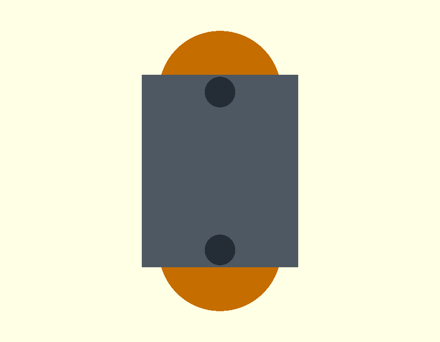
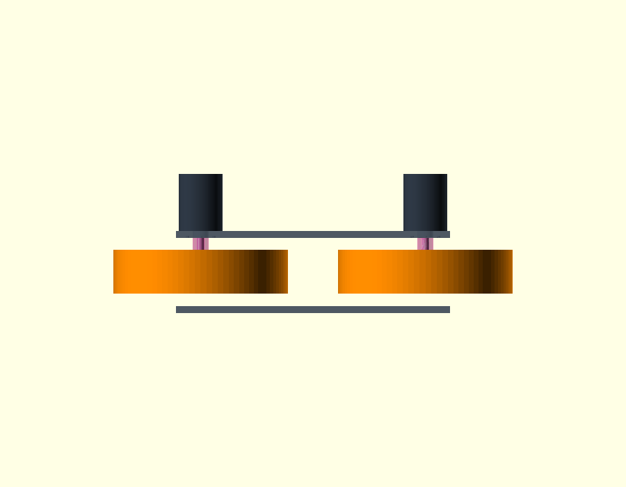
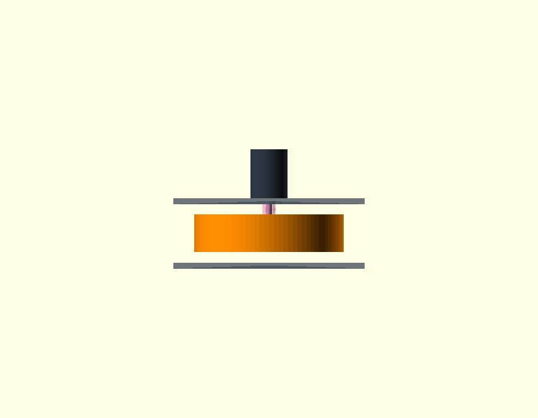
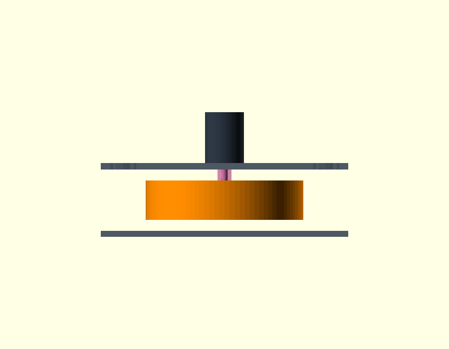

# Flywheel launcher direct-drive mechanical definition and Gate A decision

Date: 2026-08-26
Scope: isolated, standalone flywheel launcher only

> **Evidence-chain status:** this report remains active evidence for the direct-panel motor placement and structural screen. Its 0.40 kg placeholder and Gate-A stop describe this stage only. The later [`flywheel-wheel-candidate-provisional-gate-a.md`](flywheel-wheel-candidate-provisional-gate-a.md) supersedes those two status items with the controlled 0.70–0.90 kg candidate range and simulation-ready provisional interface. The current checkpoint is [`standalone-flywheel-launcher.md`](standalone-flywheel-launcher.md).

## Decision

The intended architecture is accepted: each D5065 mounts directly to the outside face of the existing 8 mm upper cradle panel, its 8 mm shaft passes inward through that panel, and the hub and 200 × 50 mm flywheel sit inside the cradle. The complete launcher module supplies the accepted 20° pitch. A separate motor bracket and independent motor-pitch hardware are neither required nor missing.

The direct-panel placement is geometrically valid and has passed a conservative first structural screen. Mechanical Gate A nevertheless remains **STOPPED**. The actual flywheel interface, selected hub, shaft engagement, positive/removable axial retention, finished rotating mass and complete rotating inertia are not defined. No launcher-performance trial is authorized from this result.

Machine-readable decision: [`config/flywheel_launcher_direct_drive_mechanical_gate.json`](../../config/flywheel_launcher_direct_drive_mechanical_gate.json).

## Evidence discipline

This decision uses the following labels literally:

- `MANUFACTURER_SPEC`: published D5065 or candidate-hub data.
- `MEASURED_FROM_HARDWARE`: none in this gate; the motor and flywheel have not been received and measured.
- `MEASURED_FROM_CAD`: accepted standalone launcher datums already controlled by the repository.
- `DERIVED`: arithmetic from labelled inputs.
- `ASSUMED / PROVISIONAL`: screening values that cannot release hardware or capability simulation.
- `MISSING`: a required fact with no acceptable evidence.

The D5065 body diameter 50 mm, body length 65 mm, mass 0.49 kg, primary shaft diameter 8 mm, 30 mm projection, 24 mm flat length, 0.5 mm flat depth, and four 4 mm mounting features on a 30 mm PCD are manufacturer data from the [ODrive D5065 product page](https://shop.odriverobotics.com/products/odrive-custom-motor-d5065) and [ODrive motor documentation](https://docs.odriverobotics.com/v/latest/hardware/odrive-motors.html). The captured evidence does not establish whether the four mounting features are threaded or clearance holes, their thread designation, or usable engagement depth. Motor rotor inertia is not published in the captured evidence.

## Authoritative standalone geometry retained

- Flywheel envelope: 200 mm diameter × 50 mm axial width.
- Wheel centres: launcher-local `(x, y, z) = (0, ±129, 0) mm`; centre spacing 258 mm.
- Geometric nip: 58 mm.
- Cradle panels: 256 × 314 × 8 mm, centred at launcher-local `z = ±43 mm`.
- Upper-panel inside and outside faces: `z = +39 mm` and `z = +47 mm`.
- Flywheel axial faces: `z = −25 mm` and `z = +25 mm`.
- Complete-module pitch: 20°; nothing in the motor interface adds another pitch degree of freedom.

## Mirrored motor-interface audit

The following audit applies identically to the motors at `y = +129 mm` and `y = −129 mm`.

1. **Placement and orientation — `MEASURED_FROM_CAD` + `DERIVED`.** The motor mounting face coincides with the upper-panel outside face at `z = +47 mm`. The body is outside the cradle and occupies `z = +47…+112 mm`; the primary shaft points inward.
2. **Motor centre — `DERIVED`.** Mounting-face centres are `(0, +129, +47) mm` and `(0, −129, +47) mm` in the launcher frame.
3. **Shaft axis — `DERIVED`.** Both shaft direction vectors are `(0, 0, −1)` and are coaxial with their flywheel axes.
4. **Mount pattern — `MANUFACTURER_SPEC`.** Four nominal 4 mm features lie on a 30 mm PCD. Pattern clocking about the shaft remains free until lead exit and tool access are measured.
5. **Panel edge fit — `DERIVED`.** A 50 mm motor body leaves only 3 mm from its outer cylindrical envelope to the nearest 314 mm panel edge. The outer edge of a nominal 4 mm mounting feature leaves an 11 mm edge ligament. This is geometric fit, not service-clearance validation.
6. **Central opening — `MISSING`.** The 8 mm shaft needs passage, but the released cutout must also accommodate the chosen hub, clamp/tool access and retention installation. Sensitivity cases give mount-hole-edge ligaments of 8, 5, 4 and 3 mm for 10, 16, 18 and 20 mm central openings respectively. None is a manufacturing dimension.
7. **Fasteners and engagement — `MISSING`.** Bolt thread, length, property class, washers, locking method, motor-feature depth, panel hole tolerances and tightening torque remain open.
8. **Body, wires and service — mixed evidence.** The 50 × 65 mm body envelope fits. Lead and thermistor exit locations, 4 mm bullet-connector envelope, bend radius, clocking, fastener-tool swing and removal path are missing.
9. **Shaft interface — `MANUFACTURER_SPEC` + `MISSING`.** The known 8 mm shaft and flat are compatible with searching for a metal clamp hub, but no allowable transmitted torque, axial clamp capacity, shaft shoulder, end thread or retaining-groove evidence is available.
10. **Axial assembly and retention — `DERIVED` + `MISSING`.** The shaft reaches the wheel envelope, but no physically removable and positive retention stack is defined; the D-flat alone does not prevent axial walk.

## Axial stack

All values below are launcher-local `z`, measured from the flywheel centre plane:

- Motor outside end: `+112 mm`.
- Motor mounting face / panel outside face: `+47 mm`.
- Panel inside face: `+39 mm`.
- Flywheel outer face: `+25 mm`.
- Shaft tip: `+17 mm`.
- Flywheel centre plane: `0 mm`.
- Flywheel inner face: `−25 mm`.

Therefore the 30 mm shaft projects 22 mm beyond the panel inside face, crosses the 14 mm air gap to the nominal wheel outer face, and reaches 8 mm into the 50 mm wheel envelope. That proves only that a short flange-style arrangement is geometrically possible. Hub start/end, effective clamping length, wheel face datum, spacers, axial stop, retainer and installation order remain `MISSING`.

## Hub design gate

Two purchased 8 mm aluminium clamp hubs were screened as search anchors:

- [goBILDA 1309-0016-0008 Sonic Hub](https://www.gobilda.com/1309-series-sonic-hub-8mm-bore/): 14 g, dual pinch bolts, M4 threaded holes on the 16 mm goBILDA pattern.
- [goBILDA 1310-0016-0008 Hyper Hub](https://www.gobilda.com/1310-series-hyper-hub-8mm-bore/): 24 g, balanced/heavy-duty dual-pinch concept in the same pattern family.

Neither is selected. The repository does not define the real wheel centre bore or hex, recess geometry, face thickness, bolt circle, hole sizes, material, balance grade or allowable interface torque. The captured hub pages also do not provide quantified torque and axial capacity for this D-shaft application. Selecting either part now would invent the wheel-side interface and the retention proof.

A releasable direct-drive hub definition must state the exact purchased/custom part, material, full drawing, 8 mm shaft fit and effective engagement, wheel fasteners and pattern, torque transfer, axial stop, removable retention, assembly order, balance/runout requirement and verified torque/axial ratings.

## First structural screen

This is a deterministic screening calculation, not FEA and not physical validation.

- Calibrated quasi-static Hertz reaction at the nominal 4 mm per-wheel compression: `27.15 N` per wheel.
- Conservative radial screening reaction: `263.70 N`, defined as `1.25 ×` the largest independent rebound-calibration peak. It is deliberately conservative and is not a measured launcher reaction.
- Radial moment at the panel centre plane: `263.70 N × 0.043 m = 11.34 N·m`.
- Static gravity moment excluding the unknown hub: `0.325 N·m`, using the manufacturer motor mass and the provisional 0.40 kg wheel mass.
- D5065 torque screens using published `Kt = 0.031 N·m/A`: `0.62 N·m` at the provisional 20 A point and `2.635 N·m` at the published 85 A / 3 s peak-current point.
- Four-bolt, 15 mm-radius screen: worst cardinal two-bolt-couple tension `388.8 N`; radial shear `65.9 N/bolt`; peak-torque shear `43.9 N/bolt`; combined shear `79.2 N/bolt`.
- 8 mm panel nominal bearing stress at a 4 mm feature: `12.15 MPa`.
- Simple panel-strip bending stress: `36.45 MPa` for 30 mm effective width and `21.87 MPa` for 50 mm effective width.

These stresses are low relative to an **assumed** 6061-T6 comparison, but the actual panel alloy/temper, final opening, attachment boundary, fastener engagement, hub and wheel mass, dynamic ball reaction and imbalance are not known. Consequently the result supports `D5065_DIRECT_PANEL_MOUNT_STRUCTURALLY_SCREENED = true`; it does not release the panel, bolts or cutout. No reinforcement is released, and there is no present justification for a separate motor cradle. A local doubler can be decided only after the missing data are measured.

Vibration and resonance remain unresolved because rotating inertia, balance/runout, motor-bearing stiffness, panel boundary conditions and modal/bench evidence are absent.

## Rotating mass and inertia stop

The standalone Xacro currently carries a provisional `wheel_mass = 0.40 kg` and the corresponding solid-cylinder spin inertia `I = ½mr² = 0.002 kg·m²`. These are model placeholders, not physical mass properties. The actual wheel mass/material/density distribution, hub mass/inertia and D5065 rotor inertia are all missing. Total drive inertia must include motor rotor + hub + wheel about the shaft axis.

Accordingly, no plausible-density replacement was promoted and no launcher capability simulation was run. The standalone Xacro remains the owner of this isolated model, but it was intentionally left unchanged. No complete-robot URDF/Xacro file was changed by this gate.

## Analysis-only CAD

The OpenSCAD study [`direct-drive-mechanical-definition-study.scad`](../../cad/flywheel-launcher-v0/direct-drive-mechanical-definition-study.scad) is non-manufacturing analysis geometry. Orange is the accepted wheel envelope, dark grey is the manufacturer motor envelope, silver is the shaft, and magenta is the deliberately unresolved hub/retention zone and 18 mm cutout sensitivity case.

## Exact remaining physical measurements

1. Select or provide the real 200 × 50 mm flywheel. Measure total mass, centre bore/hex, concentric recesses, face thicknesses, all bolt-circle diameters and hole sizes, axial datum, material, tread construction and balance/runout specification.
2. On a delivered D5065, identify the four mounting features as threaded or clearance; measure thread specification and usable depth. Record lead and thermistor exits, connector envelope, bend radius and acceptable clocking.
3. Match a metal hub to the measured wheel interface. Record its controlled drawing, shaft engagement, wheel-fastener engagement, rated torque and axial capacity, mass, axial stop, removable retention hardware and assembly/tool path.
4. Obtain the D5065 rotor inertia from the manufacturer or measure it independently. Measure or calculate hub and wheel polar inertias, then produce the complete rotor + hub + wheel value.
5. Verify panel alloy/temper, thickness around both mounts, flatness and actual boundary restraint. After machining the final cutout, weigh the finished rotating assembly and verify balance, shaft/hub runout, fastener retention and vibration across the intended speed range.

## Final classifications

- `D5065_DIRECT_PANEL_MOUNT_GEOMETRICALLY_VALID = true`
- `D5065_DIRECT_PANEL_MOUNT_STRUCTURALLY_SCREENED = true`
- `FLYWHEEL_PANEL_CUTOUT_DEFINED = false`
- `FLYWHEEL_DIRECT_DRIVE_HUB_DEFINED = false`
- `FLYWHEEL_SHAFT_ENGAGEMENT_VALIDATED = false`
- `FLYWHEEL_AXIAL_RETENTION_DEFINED = false`
- `FLYWHEEL_ROTATING_MASS_DEFINED = false`
- `FLYWHEEL_ROTATING_INERTIA_DEFINED = false`
- `FLYWHEEL_MECHANICAL_GATE_A_PASSED = false`

Gate A may be re-evaluated only when the exact wheel/hub/retention stack and complete rotating mass properties above are available. Until then, the valid direct-panel concept remains a mechanically incomplete definition, not a launch-capability baseline.
