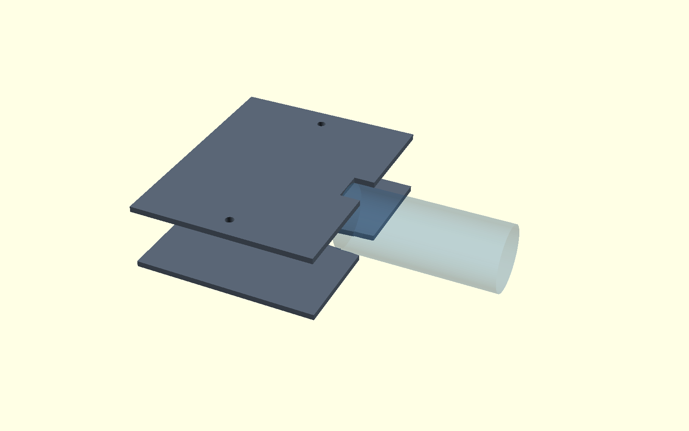
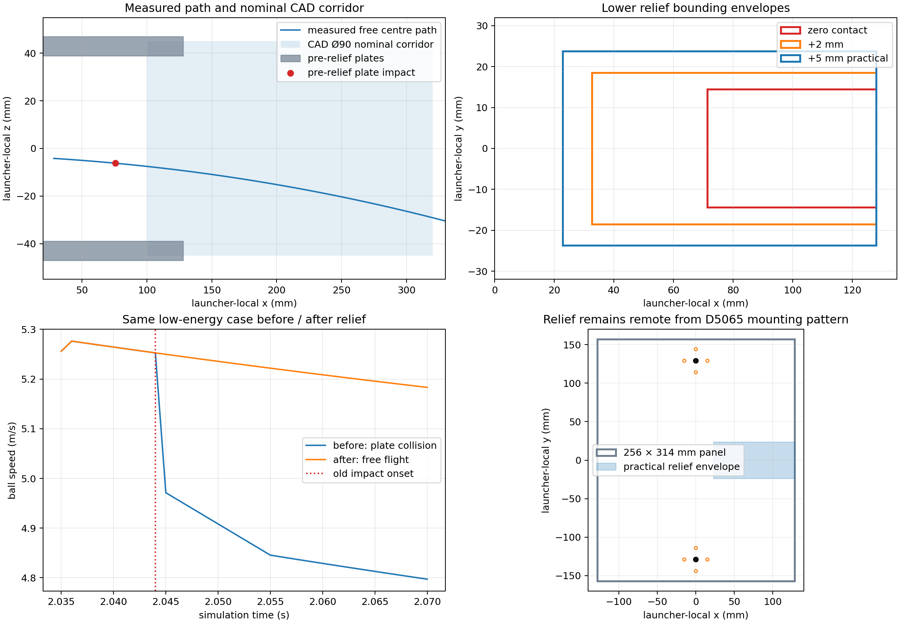

# Flywheel launcher post-nip exit-corridor audit and resolution

Date: 2026-08-26

## Outcome

The post-nip interference was a cradle geometry defect, not a ball-contact
calibration failure. A local shaped relief has been applied to the two
standalone cradle panels, and the mandated identical low-energy case now clears
all launcher solids without secondary contact.

The RPM sweep was not resumed in this task. The corridor is ready for that
separate capability retest sequence, beginning from the already repeated
low-energy case.

Machine-readable evidence is in
`config/flywheel_launcher_exit_corridor_audit.json`.

## What the translucent CAD cylinder is

The object is created by `exit_guide_envelope()` in
`cad/flywheel-launcher-v0/launcher-envelope.scad`, using `exit_guide_len = 220`
mm and `exit_clear_d = 90` mm from `params.scad`.

Its launcher-local definition is:

- classification: `NOMINAL_LAUNCH_CORRIDOR`;
- centre/origin: `[210, 0, 0]` mm;
- axis: launcher-local +X;
- axial extent: x = 100…320 mm;
- diameter: 90 mm;
- radius: 45 mm;
- visualization: translucent steel blue;
- collision participation: none;
- manufacturing intent: none.

The entire source file describes itself as a non-manufacturing packaging model.
The accompanying design note calls for a short guarded guide, not a long barrel,
and describes 90 mm as the clear feed/guard channel. The cylinder is therefore
a clearance/guard reference. It must not be silently reconstructed as a solid
tube.

## Reconstructed measured path

The accepted pre-relief low-energy trial used µ = 0.30, 1.00 ms timestep,
±80 rad/s wheel targets, and a deterministic 3.0 m/s launcher-local +X feed.

- final left/right analytical wheel contact: 2.035 s;
- sampled wheel-release state: 2.037 s;
- world release position: `[0.038094, 0, 0.358997]` m;
- launcher-local release position: `[0.038873806, 0, -0.004574501]` m;
- world release velocity: `[5.01907, 0, 1.61728]` m/s;
- launcher-local release velocity: `[5.269525, 0, -0.196877]` m/s;
- exit speed: 5.273202 m/s;
- actual elevation: 17.860343°, or 2.139657° below the 20° module axis.

The first geometric lower-plate overlap occurred at 2.044 s:

- world ball-centre position: `[0.0732274, 0, 0.370043]` m;
- launcher-local position: `[0.075666357, 0, -0.006210987]` m;
- exact generated collision:
  `flywheel_launcher_frame_link_fixed_joint_lump__flywheel_cradle_lower_plate_col_collision`;
- lower inner-face ball-centre limit: -6.000 mm;
- first sampled penetration: 0.210987 mm;
- contact normal on the ball, world frame:
  `[-0.342020143, 0, 0.939692621]`;
- centre distance travelled after sampled release: 36.828928 mm.

At the next physics step the native plate changed velocity and Y-axis spin.
No other fixed component redirected the ball before this event.

## Full-ball swept envelope

The audit uses the complete 66 mm ball, not only its centre ray. The current
post-wheel swept volume is the gravity-propagated measured centre trajectory
Minkowski-summed with a 33 mm sphere.

Against the pre-relief geometry:

- lower plate: interference at x = 75.666 mm;
- upper plate: no interference on the measured downward path;
- hubs, shafts and retainers: clear after wheel release;
- D5065 motor bodies and mounting pattern: clear;
- physical exit shroud/barrel: none exists;
- other launcher solids: no pre-impact redirection was observed.

The measured centre ray remains inside the Ø90 CAD cylinder over its full
100…320 mm extent. The full ball does not: its centre reaches z = -12.004 mm at
x = 165.026 mm, exhausting the cylinder's 12 mm radial allowance around a
33 mm ball. Therefore Ø90 is a nominal straight corridor, not a validated tube
for this gravity-curved low-speed trajectory. A physical Ø90 barrel would
eventually contact and steer the ball and is explicitly not proposed.

The original plates also intersected the CAD corridor itself over
x = 100…128 mm. At the lower inner face z = -39 mm, the Ø90 cylinder occupies
y = ±22.4499 mm. The source CAD contains solid plates there, so the conflict
exists in the exploratory CAD rather than being introduced by the standalone
Xacro reconstruction.

## Root cause

The measured alternatives resolve as follows:

- A — cradle incorrectly reconstructed: false. The pre-relief 256 × 314 × 8 mm
  plates matched the envelope CAD after the selected side-by-side rotation.
- B — CAD lacks the necessary exit opening: true. Its plates remain solid where
  the declared exit corridor passes through them.
- C — measured exit differs enough from nominal 20°: true. Only 6 mm of
  ball-centre clearance existed between the 33 mm ball and each inner plate
  face; the measured downward component and gravity consumed it.
- D — shaped exit cut-out required: true.
- E — another component redirected the ball first: false.

## Minimum and practical shaped openings

Each opening is the projection through the 8 mm plate of the measured ballistic
swept sphere. It is clipped at the existing x = 128 mm downstream panel edge;
the edge is intentionally open rather than leaving a thin end ligament.

Mathematical zero-contact opening:

- lower XY bounding box: x = 71.30…128.00 mm,
  y = -14.432…+14.432 mm;
- removed area: 1,066.99 mm²;
- removed volume: 8,535.93 mm³;
- remaining side ligament: 142.57 mm each side.

Measured envelope plus 2 mm:

- lower XY bounding box: x = 32.60…128.00 mm,
  y = -18.555…+18.555 mm;
- removed area: 2,389.84 mm²;
- removed volume: 19,118.75 mm³;
- remaining side ligament: 138.45 mm each side.

Selected practical opening, measured envelope plus 5 mm unioned with the
explicit CAD nominal corridor:

- lower XY bounding box: x = 22.80…128.00 mm,
  y = -23.733…+23.733 mm;
- removed area: 3,970.60 mm²;
- removed volume: 31,764.81 mm³;
- nominal removed 6061 mass: 85.76 g;
- remaining side ligament: 133.27 mm each side.

The upper panel removes only the CAD-corridor intersection; the measured
downward path is not mirrored without evidence:

- upper XY bounding box: x = 100.00…128.00 mm,
  y = -22.450…+22.450 mm;
- additional removed area: 1,257.20 mm²;
- additional removed volume: 10,057.58 mm³;
- nominal removed 6061 mass: 27.16 g;
- remaining side ligament: 134.55 mm each side.

The lower selected shape is not an arbitrary rectangular deletion. Its edge is
the swept-sphere/plate intersection and follows the measured ballistic curve;
the small downstream union ensures the explicit CAD corridor is no longer
occupied by plate material.

## Structural screen

The selected relief is remote from the direct-drive attachment:

- minimum distance to a nominal D5065 mounting-hole edge: 102.36 mm;
- minimum distance to either shaft axis: 118.64 mm;
- minimum remaining distance to either panel side edge: 133.27 mm;
- 12 mm shaft openings and their 7 mm local mount-hole ligament are unchanged;
- wheel, hub, shaft, retainer, motor bodies and mounting datums are unchanged.

The two large lateral plate arms remain. The notch opens only at the downstream
edge, so it does not create a narrow closed-slot end or approach the motor bolt
group. The earlier local motor bearing, bolt-tension and 30/50 mm strip screens
are not worsened at the attachment.

However, the opening reduces downstream torsional/bending continuity, the lower
relief is intentionally larger than the upper relief, and physical vibration,
fatigue, guard attachment and edge reinforcement have not been tested. The
correct classification is:

```text
GEOMETRIC_PASS_STRUCTURAL_REVIEW_REQUIRED
```

The provisional fixed-assembly mass properties were updated for the removed
plate material: 4.334783 kg, COM x = -2.313 mm, COM z = 18.506 mm, including
the small non-zero x-z product of inertia. This is simulation bookkeeping, not
physical mass-property validation.

## Implemented standalone geometry

The active standalone Xacro now uses:

- `flywheel_lower_panel_exit_clearance.stl`;
- `flywheel_upper_panel_exit_clearance.stl`.

Both are generated from
`cad/flywheel-launcher-v0/provisional-cradle-exit-clearance.scad` and remain
provisional simulation geometry, not manufacturing drawings. No complete-robot
file, ball calibration coefficient, wheel/nip datum, pitch, motor model, hub,
or torque limit was changed.





## Mandatory identical low-energy retest

The exact accepted low-energy settings were rerun after the geometry change:

- wheel targets: +80 / -80 rad/s;
- friction assumption: µ = 0.30;
- timestep: 1.00 ms;
- injection: 3.0 m/s launcher-local +X, zero spin;
- exit speed: 5.273202 m/s;
- elevation: 17.860343°;
- wheel-contact state: unchanged;
- post-release cradle/hub/motor contact: none;
- maximum non-gravity velocity increment before ground: 0.000004 m/s;
- first ground contact: 2.508 s;
- first-bounce position: `[2.40207, 0, 0.0314045]` m;
- wheel recovery time: 0.209 s.

The unchanged wheel-exit state and gravity-only motion through the former impact
location demonstrate that the relief provides clearance and does not act as a
second launcher surface.

## Future capability envelope

`MINIMUM_CURRENT_TEST_CLEARANCE` is defined by the measured path plus 5 mm.
The existing Ø90 cylinder remains a provisional
`FUTURE_CAPABILITY_KEEP_OUT`, but it is not a validated final angular envelope:
the stopped RPM/timestep matrices contain no measured 12–18 m/s exit-angle
range. The selected upper relief therefore follows only existing CAD evidence,
and the lower extension follows measured evidence. Future capability trials
must monitor full-ball clearance at every point; they must not assume the Ø90
cylinder proves all future trajectories.

## Required decisions — final state

```text
CAD_CYLINDER_IS_PHYSICAL_HARDWARE = false
CAD_CYLINDER_IS_EXIT_KEEP_OUT_OR_REFERENCE = true

CURRENT_CRADLE_VIOLATES_BALL_EXIT_ENVELOPE = false

LOWER_PLATE_EXIT_CUTOUT_REQUIRED = true

MINIMUM_EXIT_CUTOUT_DEFINED = true
PRACTICAL_EXIT_CLEARANCE_DEFINED = true

POST_FLYWHEEL_PATH_NONCONTACTING = true
POST_FLYWHEEL_BARREL_CONTACT_REQUIRED = false

CRADLE_EXIT_GEOMETRY_READY_FOR_CAPABILITY_RETEST = true

STRUCTURAL_REVIEW_REQUIRED = true
```

The prior interference remains preserved in the audit as the
pre-implementation state. `CURRENT_CRADLE_VIOLATES_BALL_EXIT_ENVELOPE = false`
describes the newly relieved standalone geometry after the mandatory identical
retest. It does not authorize physical manufacture and does not claim the
unmeasured 12–18 m/s envelope is already validated.
