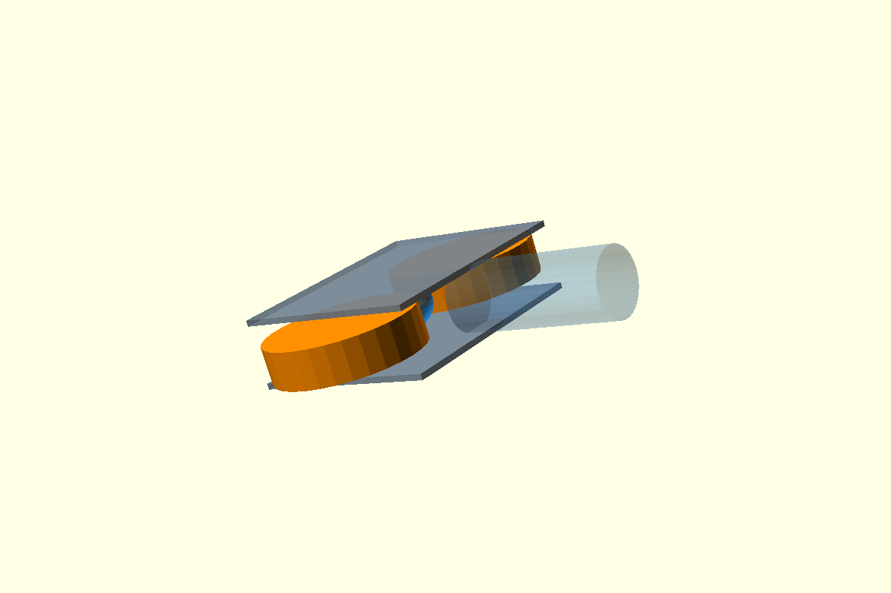

# Authoritative standalone flywheel launcher reconstruction and compliant-ball design gate

Date: 2026-08-25

## Outcome

The authoritative launcher geometry has been reconstructed as a standalone
Xacro module and isolated geometry-bench entrypoint. The compliant-ball **model
architecture** is selected and its calibration gate is defined, but the model
is intentionally not implemented or tuned yet. Launcher physics trials remain
closed until independent ball calibration evidence passes.

```text
AUTHORITATIVE_STANDALONE_LAUNCHER_RECONSTRUCTED = true
STANDALONE_LAUNCHER_GEOMETRY_REGRESSION_VALIDATED = true
COMPLIANT_BALL_MODEL_ARCHITECTURE_SELECTED = true
COMPLIANT_BALL_MODEL_IMPLEMENTED = false
COMPLIANT_BALL_MODEL_CALIBRATED = false
BALL_LAUNCH_PHYSICS_TRIALS_AUTHORIZED = false
COMPACT_INTEGRATION_MODIFIED = false
```

## Standalone reconstruction

The simulation source is
`urdf/components/flywheel_launcher_module.urdf.xacro`. It is instantiated only
by `urdf/flywheel_launcher_bench.urdf.xacro`; no compact robot, feeder, intake,
basket, perception, navigation or Throwing Mode dependency is present.

The launcher-local datum is the tennis-ball centre at the geometric nip:

- local +X: launch direction;
- local +Y: left wheel;
- local +Z: positive wheel axis / upper cradle plate before mounting pitch;
- baseline mount pitch: 20 degrees about -Y;
- world launch unit vector: `(0.9396926, 0, 0.3420201)`.

The reconstructed collision geometry is a literal metric mirror of
`cad/flywheel-launcher-v0/params.scad` and `launcher-envelope.scad` in the
side-by-side orientation:

- ball reference diameter: 66 mm;
- wheel diameter: 200 mm;
- wheel width: 50 mm;
- wheel centres: local `(0, +129, 0)` and `(0, -129, 0)` mm;
- wheel centre distance: 258 mm;
- geometric nip: 58 mm;
- cradle plates: two 256 x 314 x 8 mm boxes;
- plate centres: local Z = +/-43 mm;
- real wheel collisions: finite 200 x 50 mm cylinders;
- wheel joints: local Z axes, opposite velocity commands for forward launch.

This resolves both discrepancies found in the preceding stop report: it does
not use the historical 40 mm wheels / 280 x 508 x 35 mm frame, and it does not
use the shortened 258 mm compact cradle plates.

The declared fixed mass of 4.4525888 kg is a transparent simulation estimate:
3.4725888 kg for the two plate volumes at 2700 kg/m3 plus two 0.49 kg motors.
Each wheel remains a provisional 0.40 kg solid-cylinder inertia. These masses
are not claimed as authoritative manufactured-part properties.

## Runnable geometry scaffold

`gazebo/worlds/flywheel_launcher_geometry_bench.sdf` is a minimal ground world
that selects `gz-physics-dartsim-plugin` explicitly at 1 ms. The Xacro has a
kinematic datum link, 500 Hz standalone flywheel velocity controller and no
other robot joints.

The world deliberately contains no tennis ball. It is a reconstruction and
controller scaffold, not permission to run launch trials.

## Why SDF ODE softness was rejected

Gazebo Harmonic selects a gz-physics engine through the Physics system plugin,
not through the SDF `<physics type>` label. DART is the primary/default engine;
Bullet support is described upstream as preliminary. This installation has
DART and Bullet gz-physics plugins but no ODE gz-physics engine plugin.

Therefore the existing ODE `kp`, `kd`, `soft_cfm`, `soft_erp`, `mu` and `mu2`
surface blocks are not accepted as a portable compliant-ball model under the
actual DART execution path. DART's SDF `soft_contact` block is also not treated
as proof of a deformable tennis-ball body. A parameter that parses but is not
shown to control the installed engine is not a calibration mechanism.

Upstream engine-selection reference:
https://github.com/gazebosim/gz-sim/blob/main/tutorials/physics.md

## Selected compliant-ball architecture

The selected representation is an explicit Gazebo system implementing an
axisymmetric analytical sphere-to-finite-cylinder contact for each flywheel:

1. One rigid state body carries measured mass, inertia, pose, linear velocity
   and angular velocity.
2. Each wheel contact independently computes geometric indentation `delta` and
   indentation rate from the ball and finite cylinder states.
3. Normal force uses a calibrated loading/unloading law
   `F_n(delta, delta_dot)`. No coefficients are currently assigned.
4. Tangential traction uses a regularized Coulomb law, limited by measured
   wheel/ball friction, and applies equal/opposite ball force, ball torque and
   wheel torque.
5. Native rigid response is collision-filtered only for the analytically
   handled ball/flywheel pair. Ground and cradle collisions remain enabled.
6. Ground rebound uses a separately calibrated contact parameter set; launcher
   tyre contact must not inherit court/ground values.

This architecture makes bilateral force, penetration, slip, work and wheel
disturbance observable without pretending that a rigid overlap is deformation.

## Independent calibration contract

The machine-readable contract is `config/tennis_ball_compliance_design.json`.
It uses the 2026 ITF Type 2 requirements and test method as acceptance bands:

- size: 65.4 to 68.6 mm;
- mass: 56.0 to 59.4 g;
- deformation test: 15.57 N cover preload plus 80.07 N additional load,
  95.64 N total;
- forward deformation: 5.6 to 7.4 mm;
- return deformation: 8.0 to 10.8 mm;
- platen speed: 200 mm/min;
- rigid-surface rebound: 1.35 to 1.47 m after a 2.54 m drop, both measured from
  the bottom of the ball.

ITF source:
https://www.itftennis.com/media/15648/2026-technical-booklet.pdf

The 58 mm launcher nip reduces the nominal 66 mm diameter by 8 mm. That exceeds
the ITF forward-deformation band at the 95.64 N standard load and only reaches
the lower edge of the return-deformation band after the prescribed 25.4 mm
over-compression cycle. The launcher preload therefore cannot be inferred from
the ITF limit table alone. A measured multi-point loading/unloading curve is
required; wheel tyre compliance may also carry part of the 8 mm reduction.

## Calibration gates still required

- Three-axis ball preconditioning and quasi-static platen force/displacement
  curves through at least the launcher's 8 mm diametral reduction.
- Loading/unloading hysteresis and hold-time/relaxation fit.
- ITF rigid-surface drop/rebound fit, followed by impact-speed checks spanning
  the launcher contact regime.
- Ball-to-selected-flywheel-tyre static and dynamic friction measurements.
- Finite-cylinder face/edge contact verification.
- Equal/opposite force, torque and energy-accounting verification.
- Identical calibration results at 1.0, 0.5 and 0.25 ms within declared
  tolerances.
- Bilateral symmetry with a centred zero-spin compression fixture.

Launch outcomes may not be used to tune these coefficients. Only independent
calibration fixtures may fit the ball/contact model.

## Automation and visual evidence

`scripts/evaluate_flywheel_launcher_design_gate.py` reads the CAD literals,
checks the mirrored Xacro dimensions, verifies isolation, verifies explicit
DART selection and keeps the launch authorization gate closed. It reports a
successful model-design gate while separately reporting implementation and
calibration as false.

`tests/test_flywheel_launcher_design_gate.py` adds regression coverage for:

- CAD/Xacro dimension equality;
- 20 degree standalone pitch;
- 256 x 314 x 8 mm bilateral cradle collisions;
- 200 x 50 mm real wheel collisions and 58 mm nip;
- absence of other robot subsystems and absence of a premature ball;
- official calibration targets, unset force coefficients and closed launch
  authorization.

The rendered side-by-side CAD reference is:



This gate does not claim ball capture, launch speed, trajectory, motor power or
compact integration readiness.
