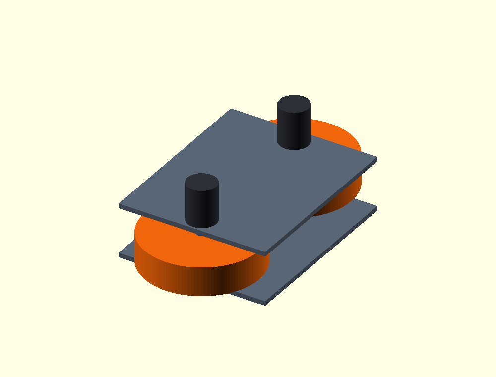
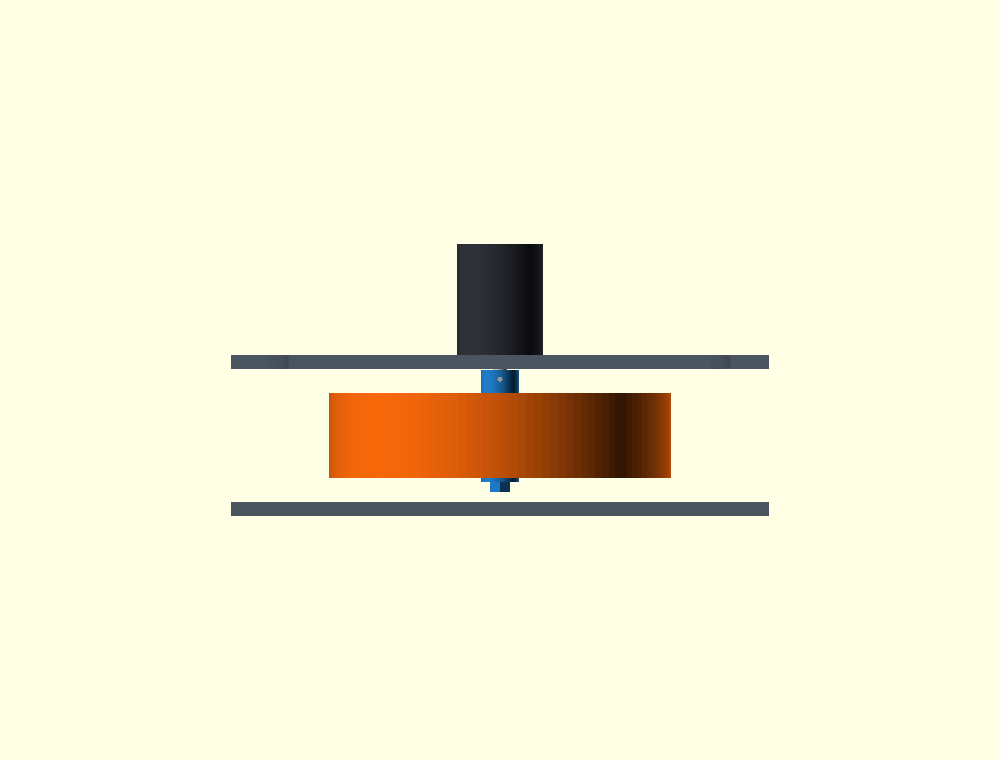

# Flywheel wheel-candidate provisional mechanical Gate A

Date: 2026-08-26

Scope: isolated standalone launcher only. This is a **simulation-ready provisional engineering baseline**, not a procurement freeze, manufacturing release or physical validation.

## A. Candidate wheel definition

The current engineering candidate is the user-selected AliExpress electric-skateboard/off-road pneumatic wheel:

- seller geometry: 200 mm outside diameter, 50 mm width and 10 mm axle/bore datum;
- construction: aluminium-alloy hub with rubber/pneumatic tyre;
- seller nominal mass: approximately 0.90 kg;
- provisional mass bracket: 0.70–0.90 kg;
- standalone nominal simulation mass: 0.90 kg per wheel.

The accepted launcher geometry remains unchanged: wheel centres `(0, ±129, 0) mm`, 258 mm centre spacing, 58 mm nip, 256 × 314 × 8 mm cradle panels and whole-module 20° pitch. Each D5065 remains directly attached to the outside face of the upper panel. There is no separate motor bracket, independent pitch mechanism, external shaft, bearing, belt, pulley, gearbox or printed high-speed hub.

## B. Evidence and uncertainty

Diameter, width, nominal 10 mm bore and aluminium/rubber construction are `USER_SUPPLIED_SELLER_DATA`. The 0.70–0.90 kg range and 0.90 kg nominal simulation value are `PROVISIONAL`. None is measured from received hardware.

The most important interface assumption is that the listed 10 mm datum is a concentric, rigid through-bore in the aluminium hub with clampable faces. If it is actually the inner race of a free-running bearing stack, the proposed direct-drive torque path is invalid and this provisional Gate A immediately reopens.

The D5065 model uses the existing manufacturer evidence: 270 rpm/V, `Kt = 0.031 N·m/A`, 0.039 Ω phase-neutral resistance, 45 A free-air continuous current, 65 A forced-air continuous current and 85 A/3 s peak current. The prototype 12.8 V bus and 20 A per-motor operating limit remain provisional repository inputs. Manufacturer rotor inertia remains unavailable and is kept separate.

The calibrated tennis-ball coefficients and files are unchanged. No tyre-friction value was fitted and no launcher result was used to tune ball contact.

## C. Hub/adapter architecture

The analysis-only adapter is classified `PROVISIONAL_HUB_FOR_SIMULATION`. It is a one-piece metal clamping arbor plus removable inner retention hardware:

- assumed 7075-T6 aluminium body; the metal requirement is fixed, but alloy is not frozen;
- 22 mm outside-diameter split collar from `z = +38.5` to `+25 mm`;
- blind 8 mm D-bore from `z = +38.5` to the shaft tip at `+17 mm`, giving 21.5 mm engagement against a 24 mm available flat;
- split clamp plus a dog-point screw registered to the D-flat, preventing a plain loose sleeve from becoming the torque/retention solution;
- integral 10 mm concentric pilot through the 50 mm wheel bore;
- integral outer shoulder at the wheel outer face;
- distal M8 stem, washer and all-metal locknut at the wheel inner face;
- removable wheel clamped between outer flange and inner washer/nut, preventing axial walk.

The parametric envelope has calculated mass `0.02676 kg` and polar inertia `1.162×10⁻⁶ kg·m²`. It is not manufacturing CAD and provides no permission to fabricate or run hardware.

The provisional wheel-face torque screen assumes 5 kN axial preload, dry aluminium interface coefficient `μ = 0.15` and 8 mm effective friction radius. The resulting 6.0 N·m friction capacity exceeds the D5065 85 A/3 s torque screen of 2.635 N·m. These are simulation-design assumptions pending wheel-face geometry, allowable clamp load and a controlled hub drawing.

## D. Axial stack

Launcher-local axial datums are:

- motor mounting face / panel outside: `+47 mm`;
- panel inside: `+39 mm`;
- hub clearance face: `+38.5 mm`;
- hub collar and flange: `+38.5…+25 mm`;
- wheel outer face / hub shoulder: `+25 mm`;
- D5065 shaft tip: `+17 mm`;
- wheel centre: `0 mm`;
- wheel inner face: `−25 mm`;
- retention washer: `−25…−27 mm`;
- retention nut end: `−33 mm`.

The hub fits the accepted stack without moving the wheel. It leaves 0.5 mm axial clearance to the panel, uses the complete 14 mm panel-to-wheel gap for its clamp/flange, and engages 21.5 mm of the shaft. The 10 mm pilot continues beyond the shaft tip as a solid arbor through the wheel.

## E. Panel cutout

The provisional upper panel uses two circular 12 mm cutouts on the wheel axes. An 8 mm shaft therefore has 2 mm radial service clearance. With nominal 4 mm motor features on a 30 mm PCD, the opening leaves 7 mm between the cutout edge and each mounting-feature edge.

The 22 mm hub collar deliberately does not pass through the panel: such an opening would reduce that ligament to only 2 mm. The controlled provisional assembly sequence is motor-to-panel first, hub inserted from the cradle interior onto the protruding shaft, radial clamp tools applied from the open cradle side, then wheel, inner washer and locknut installed. This makes 12 mm the smallest practical service opening without inventing a larger weak cutout.

The standalone upper-panel collision/visual retains these two 12 mm openings in the later exit-relieved mesh. The lower and upper shaped exit clearances are documented separately by the post-nip corridor audit. Both meshes and their OpenSCAD source remain provisional simulation geometry, not drill drawings.

## F. Structural re-screen

The earlier conservative radial reaction remains `263.70 N`, equal to 1.25 times the largest independent calibrated rebound peak. It is a screen load, not a measured launcher load.

With the nominal 0.90 kg wheel and 0.02676 kg hub:

- radial panel moment: `11.339 N·m`;
- wheel + hub + motor static moment: `0.547 N·m`;
- total conservative overturning moment: `11.886 N·m`;
- worst cardinal two-bolt-couple tension: `396.2 N`;
- nominal 4 mm feature bearing stress in the 8 mm panel: `12.38 MPa`;
- simple strip bending stress: `37.14 MPa` at 30 mm effective width and `22.29 MPa` at 50 mm width;
- two-ligament net tension stress around the 12 mm cutout: `3.54 MPa`.

This remains a screen pass against an assumed 6061-T6 comparison, not physical validation. Panel alloy/temper, motor thread engagement, final fasteners, machining quality, dynamic reaction, balance and vibration remain open.

## G. Mass sensitivity

The obsolete 0.40 kg wheel placeholder is removed from the standalone model. Capability calculations explicitly evaluate 0.70, 0.80 and 0.90 kg per wheel. The standalone nominal rotating-link mass is `0.92676 kg`, comprising the 0.90 kg wheel and 0.02676 kg provisional hub/retainer envelope.

`FLYWHEEL_ROTATING_MASS_BOUNDED = true` means only that simulation has a controlled 0.70–0.90 kg candidate range. It does not mean the seller value has been verified.

## H. Inertia sensitivity

Because the candidate combines a pneumatic tyre and aluminium hub, no solid-cylinder inertia is promoted as authoritative. Wheel polar inertia is bracketed by:

- low bound: `I = 0.5 mR²`, a solid-disk-style central-mass bound;
- high bound: `I = mR²`, a thin-ring outer-mass bound.

Across 0.70–0.90 kg this gives `0.0035…0.0090 kg·m²` per wheel. The nominal Xacro uses the midpoint law `I = 0.75 mR²` at 0.90 kg plus calculated hub inertia, giving `Izz = 0.00675116 kg·m²`. The corresponding composite transverse inertia is `0.00358106 kg·m²`, mass is `0.926764 kg`, and axial COM offset is `+0.000272 m`.

D5065 rotor inertia has no manufacturer value in the captured evidence. It is not silently set to zero: the capability analysis keeps it separate and evaluates `0`, `0.0001` and `0.0002 kg·m²` sensitivity. The upper assumed rotor value adds at most about 0.068 s to the 2000 rpm current-limited spin-up cases. The Xacro does not include rotor inertia until measured or manufacturer-backed evidence exists.

## I. D5065 spin-up capability

The calculation uses a 12.8 V bus, 20 A current limit, `Kt = 0.031 N·m/A`, 0.039 Ω phase-neutral resistance and back-EMF from 270 rpm/V. Available torque is limited to 0.62 N·m per motor. The 20 A voltage-limited base speed is approximately 3245 rpm, so every requested 1000–2000 rpm point remains in the current-limited region. Required voltage at 20 A rises from 4.48 V at 1000 rpm to 8.19 V at 2000 rpm.

This is a first-order current/back-EMF screen. Bearing drag, windage, iron loss, inverter drop/efficiency, battery sag and thermal accumulation are not yet measured, so calculated spin-up times are optimistic bounds rather than acceptance-test predictions.

Across every 0.70/0.80/0.90 kg and low/high inertia case:

- at 1000 rpm: spin-up `0.591…1.520 s`; a 2 s objective needs `0.183…0.471 N·m` and `5.91…15.20 A`; pair energy reservoir `38.39…98.71 J`; peak mechanical power `64.93 W/motor`;
- at 1250 rpm: spin-up `0.739…1.900 s`; 2 s objective `0.229…0.589 N·m`, `7.39…19.00 A`; pair reservoir `59.99…154.23 J`; peak power `81.16 W/motor`;
- at 1500 rpm: spin-up `0.887…2.280 s`; 2 s objective `0.275…0.707 N·m`, `8.87…22.80 A`; pair reservoir `86.39…222.09 J`; peak power `97.39 W/motor`;
- at 1750 rpm: spin-up `1.035…2.661 s`; 2 s objective `0.321…0.825 N·m`, `10.35…26.61 A`; pair reservoir `117.58…302.30 J`; peak power `113.62 W/motor`;
- at 2000 rpm: spin-up `1.183…3.041 s`; 2 s objective `0.367…0.943 N·m`, `11.83…30.41 A`; pair reservoir `153.58…394.84 J`; peak power `129.85 W/motor`.

Where the 2 s objective exceeds 20 A, the model accepts the longer current-limited time; it does not impose ideal velocity.

There is no calibrated launcher event yet because tyre traction remains disabled/unmeasured. For a bounded droop/recovery sensitivity only, the calculation withdraws the independently calibrated 2.54 m rebound incident energy, `1.4447 J`, equally from the two wheels. Predicted droop is `7.35…18.99 rpm` at 1000 rpm and `3.66…9.43 rpm` at 2000 rpm; 20 A torque-limited recovery is about 11.2 ms and 5.57 ms respectively. These are not launch-contact validation claims.

For context only, ball translational energies at 12/14/16/18 m/s are 4.176/5.684/7.424/9.396 J. The wheel reservoir screen is ample, but it cannot prove delivery through an uncalibrated tyre interface.

All 30 mass/inertia/RPM cases are recorded in [`flywheel-wheel-candidate-capability-screen.csv`](flywheel-wheel-candidate-capability-screen.csv), with full precision in [`config/flywheel_launcher_provisional_gate_a.json`](../../config/flywheel_launcher_provisional_gate_a.json).

## Standalone Xacro completeness

Only the standalone bench was updated. It now contains:

- shaped-relief lower plate and the upper plate with two 12 mm shaft openings plus the nominal exit-corridor relief;
- two fixed 50 × 65 mm D5065 body envelopes outside the upper panel;
- two rotating 8 × 30 mm primary shafts;
- two blue provisional collar/pilot/retainer envelopes;
- two 200 × 50 mm wheel collisions/visuals;
- explicit nominal rotating mass, COM, transverse inertia and polar inertia.

The standalone `ros2_control` command interface is now effort-limited to ±0.62 N·m instead of commanding ideal joint velocity. The complete-robot Xacro and controller configuration are unchanged.

## J. Gate A classifications

- `D5065_DIRECT_PANEL_MOUNT_GEOMETRICALLY_VALID = true`
- `D5065_DIRECT_PANEL_MOUNT_STRUCTURALLY_SCREENED = true`
- `FLYWHEEL_PANEL_CUTOUT_DEFINED = true`
- `FLYWHEEL_DIRECT_DRIVE_HUB_DEFINED_FOR_SIMULATION = true`
- `FLYWHEEL_SHAFT_ENGAGEMENT_VALIDATED_FOR_SIMULATION = true`
- `FLYWHEEL_AXIAL_RETENTION_DEFINED_FOR_SIMULATION = true`
- `FLYWHEEL_ROTATING_MASS_BOUNDED = true`
- `FLYWHEEL_ROTATING_INERTIA_BOUNDED = true`
- `FLYWHEEL_MECHANICAL_GATE_A_SIMULATION_READY = true`
- `FLYWHEEL_MECHANICAL_GATE_A_PHYSICAL_VALIDATED = false`

Status discipline:

- `FLYWHEEL_WHEEL_CANDIDATE_SELECTED = true`
- `FLYWHEEL_WHEEL_FINAL_PROCUREMENT_FROZEN = false`
- `FLYWHEEL_WHEEL_PHYSICAL_MEASUREMENT_PENDING = true`
- `FLYWHEEL_WHEEL_REVISIT_ALLOWED = true`

This provisional pass authorizes the isolated capability phase: low-energy launch, RPM sweep, exit vector/speed/elevation/azimuth/spin, droop/recovery, trajectory and 12/14/16/18 m/s mapping. Tyre friction must not be tuned merely to hit 14 m/s, and the calibrated ball model must remain frozen.

## K. Exact measurements required on arrival

1. Weigh each complete wheel and identify whether the 10 mm datum is a plain rigid through-bore, bearing inner race, removable bearing, bushing or axle sleeve.
2. Measure bore diameter, straightness, depth, runout and concentricity to the tyre; record hub-face material, flatness, face diameters, recesses and allowable axial clamp load.
3. Measure wheel polar inertia directly by torsional pendulum or equivalent, plus tyre pressure and pressure-dependent diameter/profile.
4. Measure D5065 flat start/end, shaft runout and actual usable engagement; identify mounting-feature thread/clearance and depth.
5. Replace the analysis hub with a controlled purchased/manufacturing drawing; verify clamp torque, dog-point engagement, wheel-face preload, nut locking, balance and burst-speed margin.
6. Measure assembled wheel/hub runout, imbalance and vibration across the complete operating range; verify panel alloy, cutout, fasteners and deflection.
7. Obtain or measure motor rotor inertia and update the rotating model without double-counting motor mass.

## L. Revisit criteria

Gate A reopens immediately if the delivered bore is a bearing race, mass lies outside 0.70–0.90 kg, measured inertia lies outside `0.5mR²…mR²`, wheel faces cannot accept the provisional 5 kN clamp, effective friction radius is below 8 mm, D-shaft engagement is below 21.5 mm, or any panel/fastener/runout/balance/vibration/retention check fails.

The wheel may also be replaced for procurement, packaging, balance, pressure stability or durability reasons. Any replacement must rerun this gate and the capability map. The present result closes mechanical Gate A **only for provisional standalone simulation**.
