# Standalone fixed-motor intake handoff capability

Date: 2026-08-27 · schema 2 · **supersedes the flat-ground revision**

Evidence class: **SIMULATION_BOUNDED — not physical validation**

## What changed and why every earlier number is withdrawn

The previous revision measured the entire handoff envelope on a flat
frictionless ground datum with a prescribed −0.45 m/s approach and a position
clamp. The real Option A package has a 33.5 mm smoothstep handoff ramp running
directly through the nip zone
(`oa_ramp_z`, 520 mm → 420 mm,
1.5 mm → 35 mm, max slope
26.7°, zero slope at both ends).

This is not a datum swap. At the 0.45 m/s approach
the ball has only 10.3 mm of coast climb
available against a 33.5 mm rise: it cannot
coast up. The robot drives a wedge under a ball that is at rest in the world,
and on the 26.7° section the surface normal has a
forward horizontal component. The solver now models this as a real normal +
friction contact against the inclined surface — the court moves rearward in the
robot frame, the ramp does not — and no longer prescribes the approach velocity
of the ball. The ramp side walls bound the ball centre to
|y| ≤ 57 mm.

**Every number downstream of the exit vector in the previous report is
invalidated**: handoff envelope, reachable volume, receiving heights, basket
constraints, lateral spread and the sensitivity tables. They are re-derived
here, not patched.

## Headline result: the ball is ploughed ahead at collection speeds

The frozen ramp lip reaches a court-resting ball at CAD
x = 529.8 mm —
48.6 mm **before** the first centred wheel contact at
x = 481.2 mm. The ball must
therefore cross the wedge on its own momentum, which makes the commanded
approach speed a first-order variable rather than a nuisance parameter.

| Approach case | m/s | Captures (all entries) | Captures (centred) | Peak ball centre z (mm) | Exit speed (m/s) |
| --- | --- | --- | --- | --- | --- |
| ROUTE_NOMINAL | 0.35 | 0/405 | 0/81 | 36.9 | n/a |
| STUDY_REFERENCE | 0.45 | 28/405 | 0/81 | 99.2 | 1.383..1.979 |
| ROUTE_MAX | 0.60 | 140/405 | 0/81 | 106.7 | 1.045..1.936 |
| ABOVE_THRESHOLD | 0.80 | 233/405 | 81/81 | 102.8 | 0.985..2.119 |

Minimum approach speed with any capture:
**0.675 m/s**;
capture across every friction bound from
**0.775 m/s**.
The collection route commands 0.35 m/s nominal
and caps at 0.60 m/s
(`ros2_ws/src/tennis_robot/config/collection_route.yaml`).

Laterally offset entries behave differently and the split matters: a ball
20 mm off the centreline reaches a wheel much earlier in X than a centred one,
so some offset entries capture even at 0.35 m/s while **no centred entry
captures below 0.625 m/s**. The funnel's whole job is to deliver a centred
ball, which is exactly the entry the ramp ploughs.

Below the threshold the ball rides a few millimetres up the smoothstep, reaches
the slope where the surface can no longer drive it rearward relative to the
robot, and is then bulldozed forward at approximately the robot's own speed: it
never reaches the nip, so no wheel ever touches it. This is **task section 14
stop condition 1** (`the ball cannot climb the ramp and is ploughed ahead`).

Energy makes the mechanism explicit. In the robot frame the ramp is static and
does no work, so the ball's only budget for the 33.5 mm rise is its own kinetic
energy. At 0.45 m/s that is 10.3 mm
of coast climb before rolling inertia is even counted. The court, which does
move in that frame, can feed energy in through friction only while the ball
touches the court and the ramp at the same time — a window that closes a few
millimetres up the sheet.

**Everything below this point — the exit envelope, S5, the reachable volume and
the basket-on-base study — is derived at the
0.80 m/s `ABOVE_THRESHOLD` approach
case, the only regime in which the frozen ramp captures at all. Those numbers
are conditional on a commanded speed the collection route does not currently
drive.**

## The ramp effect: before / after

Representative centred case `ABOVE_THRESHOLD_NOMINAL_mu0.6_F60_r0.40_y+0.000`, both columns at
the 0.45 m/s reference approach so the ONLY difference is the
ground profile.

| Quantity | Flat datum (invalid) | Authoritative ramp | Δ |
| --- | --- | --- | --- |
| exit station, CAD x (mm) | 429.5 | 559.5 | +130.0 |
| exit ball-centre z (mm) | 65.5 | 32.2 | -33.3 |
| exit speed (m/s) | 1.356 | 0.093 | -1.264 |
| exit elevation (deg) | 35.72 | 69.58 | +33.86 |
| apex ball-centre z (mm) | 97.5 | 33.0 | -64.5 |
| ballistic range (m) | 0.215 | 0.000 | -0.215 |
| bilateral contact (ms) | 60.3 | 0.0 | -60.3 |
| outcome | CAPTURED | PLOUGHED_AHEAD | |

At the reference approach the ramp column does not produce an exit at all — the
ball is ploughed. The same comparison at the 0.80 m/s
envelope approach, where both profiles capture, isolates the ramp's effect on
the exit vector itself:

| Quantity | Flat datum (invalid) | Authoritative ramp | Δ |
| --- | --- | --- | --- |
| exit station, CAD x (mm) | 429.4 | 439.4 | +10.0 |
| exit ball-centre z (mm) | 65.2 | 79.5 | +14.3 |
| exit speed (m/s) | 1.360 | 1.360 | -0.000 |
| exit elevation (deg) | 36.58 | 30.19 | -6.39 |
| apex ball-centre z (mm) | 98.7 | 103.3 | +4.6 |
| ballistic range (m) | 0.217 | 0.223 | +0.006 |
| above-base receiving distance (m) | 0.120 | 0.129 | +0.009 |
| outcome | CAPTURED | CAPTURED | |

The two opposing consequences the task predicted are both visible and are
reported as measured, not as an expectation.

## Ramp dynamics in the solver

Predicted static ball-centre heights on the ramp at the three nip stations
(upper / mid / lower):
44.1 /
55.2 /
63.9 mm,
against a constant 33.0 mm on flat ground.

Simulated ball-centre height when the ball crossed each station, over all valid
trials: upper 44.3..47.9 mm,
mid 56.6..63.1 mm,
lower 71.0..77.6 mm.

Peak ramp normal force across the matrix:
3.0..6.4 N.
Cases where a wheel touched before the ramp did:
0 of 405.
Ploughed-ahead cases: 172.
Stalled-in-nip cases: 0.

## Campaign

405 bounded matrix trials
(3 speeds × 3 tread-friction bounds ×
3 tyre bounds × 3
ball-to-ramp friction bounds × 5 lateral offsets).
233 captured mechanically;
181 also passed the model-validity gates.

### Mechanism outcomes

| Outcome | Cases |
| --- | --- |
| CAPTURED | 233 |
| PLOUGHED_AHEAD | 172 |

### Model-validity gate rejections (NOT mechanism failures)

| Gate | Cases |
| --- | --- |
| tyre_deflection_above_5mm_model_validity_bound | 52 |
| bridge_collision | 0 |
| lateral_escape_beyond_100mm | 0 |

52 trials captured the
ball and were rejected only by a model-validity gate. Their bilateral contact was
30.3..72.3 ms
and they exited at
1.053..2.119 m/s.
The 5 mm tyre-deflection limit is a MODEL-VALIDITY limit on the linear tyre
bound, not a physical failure.

### Centred speed sweep (S5) on the corrected model

- LOW: 27/27 valid, exit speed
  0.985..1.131 m/s, elevation
  28.03..32.00 deg, range
  0.136..0.170 m;
- NOMINAL: 27/27 valid, exit speed
  1.306..1.414 m/s, elevation
  29.70..32.64 deg, range
  0.209..0.242 m;
- HIGH: 27/27 valid, exit speed
  1.625..1.702 m/s, elevation
  30.62..33.14 deg, range
  0.299..0.330 m.

The 0.5/0.25/0.125 ms timestep check has an exit-speed relative spread of
0.092%.

## Basket on the base, no cut-out (section 10)

Floor plane z = 0.052 m. A rim clears
when the BALL BOTTOM passes above the rim top for **every** valid trial.

Headline population `centred_HIGH`: centred entries at the
HIGH wheel-speed command across every friction, ramp-friction and tyre bound, at
the 0.80 m/s approach (27 trials).

| Rim height (mm) | Rearward distance window (m) | Width (mm) |
| --- | --- | --- |
| 5 | 0.025..0.215 | 190 |
| 10 | 0.035..0.205 | 170 |
| 15 | 0.045..0.195 | 150 |
| 20 | 0.060..0.180 | 120 |

Wheel speed is a commanded setting, so the population matters and is stated
rather than averaged. Windows (m) by population:

| Population | Trials | rim 5 mm | rim 10 mm | rim 15 mm | rim 20 mm | Max rim (mm) |
| --- | --- | --- | --- | --- | --- | --- |
| centred_LOW | 27 | 0.035..0.045 | none | none | none | 5 |
| centred_NOMINAL | 27 | 0.025..0.125 | 0.040..0.110 | 0.065..0.090 | none | 15 |
| centred_HIGH | 27 | 0.025..0.215 | 0.035..0.205 | 0.045..0.195 | 0.060..0.180 | 29 |
| centred_entries_all_bounds | 81 | 0.035..0.045 | none | none | none | 5 |
| all_valid_entries | 181 | 0.035..0.045 | none | none | none | 5 |

Absolute maximum rim height that any distance clears, centred entries:
**29 mm**.
Over the full valid matrix, including offset entries:
**5 mm**
(181 trials).

The flat-ground reference (rim 5 mm → 0.040..0.180 m, 10 mm → 0.050..0.165 m,
15 mm → 0.065..0.150 m, 20 mm → 0.095..0.120 m, absolute max 21 mm) is
**withdrawn**; it appears in the JSON only so the change can be quantified.

At the 10 mm rim the receiving state across the window is:

- near_edge: distance 0.035 m, ball centre z 96.8..101.5 mm, lateral error 0.0..0.0 mm, residual speed 1.50..1.59 m/s, vertical velocity +0.59..+0.69 m/s (rising), rigid-wall rebound would rise 68 mm
- mid: distance 0.120 m, ball centre z 114.8..124.2 mm, lateral error 0.0..0.0 mm, residual speed 1.37..1.46 m/s, vertical velocity -0.01..+0.10 m/s (apex/rising), rigid-wall rebound would rise 58 mm
- far_edge: distance 0.205 m, ball centre z 96.1..112.4 mm, lateral error 0.0..0.0 mm, residual speed 1.49..1.54 m/s, vertical velocity -0.61..-0.48 m/s (descending), rigid-wall rebound would rise 65 mm

**Unresolved conflict.** A low rim is needed for the ball to clear it, while a
deep energy-absorbing entry is needed to stop rebound escape: at the residual
speeds measured here a rigid wall returns enough energy to lift the ball tens of
millimetres. Both pull in opposite directions. This task does not resolve it and
designs no basket geometry.

## Two-instrument scope

This solver owns exit speed, exit elevation, exit azimuth, tyre radial
deflection, ball compression, contact force, wheel droop, torque and current,
because it carries the calibrated ball law and the series tyre spring.

Gazebo owns ramp wedge/plough dynamics with ground friction, cheek centering,
capture half-width, jam and reject modes, multi-contact and 6-DOF ball motion.
`gz_ros2_control` velocity commands act as an ideal velocity source, so wheel
droop, motor torque and motor current are **not measurable in Gazebo** and are
never reported from it (defect D4, declared rather than modelled).

## Gazebo campaign (S1-S5)

**S1 — ramp dynamics (Phase 3: wheels + ramp, no cheeks), centred ball.**
The nip mid-plane sits at base_link x = 370 mm and the ramp
front lip at 420 mm. `minimum ball x` is how far the ball
ever got toward the nip; `advance` is how far it was pushed forward in the world.

`REJECTED_AT_NIP` means the ball reached the wheel bite and was spat out again.
`Advance` saturates at the court net (world x=0), so it is a floor, not the
distance the ball would have travelled on an open court.

| Drive (m/s) | tread mu | ramp mu | Outcome | Climb (mm) | Min ball x (mm) | Advance (mm) |
| --- | --- | --- | --- | --- | --- | --- |
| 0.35 | 0.3 | 0.40 | PLOUGHED_AHEAD | 3.3 | 410 | 6358 |
| 0.35 | 0.6 | 0.40 | PLOUGHED_AHEAD | 3.4 | 410 | 6358 |
| 0.35 | 0.9 | 0.40 | PLOUGHED_AHEAD | 3.4 | 410 | 6358 |
| 0.60 | 0.3 | 0.40 | PLOUGHED_AHEAD | 10.9 | 393 | 6358 |
| 0.60 | 0.6 | 0.40 | PLOUGHED_AHEAD | 10.8 | 393 | 6358 |
| 0.60 | 0.9 | 0.40 | PLOUGHED_AHEAD | 10.8 | 393 | 6358 |
| 0.80 | 0.3 | 0.40 | REJECTED_AT_NIP | 12.5 | 389 | 6358 |
| 0.80 | 0.6 | 0.20 | REJECTED_AT_NIP | 13.6 | 389 | 6359 |
| 0.80 | 0.6 | 0.40 | REJECTED_AT_NIP | 13.6 | 390 | 6359 |
| 0.80 | 0.6 | 0.60 | REJECTED_AT_NIP | 11.7 | 391 | 6359 |
| 0.80 | 0.9 | 0.40 | REJECTED_AT_NIP | 11.7 | 391 | 6359 |

Climb success (ball reached the nip): 0% of
11 runs. Capture: 0%.
Maximum ball climb observed: 13.6 mm.
At least one run reached bilateral wheel contact:
true — that is a REJECT at the nip
face, not a capture: no run transported the ball past the nip.

**S2 — capture half-width (Phase 4, full intake).**

| Lateral offset (mm) | Outcome | Min ball x (mm) | Climb (mm) |
| --- | --- | --- | --- |
| 0 | REJECTED_AT_NIP | 391 | 11.6 |
| 20 | REJECTED_AT_NIP | 390 | 12.2 |
| 40 | REJECTED_AT_NIP | 411 | 2.8 |
| 60 | REJECTED_AT_NIP | 396 | 9.0 |
| 80 | REJECTED_AT_NIP | 409 | 3.6 |
| 100 | PLOUGHED_AHEAD | 412 | 2.7 |

`INTAKE_CAPTURE_HALF_WIDTH_M = null`
(gated: S1: no capture on the frozen ramp)

**S3 — lateral entry velocity.** `NOT_RUN`, gated by S2:
S2: no capture half-width exists to sweep entry velocity within.

**S4 — cheek throat adequacy.** The CAD throat admits a ball centre to
±47 mm. There is no measured capture
half-width to compare it against while S1 fails, so `CHEEK_THROAT_ADEQUATE`
stays undetermined. No cheek geometry was changed.

**S5 — wheel-speed sweep (Phase 4, centred).**

| Wheel speed (rad/s) | Outcome | Min ball x (mm) | Climb (mm) |
| --- | --- | --- | --- |
| 14.5 | REJECTED_AT_NIP | 390 | 13.6 |
| 19.7 | REJECTED_AT_NIP | 390 | 13.6 |
| 25.0 | REJECTED_AT_NIP | 391 | 11.1 |

**Cross-validation gate.** qualitative on the capture/plough mechanism at each approach speed. Exit velocity is NOT cross-compared: Gazebo uses rigid contact with kp/kd conditioning and does not own that quantity.
Solver centred capture by approach speed: {"0.35": false, "0.60": false, "0.80": true}.
Gazebo centred capture by approach speed: {"0.35": false, "0.60": false, "0.80": false}.
`CROSS_INSTRUMENT_AGREEMENT = AGREE_ON_PLOUGH_AT_ROUTE_SPEEDS`.
Above the plough threshold the two instruments differ: the reduced-order solver transports a centred ball at 0.80 m/s, Gazebo reaches the wheel bite and rejects it. The gap is narrow — both put the ball at the front face of the nip — and it is REPORTED, NOT TUNED AWAY. Candidate causes, none of which may be adjusted to close it: the two contact laws at the 1.5 mm lip (calibrated ball law vs rigid kp/kd), the solver's 2-contact reduction versus 6-DOF multi-contact, and the absence of tyre compliance in the Gazebo wheel. Settling it needs the physical ramp-lip test, not a model change.

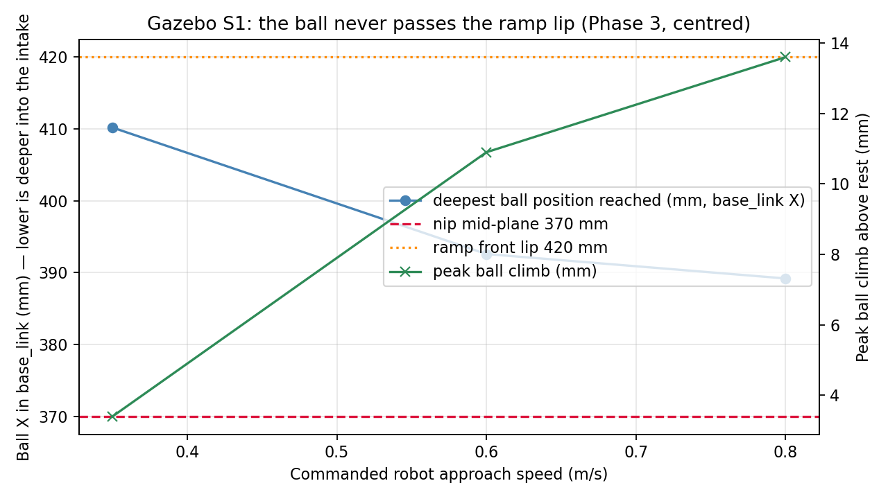

## Handoff envelope

Maximum simulated ballistic reach **0.378 m**;
strict all-bound high-speed reliable distance **undefined**.
Exit stations span CAD x 435.7..441.5 mm.

## Unmeasured parameters (swept, never selected)

- tread/felt friction [0.3, 0.6, 0.9];
- tyre radial stiffness [20.0, 60.0, 120.0] N at 5 mm;
- ball-to-ramp friction [0.2, 0.4, 0.6] (new; bound rationale in the JSON);
- rotating wheel/adapter inertia 0.0012 kg·m² allocation.

## Final classifications

```text
SIM_INTAKE_MATCHES_FROZEN_CAD = true
LEGACY_CARRIAGE_REMOVED = true
UNPHYSICAL_FRICTION_REMOVED = true
FRAME_MAPPING_ASSERTED = true
GROUND_PROFILE_IS_AUTHORITATIVE_RAMP = true
CROSS_INSTRUMENT_AGREEMENT = "AGREE_ON_PLOUGH_AT_ROUTE_SPEEDS"
BALL_CLIMBS_RAMP_IN_SOLVER = true
INTAKE_CAPTURES_CENTRED_BALL_AT_ROUTE_NOMINAL_APPROACH = false
INTAKE_CAPTURES_CENTRED_BALL_AT_ROUTE_MAX_APPROACH = false
INTAKE_CAPTURES_OFFSET_ENTRIES_AT_ROUTE_NOMINAL_APPROACH = false
MINIMUM_CENTRED_CAPTURE_APPROACH_SPEED_M_S = 0.775
CENTRED_BALL_PLOUGHED_AHEAD_AT_ROUTE_SPEEDS = true
EXIT_ENVELOPE_CONDITIONAL_ON_APPROACH_SPEED_M_S = 0.8
BALL_CLIMBS_RAMP_IN_SIM = false
INTAKE_CAPTURE_HALF_WIDTH_M = "UNMEASURED_S2_GATED: S1: no capture on the frozen ramp"
SOLVER_BOUNDED_LATERAL_OFFSET_LIMIT_M = 0.02
INTAKE_MAX_LATERAL_ENTRY_VELOCITY_M_S = "UNMEASURED_S3_GATED: S2: no capture half-width exists to sweep entry velocity within"
CHEEK_THROAT_ADEQUATE = "UNMEASURED_S4_GATED: S2: capture half-width is undefined while S1 fails"
MAX_BASKET_RIM_HEIGHT_ON_BASE_M = 0.029
MAX_BASKET_RIM_HEIGHT_ON_BASE_ALL_ENTRIES_M = 0.005
ABOVE_BASE_BASKET_RECEIVING_POSITION_FEASIBLE = false
BASE_CUTOUT_REQUIRED_FOR_BASKET_HANDOFF = "unresolved"
BASE_CUTOUT_DECISION_PHYSICALLY_UNRESOLVED = true
INTAKE_STATIC_CAPTURE_VALIDATED_IN_SIM = false
INTAKE_DYNAMIC_CAPTURE_VALIDATED_IN_SIM = true
INTAKE_EXIT_STATE_VALIDATED_IN_SIM = true
INTAKE_HANDOFF_ENVELOPE_GENERATED = true
INTAKE_RELIABLE_HANDOFF_ENVELOPE_DEFINED = false
INTAKE_TYRE_COMPLIANCE_PHYSICALLY_VALIDATED = false
INTAKE_TREAD_FRICTION_PHYSICALLY_VALIDATED = false
BALL_RAMP_FRICTION_PHYSICALLY_VALIDATED = false
PHYSICAL_HARDWARE_PENDING = true
DETERMINISTIC_SIMULATION_REPEATABILITY_ONLY = true
FULL_HANDOFF_TRAJECTORY_PHYSICS_VALIDATED = false
```

## Plots

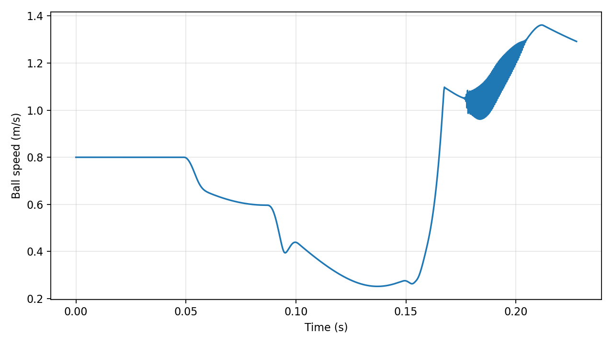
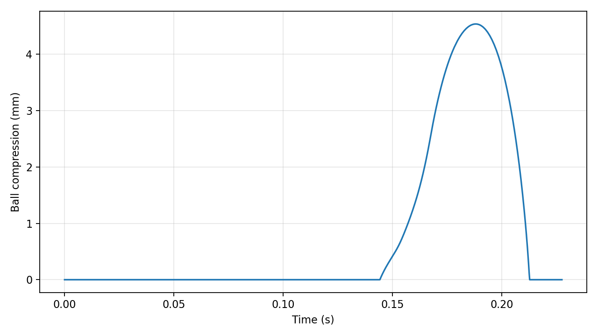
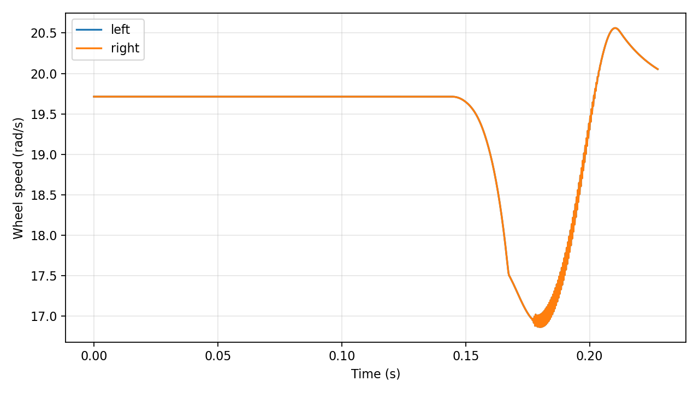
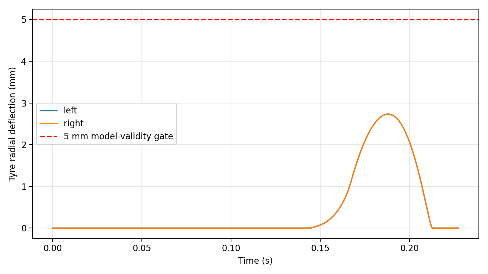
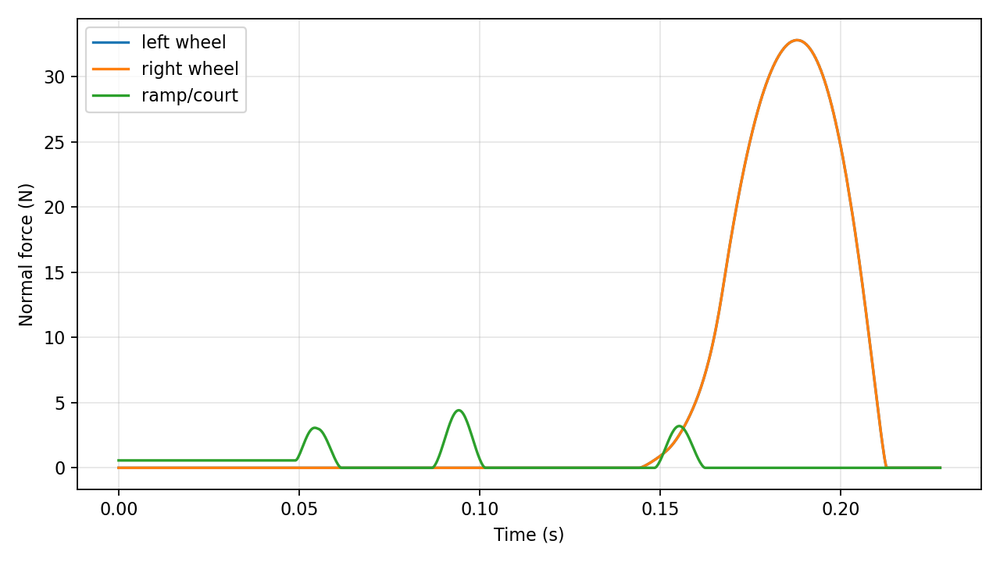
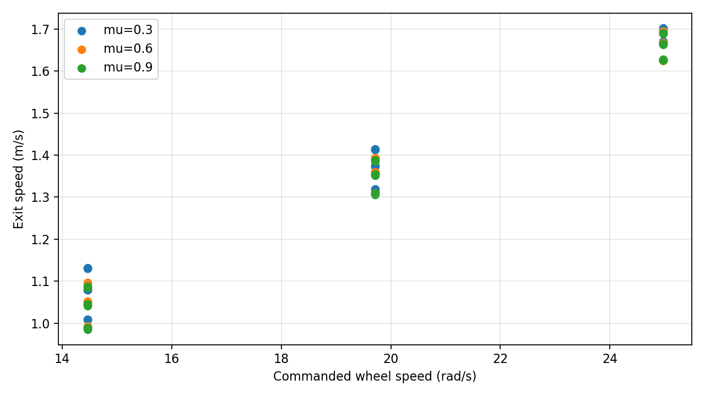
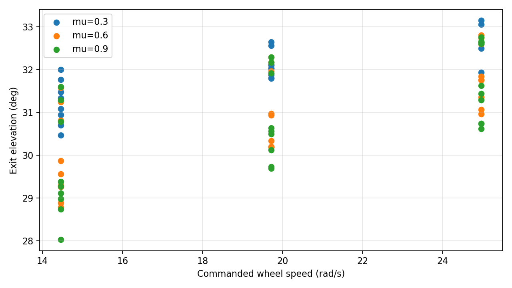
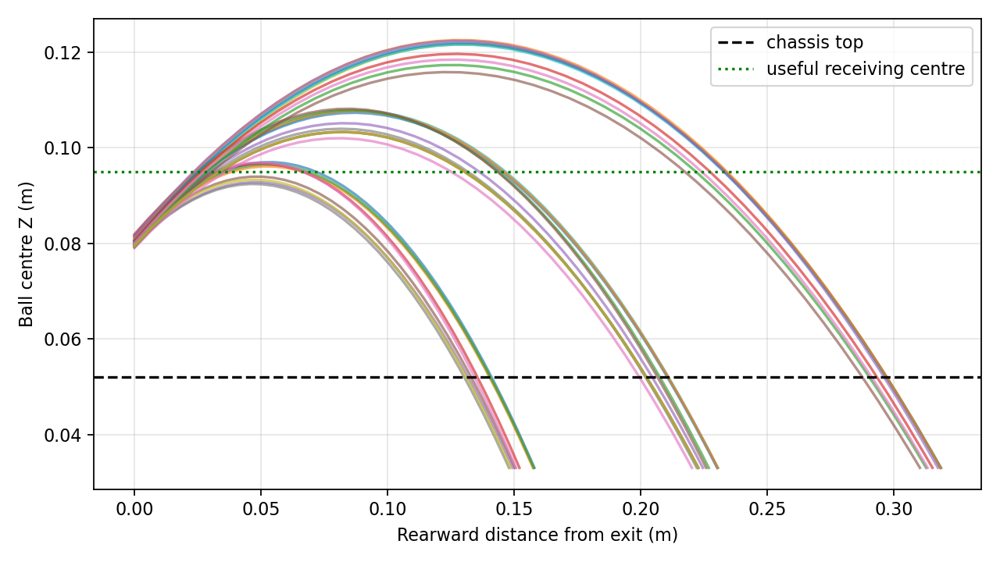
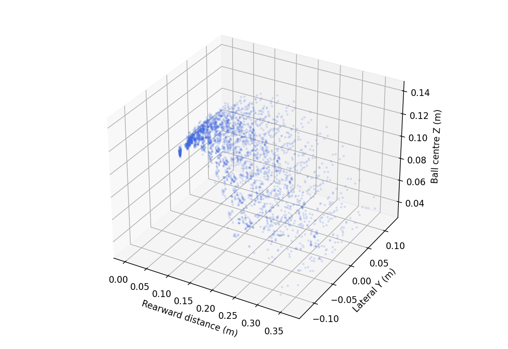
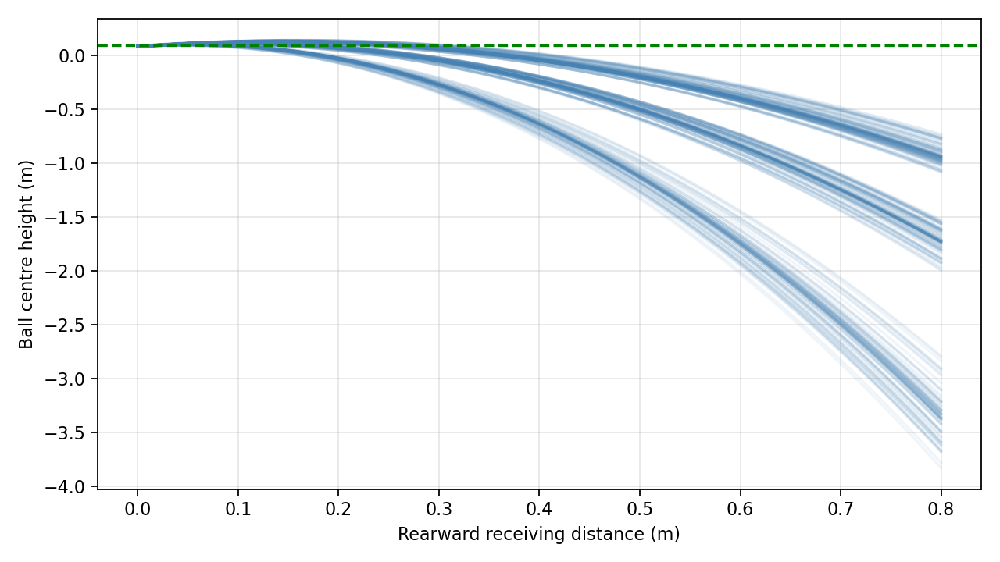
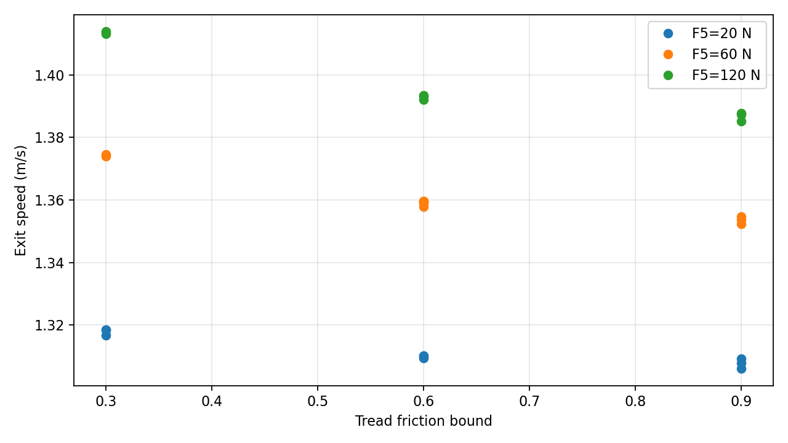
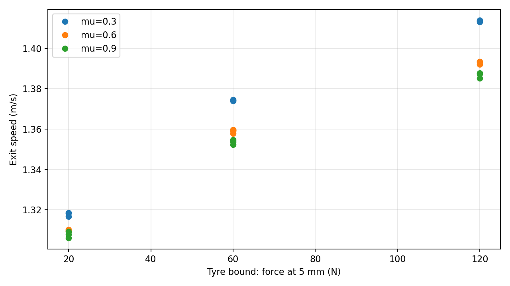
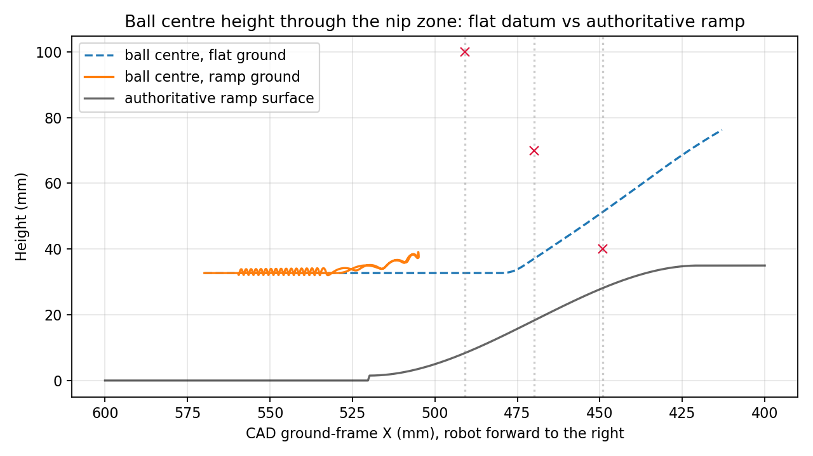
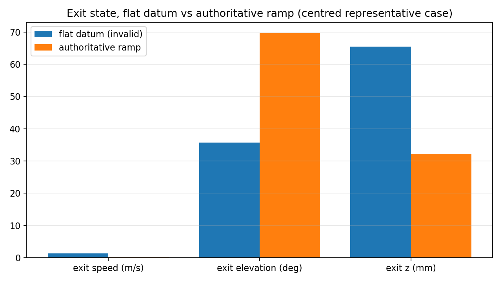
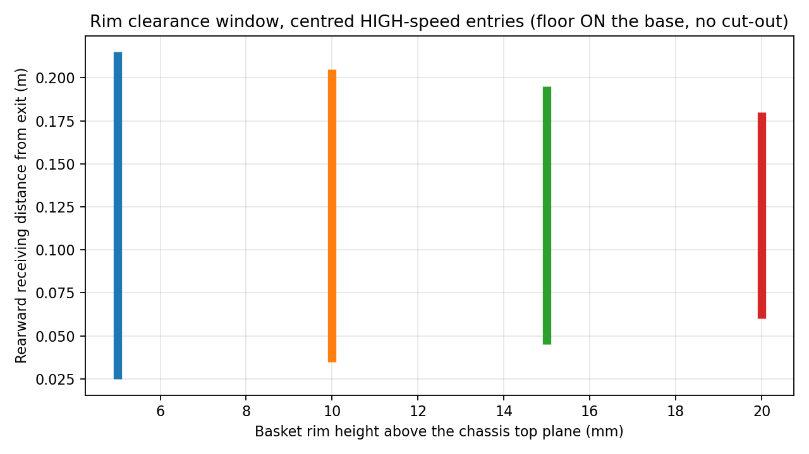
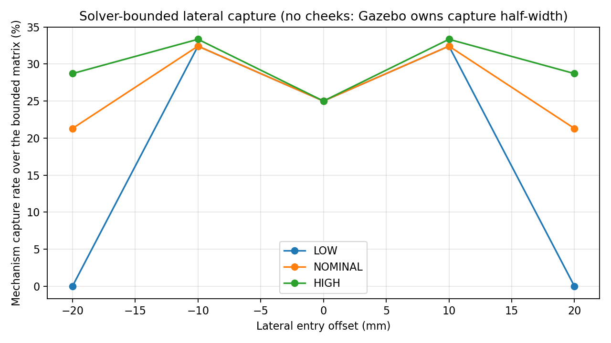
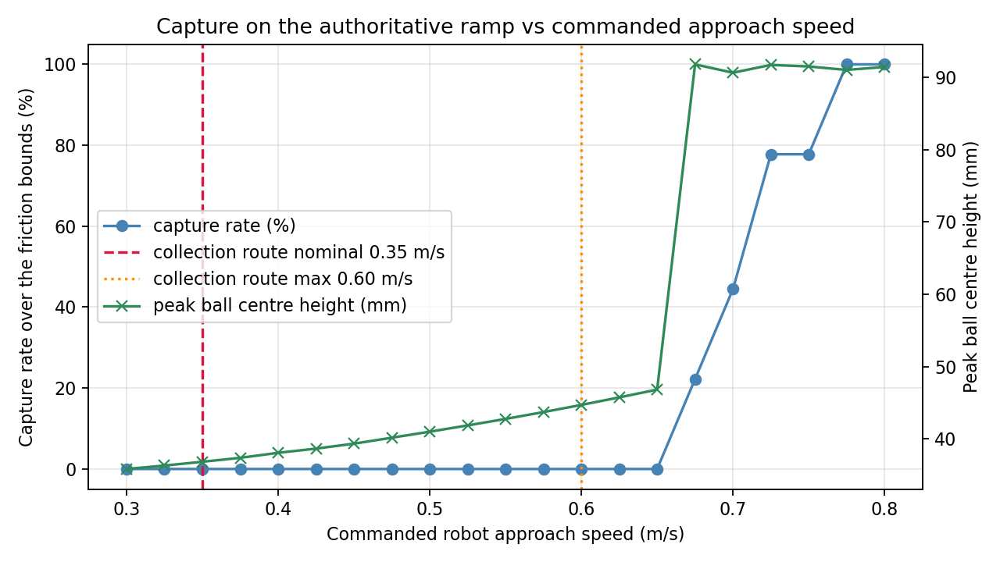

## Plots that could not be produced

Two of the requested plots depend on a measurement stage that is gated:

- *capture success vs lateral entry velocity* (S3) needs a capture half-width to
  sweep entry velocity within;
- *cheek throat output distribution* (S4) needs balls that actually pass the
  throat.

Both are gated by S1: the frozen ramp ploughs the centred ball. They are listed
as missing rather than approximated from the reduced-order solver, which cannot
represent cheeks at all.

## Smallest physical test that would settle this

The blocking result is a geometry/kinematics question, not a materials
question, so it does not need the full tyre calibration to answer:

1. **Ramp-lip plough test.** Build only the ramp (`oa_ramp_z`, 520 → 420 mm,
   1.5 → 35 mm, 180 mm wide) and push it along a hard court surface into a
   stationary ball at 0.35 m/s and at 0.80 m/s, wheels absent. Measure whether
   the ball climbs to the nip station or is bulldozed, and at what speed the
   behaviour changes. One printed ramp and a tape measure settle it.
2. Only if the ball climbs: the one-wheel/one-ball radial compression test,
   felt/tread traction at representative normal loads, ball-to-ramp friction on
   the real sheet, and the weight of the complete rotating wheel/adapter stack.
3. Then repeat the centred and offset capture test with encoder/current logging.

Until step 1 passes, the chassis cut-out decision, the basket rim height and the
whole handoff envelope stay physically unresolved, and no simulation number here
authorises removing chassis material.
